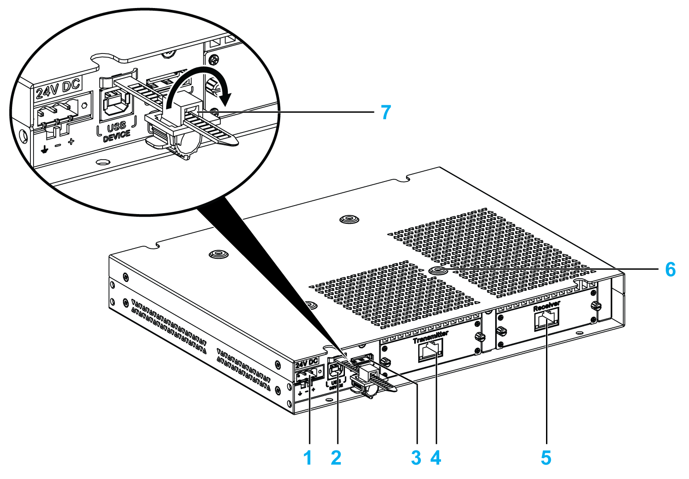

# Overview

Overview

The display can be mounted remotely from the Box iPC, using the Display Adapter.

The Display Adapter can be connected to any PC with USB cable for touch screen and DisplayPort cable for video (HMIYCABUSB51 / HMIYCABDP51 maximum distance of 5 m (16.4 ft)).

When equipped with a Receiver module and Transmitter module, up to 4 Display Adapters can be connected to one Box iPC equipped with Optional Interface for the RJ45 connector for CAT5e/CAT6 Ethernet cable. In this configuration, the single RJ45 connector for CAT5e/CAT6 cable supports both touch screens and video signal for a maximum distance of 100 m between devices, a maximum of 400 m total for 4 displays.

1   DC power supply connection

2   USB port type B (USB 2.0 for touch screen OUT)

3   DisplayPort (IN)

4   Transmitter module (HMIYDATR11) with RJ45 port

5   Receiver module (HMIYDARE11) with RJ45 port

6   Mounting holes for the VESA

7   USB locker