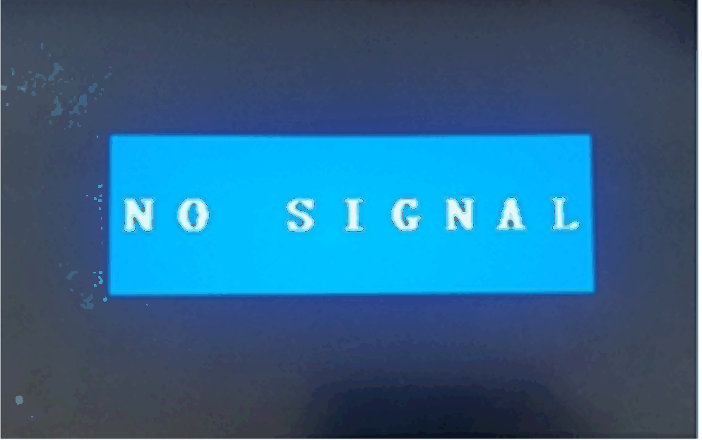

# Display with No Signal Message

Display with No Signal Message

When the host PC is turned off, or one of the display of the daisy chain is turned off or disconnected, the next other displays in the daisy chain get NO SIGNAL message on their screens. When the NO SIGNAL message appears, the remote display has no function (no touch and no display):

This is an informative note to you to check:

oIf the Ethernet cables on remote displays are disconnected, check, and reconnect. After one minute, the remote displays resume their normal operation.

oIf the host PC gets to S3 (lower power state) or S4 mode (power hibernation state), click any screen of the remote display to reactive the PC and resume normal operation.

oIf the host PC set the Turn off the Display mode in Power Options > Edit Plan Setting, click any screen in the remote display to wake up the PC and get back to normal status.