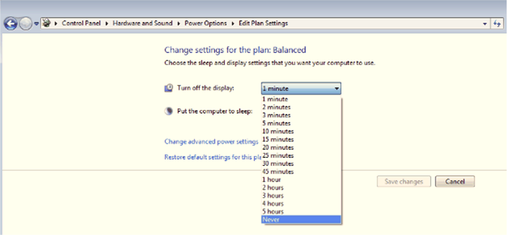

# Turn off The Display

Turn off The Display

Recommend that default setting is Never to avoid the remote display from changing to the NO SIGNAL message too often and impact the remote display operation:

