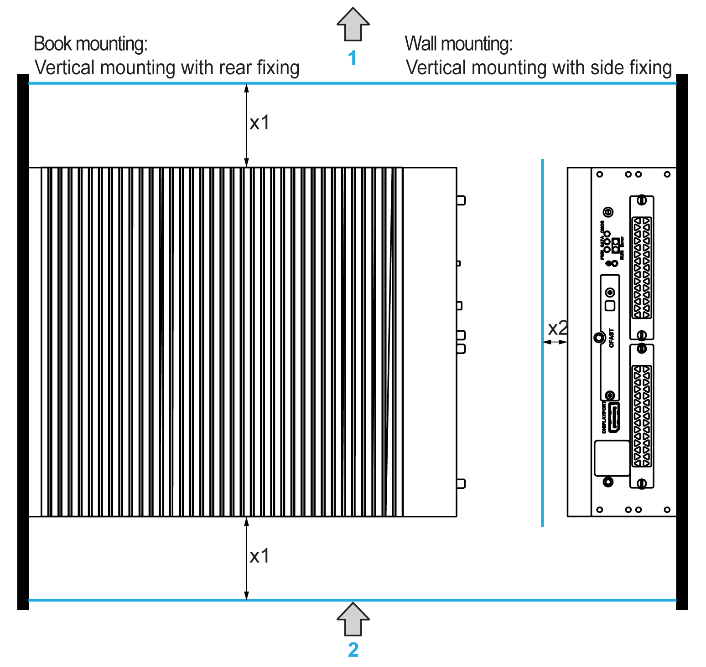

# Spacing Requirements

Spacing Requirements

In order to provide sufficient air circulation, mount the Box iPC so that the spacing on the top, bottom, and side is as follows:

1   Air out

2   Air in

x1   > 100 mm (3.93 in)

x2   > 50 mm (1.96 in)

Horizontal mounting:

x1   > 100 mm (3.93 in)

x2   > 50 mm (1.96 in)