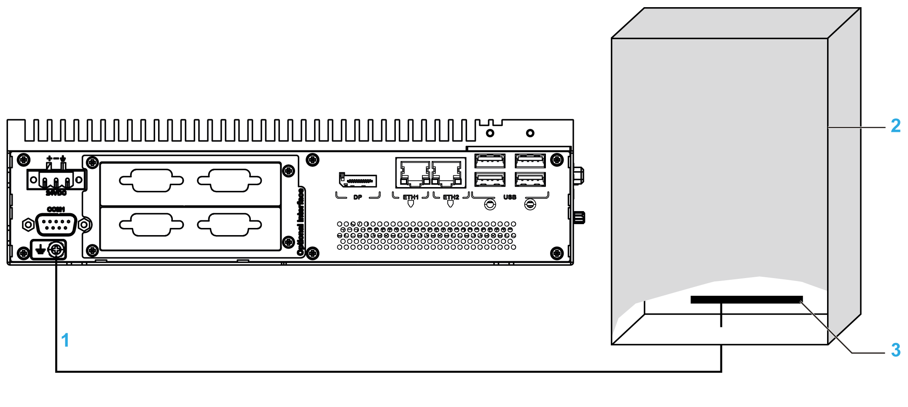
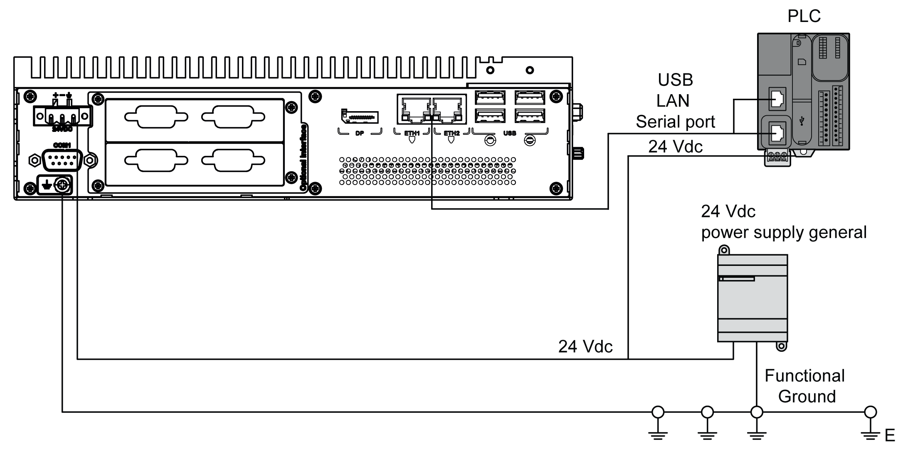

# Grounding Procedure

Grounding Procedure

|  |
| --- |
| Warning_Color.gifWARNING |
| UNINTENDED EQUIPMENT OPERATION |
| oUse only the authorized grounding configurations shown below.  oConfirm that the grounding resistance is 100 Ω or less.  oTest the quality of your ground connection before applying power to the device. Excessive noise on the ground line can disrupt operations of the Magelis Industrial PC. |
| Failure to follow these instructions can result in death, serious injury, or equipment damage. |

The Box iPC and the Display Adapter ground have 2 connections:

oDC Supply voltage

oGround connection pin

The Box iPC connections (common use for HMIBMU/HMIBMP/HMIBMI/HMIBMO):

1   Ground connection pin (functional ground connection pin)

2   Switching cabinet

3   Grounding strip

The Display Adapter connections:

1   Ground connection pin (functional ground connection pin)

2   Switching cabinet

3   Grounding strip

| Step | Action |
| --- | --- |
| 1 | Ensure all of the following is done for the system wiring:  oConnect the cabinet to ground.  oEnsure that all cabinets are grounded together.  oConnect the ground of the power supply to the cabinet.  oConnect the ground pin of the Box iPC to the cabinet.  oConnect the I/O to the controller if needed.  oConnect the power supply to the Box iPC. |
| 2 | Check that the grounding resistance is 100 Ω or less. |
| 3 | When connecting the SG line to another device, ensure that the design of the system/connection does not produce a ground loop.  NOTE: The SG and ground connection screw are connected internally in the Box iPC. |
| 4 | Use 1.3 mm2 (AWG 16) wire to make the ground connection. Create the connection point as close to the Box iPC as possible and make the wire as short as possible. |