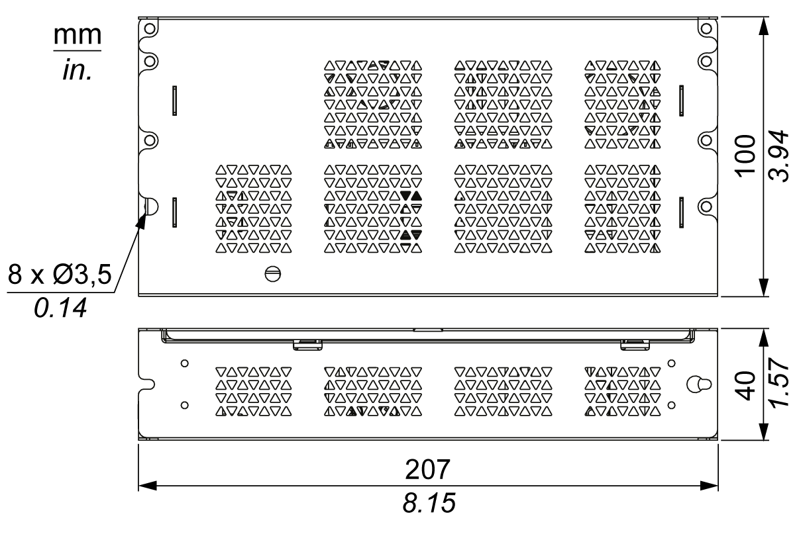

# AC Power Supply Module (HMIYMMAC1) Description

AC Power Supply Module (HMIYMMAC1) Description

The figure shows the AC power supply module:

The figure shows the DC power cable of the AC power supply module:

The figure shows the dimensions of the AC power supply module:

The table gives the technical data of the AC power supply module:

| Features | PV01 values | PV02 values |
| --- | --- | --- |
| Nominal input voltage | 100...240 Vac | |
| Frequency | 47...63 Hz | |
| Power switch | Yes | |
| Internal fuse | 3.15 A | |
| Nominal output voltage | 24 Vdc | |
| Output current | 4.6 A maximum | 5.5 A maximum |
| Operation temperature | 0...50 °C (32...122 °F) | -20...55 °C (-4...131 °F) |
| Weight | 0.8 kg (1.76 lb) | |

NOTE: PV02 combination only with HMIBMI/HMIBMO and Display Adapter certified ATEX/C1D2.