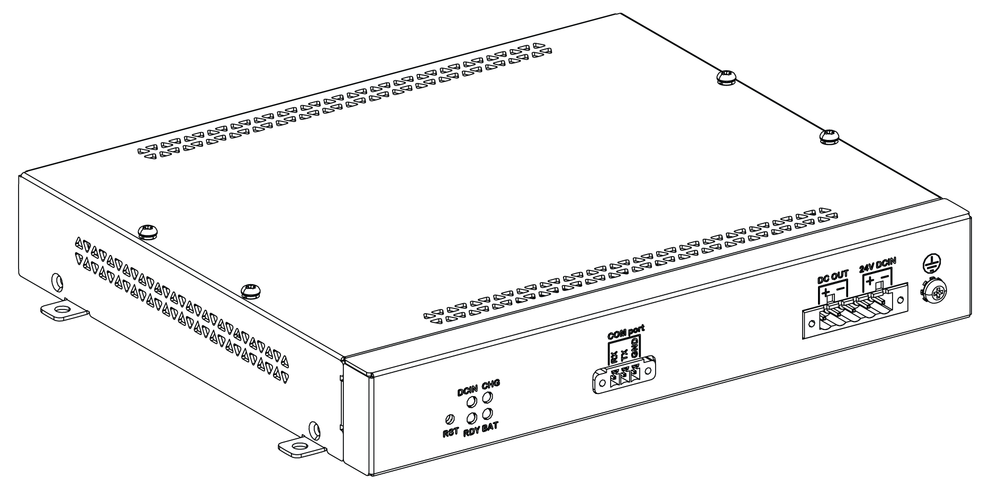

# Overview

Overview

|  |
| --- |
| Danger_Color.gifDANGER |
| EXPLOSION, FIRE, OR CHEMICAL HAZARD |
| Handling and storage:  oStore in cool, dry and ventilated rooms with impermeable surfaces and appropriate containment in case of leakage.  oProtect from adverse weather conditions and keep separate from incompatible materials during storage and transport.  oA sufficient supply of water must be located nearby.  oDamage to containers where batteries are stored and transported must be prevented.  oKeep away from fire, sparks, and excessive heat. |
| Failure to follow these instructions will result in death or serious injury. |

The uninterrupted power supply (UPS) option (HMIYMUPSKT1) includes a battery cell, a charger circuit, and a power path switch circuit. When battery capacity is not full, the charger circuit charges the battery cell automatically.

NOTE: If the UPS is configured and is activated in Standard System monitor or Node-Red System Monitor, the UPS is available.

The figure shows the UPS module:

The figure shows the UPS module cables:

The main features of the UPS option are:

oLong-lasting, maintenance-free rechargeable batteries

oCommunication via integrated interfaces