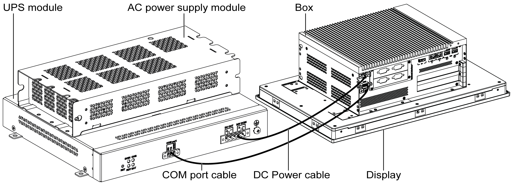

# UPS Principle

UPS Principle

With the optional UPS module, the Box iPC completes write operations even when it is turned off while write operations are being executed. When the UPS module detects a power off, it switches to battery operation immediately without interruption.

NOTE:

oThe connected monitor is not handled by the UPS and shut-off when the power is exhausted.

oOnly use COM1 of the Box iPC to connect to UPS module.

There are two configurations for UPS module:

oUPS module: The power source of the UPS module is from DC input power.

oUPS and AC power supply modules: The power source of the module is from AC input power.

This figure shows the UPS module (HMIYMUPSKT1) with the AC power supply module (HMIYMMAC1) and the Box iPC with the COM port cable and the DC power cable of the UPS cable kit (HMIYCABUPS31):

The Box iPC can get battery information from the COM port. Only COM1 can be used to detect UPS module information. The communication module of the optional interface cannot be used for UPS module; otherwise, it damages the Box iPC.

|  |
| --- |
| NOTICE |
| UNINTENDED EQUIPMENT OPERATION |
| o Use only COM1 port to detect UPS module information.  oUse only D-Sub 9-pin connector cables with a locking system in good condition. |
| Failure to follow these instructions can result in equipment damage. |

The table describes the additional modules for the UPS:

| Input power | UPS | Additional modules | Reference |
| --- | --- | --- | --- |
| DC | No | – | – |
| Yes | UPS module / UPS cables | HMIYMUPSKT1 / HMIYCABUPS31 |
| AC | No | AC power supply module | HMIYMMAC1 |
| Yes | UPS module / UPS cable and AC power supply module | HMIYMUPSKT1 / HMIYCABUPS31 and HMIYMMAC1 |

NOTE:

The UPS is not compatible with:

oPCIe/PCI cards and Ethernet PoE optional interface,

oPCIe/PCI cards and display.