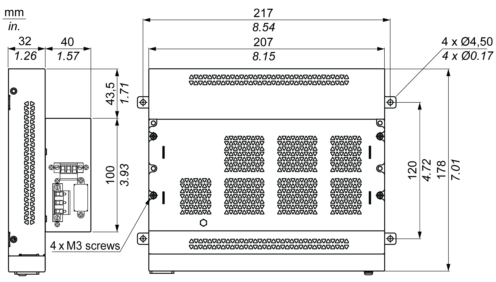

# UPS Module Description

UPS Module Description

The UPS module is subject to wear and should be replaced regularly, depending on the battery status. This information is displayed by Standard System monitor or Node-Red. The Health status shows when the battery needs to be changed.

NOTE: After going into backup mode, if no power is supplied during the next 5 minutes, then the UPS removes the 24 Vdc supply.

The behavior depends on the power mode setting (AT or ATX) in the Box iPC BIOS menu. The UPS sends event ask operation system shut down before backup power is exhausted.

When power is supplied to the UPS again;

oin AT mode, the Box iPC restarts automatically.

oin ATX mode, you need to push power button for system restart.

The figure shows the UPS module (HMIYMUPSKT1):

1   LEDs ([DCIN / CHG / RDY/ BAT]) and reset button ([RST])

2   Communication port connector ([COM port / PWR])

3   DC power connector ([DC OUT / 24V DCIN])

4   Ground connection pin

The table describes the meaning of the status indicator:

| Marking | Color | State | Meaning |
| --- | --- | --- | --- |
| DCIN | Green | ON | The input source is OK. |
| 1 Hz Flashing | DCIN loss up to 5 minutes. |
| OFF | DCIN loss. |
| CHG | Green | ON | The battery of the UPS module is loading. |
| 0.5 Hz Flashing | The temperature of the battery is > 60 °C (remains flashing until the temperature is < 55 °C). |
| 1 Hz Flashing | The battery is charging. |
| OFF | The battery capacity is over 90 % (charging not required). |
| RDY | Blue | ON | The UPS module is ready. |
| OFF | The UPS module is not functioning. |
| BAT | Yellow | 0.5 Hz Flashing | The temperature of the battery is > 60 °C (remains flashing until the temperature is < 55 °C) or less than 15 % charge. |
| OFF | The battery is not detected. |

NOTE: The button RST is used to reset the UPS module.

The table shows the technical data of the UPS module:

| Features | Values |
| --- | --- |
| UPS | |
| Input voltage | 18...36 Vdc |
| Output voltage | 24 Vdc |
| Output current | 3 A |
| Communication port | COM port / RS-232 |
| Back-up time | 10 minutes (battery 70 % fulled) |
| Operating temperature | 0...45 °C (32...113 °F) |
| Mounting | Desktop mount |
| Battery cells | |
| Capacity: | 27.5 Wh (2.73 Ah, 4S1P) |
| Maximum discharger current | 9 A (if discharged at high rate and high temperature frequently, the battery life will be shortened) |
| Charging current (max) | 1 A |
| Operating voltage | 12...16 Vdc |
| Cycle life of recharging | 300 times |
| Operating temperature | Charge: 0...45 °C (32...113 °F)  Discharge: 0...60 °C (32...140 °F) |
| Typical recharge time at low battery | 4 hours |
| Weight | 1.15 Kg (2.53 lbs) |

The figure shows the dimensions of the UPS module (HMIYMUPSKT1) equipped with the optional AC power supply module (HMIYMMAC1):

