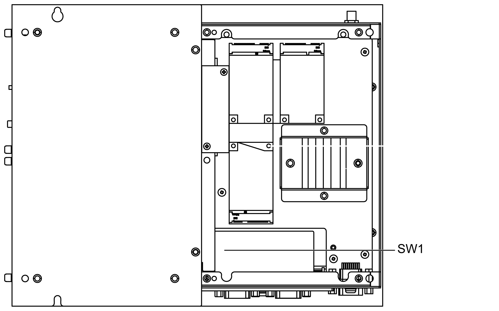

# Serial Interface Connections

Serial Interface Connections

This interface is used to connect the Box iPC to remote equipment, via a serial interface cable. The connector is a D-Sub 9-pin plug connector.

By using a long PLC cable to connect to the Box iPC, it is possible that the cable can be at a different electrical potential than the panel, even if both are connected to ground.

NOTE: The Box iPC can get UPS information from COM port. Only COM1 can be used to detect UPS module information (HMIYMUPSKT1). The communication module of the optional interface cannot use for UPS module; otherwise, it damages the Box iPC.

|  |
| --- |
| DangerElectrical_Color.gifDanger_Color.gifDANGER |
| ELECTRIC SHOCK |
| oMake a direct connection between the ground connection screw and ground.  oDo not connect other devices to ground through the ground connection screw of this device.  oInstall all cables according to local codes and requirements. If local codes do not require grounding, follow a reliable guide such as the US National Electrical Code, Article 800. |
| Failure to follow these instructions will result in death or serious injury. |

The table shows the D-Sub 9-pin assignments (COM1):

| Pin | Assignment | | | D-Sub 9-pin plug connector |
| --- | --- | --- | --- | --- |
| RS-232 | RS-422 | RS-485 |
| 1 | DCD | TxD- | Data- | G-SE-0009066.2.gif-high.gif |
| 2 | RxD | TxD+ | Data+ |
| 3 | TxD | RxD+ | N/A |
| 4 | DTR | RxD- | N/A |
| 5 | GND | GND | GND |
| 6 | DSR | N/A | N/A |
| 7 | RTS | N/A | N/A |
| 8 | CTS | N/A | N/A |
| 9 | RI | N/A | N/A |

Any excessive weight or stress on communication cables may disconnect the equipment.

NOTE:

oAdjust the serial port configuration with DIP switch (common use for HMIBMU/HMIBMP). You can select RS-232, RS-422/485. The RS-485 port is designed with auto data flow control capability and automatically detects the data flow direction.

oThe Box iPC Optimized has not a switch to set the RS-232, RS-422/485 mode. Use the BIOS for the setting.

NOTE: To achieve Modbus through RS-485 COM port with Schneider Electric device, do not use standard Schneider Electric cable. Follow wiring diagram above to create a convenient cable depending on the remote device to connect to any peripheral interface.

The figure shows the position of the SW1 for the Box iPC Universal/Performance:

The table describes the RS-232, RS-422/485 mode settings for the COM1:

| Mode | SW1 |
| --- | --- |
| RS-232 mode | G-SE-0042097.1.gif-high.gif |
| RS-422 master mode | G-SE-0042098.1.gif-high.gif |
| RS-422 slave mode | G-SE-0042099.1.gif-high.gif |
| RS-485 mode | G-SE-0042100.1.gif-high.gif |

NOTE: The RS-422 creates point-to-multipoint connections. In a point-to-multipoint arrangement, the node originating the data (master) can broadcast data to several (slave) nodes at once.

RS-422 can be configured as master mode or slave mode for networking. A master-slave system has one master node that issues commands to each of the slave nodes and process responses. Slave nodes do not typically transmit data without a request from the master node, and do not communicate with each other. Each slave must have a unique address so that it can be addressed independently of other nodes.