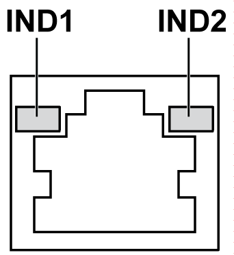

# RJ45 Connector Status LEDs

RJ45 Connector Status LEDs

The figure shows the RJ45 connector status LEDs:

The table describes the RJ45 connector status LED:

| Label | Description | LED | | |
| --- | --- | --- | --- | --- |
| Color | Status | Description |
| IND1 | Ethernet link | Green/Yellow | Off | Link at 10 Mb/s |
| Solid yellow | Link at 100 Mb/s |
| Solid green | Activity at 1000 Mb/s |
| IND2 | Ethernet activity | Green | Off | No activity |
| On | Transmitting or receiving data |