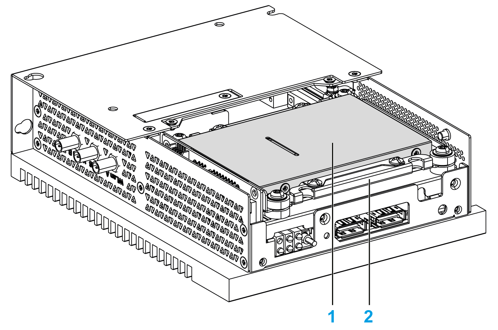

# Overview

Overview

The Box iPC supports three types of SATA devices and two SATA ports.The table shows the SATA device configuration:

| SATA port | SATA device | SATA speed |
| --- | --- | --- |
| Port 1 | HDD/SSD | 6 Gb/s; 3 Gb/s; 1.5 Gb/s |
| Port 2 | M.2 |

1   HDD/SSD

2   HDD/SSD adapter (HMIYBADHDDBMO1)