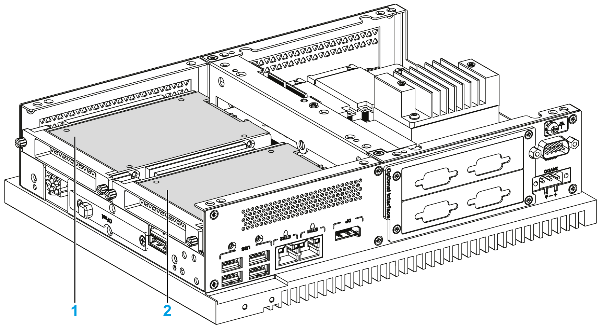

# Overview

Overview

The Box iPC supports three types of SATA devices and four SATA ports.The table shows the SATA device configuration:

| SATA port | SATA device | SATA speed |
| --- | --- | --- |
| Port 1 | mSATA | 6 Gb/s; 3 Gb/s; 1.5 Gb/s |
| Port 2 | CFast |
| Port 3 | HDD/SSD 1 |
| Port 4 | HDD/SSD 2 |

1   HDD/SSD 1

2   HDD/SSD 2

The Box iPC supports RAID 0/1 (redundant array of independent disks) feature (two HDD or two SSD can support this feature). The RAID is a data storage virtualization technology that combines multiple physical disk drive components into a single logical unit for the purposes of data redundancy, performance improvement, or both.

Use Intel rapid storage technology (Intel RST) to support RAID 0/1 feature (see the Intel rapid storage user manual on the recovery media). Do not use Windows RAID configuration tool:

oRAID level 0 performance scaling up to six drives, enabling higher throughput for data intensive applications such as video editing.

oData redundancy is offered through RAID level 1, which performs mirroring.

The Box iPC supports HDD or SSD SATA hot-swap feature:

| SATA RAID | Description | Hot-Swap |
| --- | --- | --- |
| RAID 0 | Spanned volume | No |
| RAID 1 | Mirroring | Yes |

NOTE: There is a limitation with the System Monitor when RAID mode is enabled. The Hard Information is not updated.