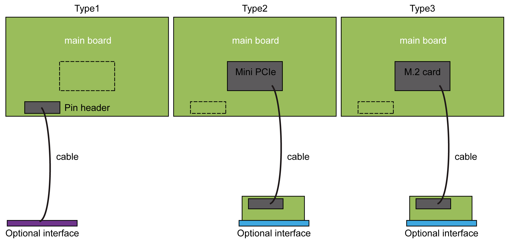
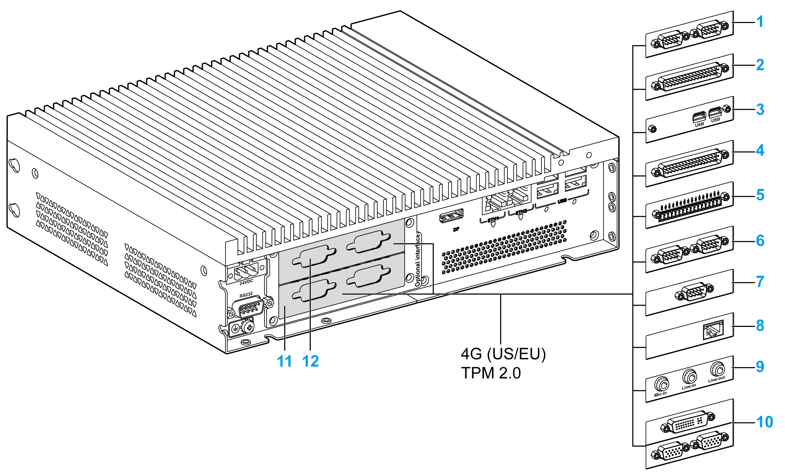

# Optional Interface Compatible Table

Optional Interface Compatible Table

| Part number | Description | HMIBMP/HMIBMU | HMIBMI/HMIBMO Expandable |
| --- | --- | --- | --- |
| HMIYMINUSB1 | Interface USB 3.0, 2 x USB | Yes(1) | Yes |
| HMIYMINAUD1 | Interface audio, 1 x LI/LO/MIC | Yes(2) | N/A |
| HMIYMINSL24851 | Interface 2 x RS-422/485 isolation | Yes | Yes |
| HMIYMINSL44851 | Interface 4 x RS-422/485 | Yes | Yes |
| HMIYMINSL22321 | Interface 2 x RS-232 isolation | Yes | Yes |
| HMIYMINSL42321 | Interface 4 x RS-232 | Yes | Yes |
| HMIYMINAUD21 | Interface audio 1 x LI/LO/MIC | Yes(2) | Yes |
| HMIYMINATPM201 | Interface TPM 2.0 | Yes(9) | Yes |
| HMIYMINIO1 | Interface 16 DI/8 DO, 1 x DB37, 2 m cable | Yes | Yes |
| HMIYMIN8AI1 | Interface 8 analog input | Yes | Yes |
| HMIYMINWIFI1 | Interface WiFi, AC3160, 2 x antenna | Yes | Yes |
| HMIYMINGPRS1 | Interface 3G, 1 x antenna | Yes | Yes |
| HMIYMIN4GUS1 | Interface 4G US, 1 x antenna | Yes | Yes |
| HMIYMIN4GEU1 | Interface 4G EU/ASIA, 1 x antenna | Yes | Yes |
| HMIYADDPDVI11 | Interface DP to DVI adaptor, active mode | Yes | Yes |
| HMIYMINDVII1 | Interface 1 x DVI-I | Yes(4/5) | Yes |
| HMIYMINVGADVID1 | Interface, 1 x DVI-D, 2 x VGA, two brackets | Yes(4/5) | Yes(3) |
| HMIYMINDP1 | Interface transmitter | Yes(5/6/7) | Yes(7) |
| HMIYMINPRO1 | Interface Profibus w/NVRAM | Yes | Yes |
| HMIYMINCAN1 | Interface fieldbus, 2 x CANopen | Yes | Yes |
| (1) Only support one HMIYMINUSB1 in HMIBMP/HMIBMU.  (2) Only support one HMIYMINAUD1 in HMIBMP/HMIBMU. HMIBMP/HMIBMU has pin header, so for Line in, Line out and Mic in, preferably use HMIYMINAUD1.  (3) HMIBMO Expandable only support one Interface bracket; either with 2 x VGA or DVI-D bracket.  (4) HMIYMINDVII1 and HMIYMINVGADVID1 cannot use together in HMIBMP/HMIBMU.  (5) HMIYMINDP1 cannot use with HMIYMINDVII1 or HMIYMINVGADVID1.  (6) HMIYMINDP1 and HMIYMINUSB1 cannot use together in HMIBMP/HMIBMU.  (7) Remove the existing driver when you want to install HMIYMINDP1 or HMIYMINDVII1 or HMIYMINVGADVID1.  (8) Cannot monitor UPS status because Display Adapter does not have COM port.  (9) Need to downgrade to TPM 1.2 in HMIBMP/HMIBMU. | | | |

The figure shows the interface types (top view):

Type1   Pin header

Type 2   mini PCIe card

Type 3   M.2 card

The figure shows the possible interfaces:

   

1   2 x RS-232, RS-422/485 interface

2   4 x RS-232, RS-422/485 interface

3   USB interface

4   DIO interface

5   Analog input interface

6   CANopen interface

7   Profibus DP interface

8   mini PCIe to Display Adapter Interface

9   Audio interface

10   VGA and DVI interface for the Box iPC Universal/Performance

11   Optional interface 1

12   Optional interface 2 for the Box iPC Universal/Performance

The table shows the type and part number of the optional interface:

| Designation | Part number | Interface | Type: | | |
| --- | --- | --- | --- | --- | --- |
| mini PCIe card | Interface plate | Pin header from system |
| [NVRAM card](Simple_panel_PC_-_Hardware_Modifications-22.htm#XREF_D_SE_0045327_1) | HMIYMINNVRAM1 | Card NVRAM | 1 | – | – |
| [RS-232, RS-422/485 interface](Simple_panel_PC_-_Hardware_Modifications-15.htm#XREF_D_SE_0045293_1) | HMIYMINSL24851 | 2 x RS-422/485 isolated | 1 | 1 | – |
| HMIYMINSL44851 | 4 x RS-422/485 |
| HMIYMINSL22321 | 2 x RS-232 isolated |
| HMIYMINSL42321 | 4 x RS-232 |
| [DIO interface](Simple_panel_PC_-_Hardware_Modifications-13.htm#XREF_D_SE_0045332_1) | HMIYMINIO1 | 16 x DI / 8 x DO | 1 | 1 | – |
| [Analog input interface](Simple_panel_PC_-_Hardware_Modifications-14.htm#XREF_D_SE_0081135_1) | HMIYMIN8AI1 | 8 x analog input | 1 | 1 | – |
| [Wireless LAN interface](Simple_panel_PC_-_Hardware_Modifications-18.htm#XREF_D_SE_0045338_1) | HMIYMINWIFI1 | 1 x Wireless LAN and 2 x antennas | 1 | 1 | – |
| [CANopen interface](Simple_panel_PC_-_Hardware_Modifications-16.htm#XREF_D_SE_0045328_1) | HMIYMINCAN1 | 2 x CanOpen/CanBus | 1 | 1 | – |
| [Profibus DP interface](Simple_panel_PC_-_Hardware_Modifications-17.htm#XREF_D_SE_0045339_1) | HMIYMINPRO1 | 1 x Profibus DP master NVRAM | 1 | 1 | – |
| USB interface | HMIYMINUSB1 | 2 x USB 3.0 | 1 | 1 | – |
| [Audio interface](Simple_panel_PC_-_Hardware_Modifications-19.htm#XREF_D_SE_0052272_1) for Box iPC Universal/Performance | HMIYMINAUD1 | 1 x Audio | – | 1 | 1 |
| [Audio mini PCIe interface](Simple_panel_PC_-_Hardware_Modifications-20.htm#XREF_D_SE_0067229_1) for Box iPC Optimized | HMIYMINAUD21 | 1 x Audio | 1 | 1 | – |
| [mini PCIe to display adapter interface](Simple_panel_PC_-_Hardware_Modifications-23.htm#XREF_D_SE_0063785_1) | HMIYMINDP1 | 1 x Transmitter | 1 | 1 | – |
| [DVI-I interface](Simple_panel_PC_-_Hardware_Modifications-23.htm#XREF_D_SE_0063785_1) | HMIYMINDVII1 | 1 x DVI-I | 1 | 1 | – |
| [VGA and DVI-D interface](Simple_panel_PC_-_Hardware_Modifications-24.htm#XREF_D_SE_0067230_1) for Box iPC Universal/Performance | HMIYMINVGADVID1 | 2 x VGA and 1 DVI-D | 1 | 2 | – |
| [GPRS interface](Simple_panel_PC_-_Hardware_Modifications-25.htm#XREF_D_SE_0052519_1) | HMIYMINGPRS1 | 1 x GPRS/GSM | 1 | – | – |
| [4G cellular for EU/ASIA](Simple_panel_PC_-_Hardware_Modifications-26.htm#XREF_D_SE_0067355_1) | HMIYMIN4GUS1 | 4G cellular for EU/Asia, antenna | 1 | – | – |
| [4G cellular for US](Simple_panel_PC_-_Hardware_Modifications-26.htm#XREF_D_SE_0067355_1) | HMIYMIN4GEU1 | 4G cellular for US, antenna | 1 | – | – |
| [TPM module](Simple_panel_PC_-_Hardware_Modifications-27.htm#XREF_D_SE_0067233_1) | HMIYMINATPM201 | – | – | – | 1 |