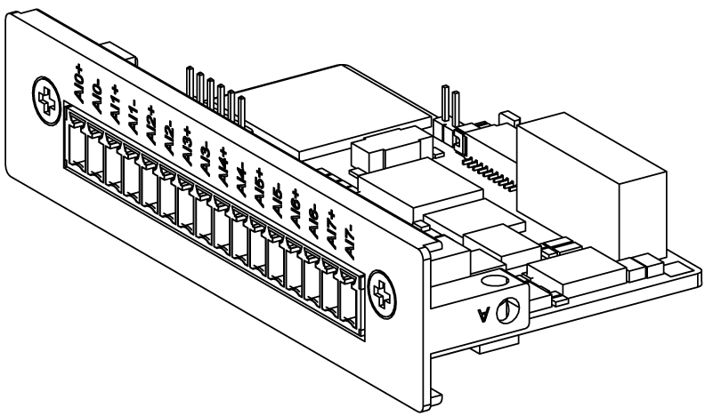

# Introduction

Introduction

The HMIYMIN8AI1 is categorized as an analog input module. It is compatible with the mini PCIe card.

The figure shows the 8 analog input interface:

The figure shows the dimensions:

