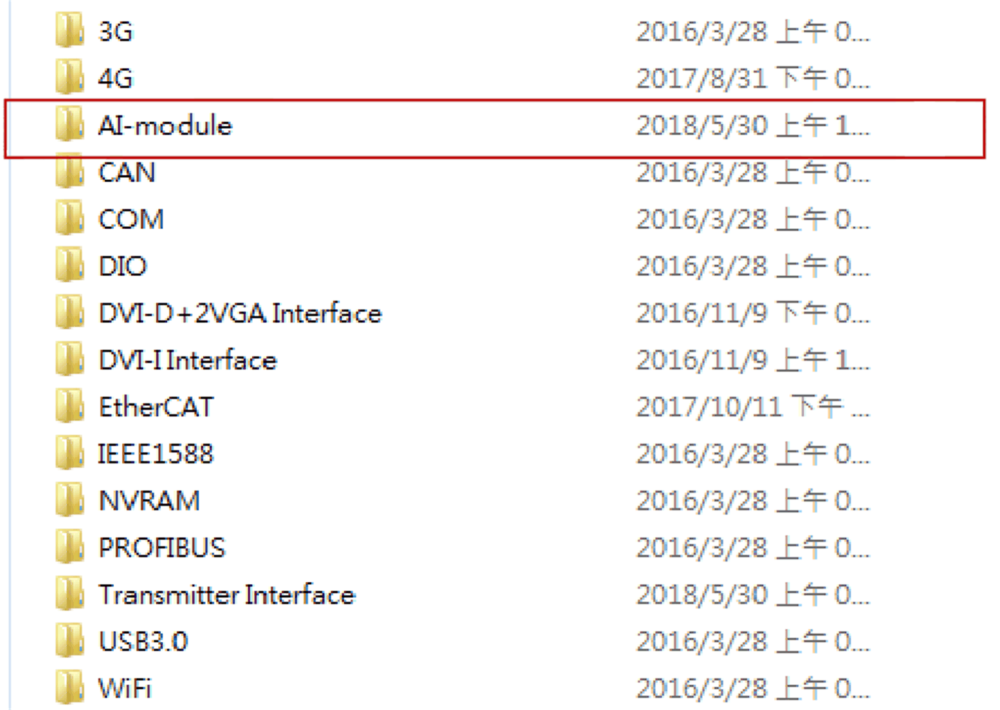

# Analog Input Module Utility for System Monitor

Analog Input Module Utility for System Monitor

NOTE:

The following are the two methods to get analog input module information:

oIf you are using the IIoT Node-Red OS SKU, please get analog input module information in [analog input node](../Box_PC_-_IIoT_Box_Project_Cyber_Security/Box_PC_-_IIoT_Box_Project_Cyber_Security-4.htm#XREF_D_SE_0084242_36).

oFor the OS with System Monitor SKU, install the analog input module utility from USB key, in optional interface devices list.

| Step | Action |
| --- | --- |
| 1 | Install the driver (\CDM v2.12.00 WHQL Certified.exe). |
| 2 | Install the drivers (\VC\_redist.x86.exe and \vcredist.x86.exe). |
| 3 | Copy EAPI\_AI\ai\_value\_range\_infor.json to C:\Windows. |
| 4 | Copy EAPI\_AI\win32\libEApi-AI.dll to C:\Windows\SysWOW64. |
| 5 | Copy EAPI\_AI\x64\libEApi-AI.dll to C:\Windows\System32. |

NOTE: You can get all the files you need from the Recovery USB key:\Optional Interfaces drivers\AI-module.