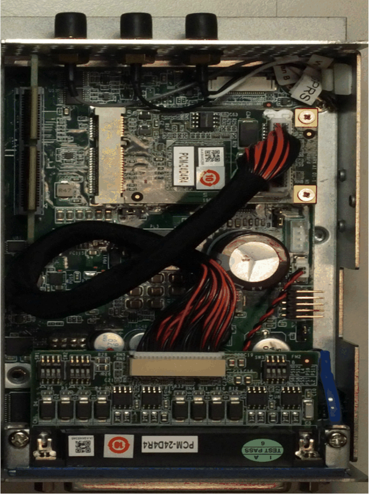
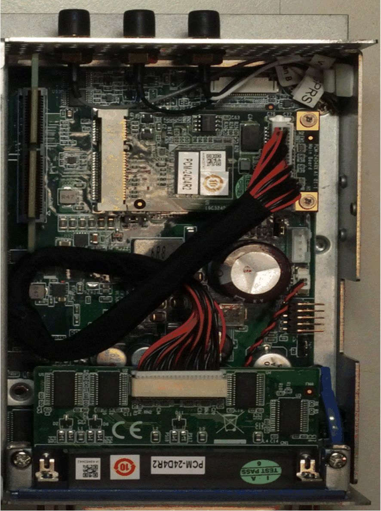
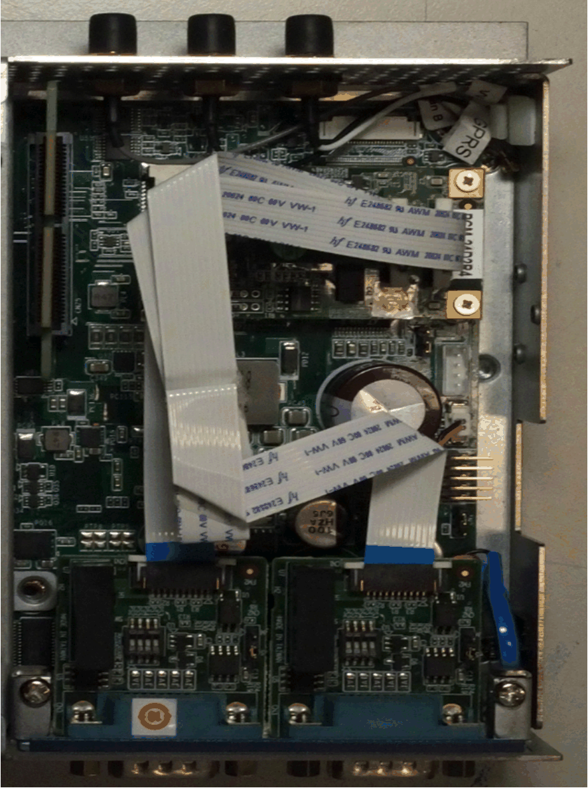
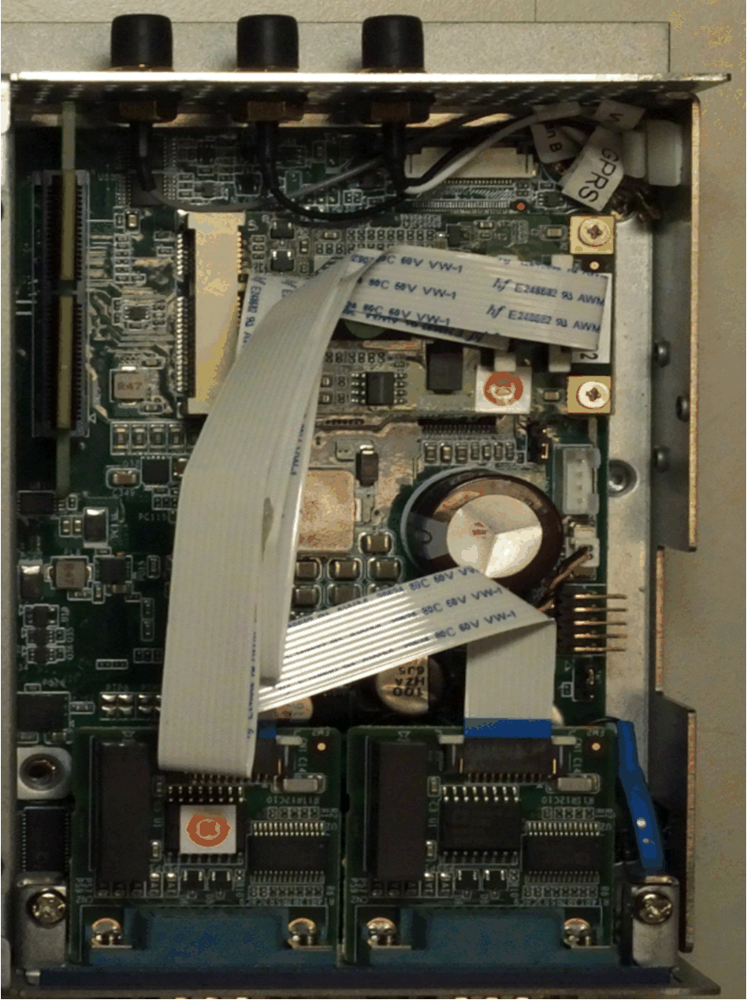
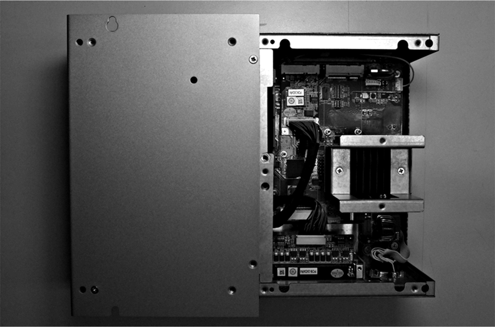
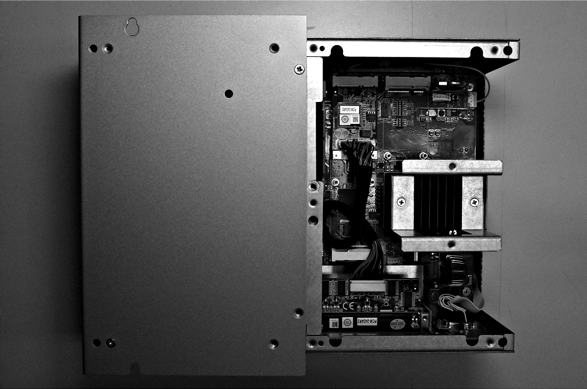
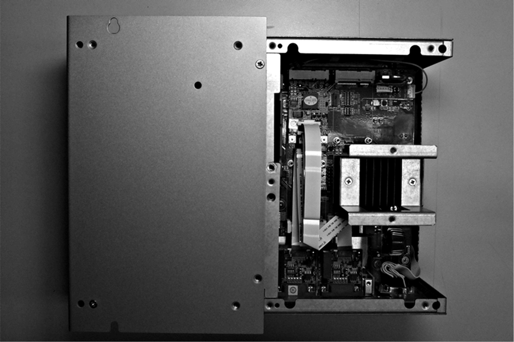
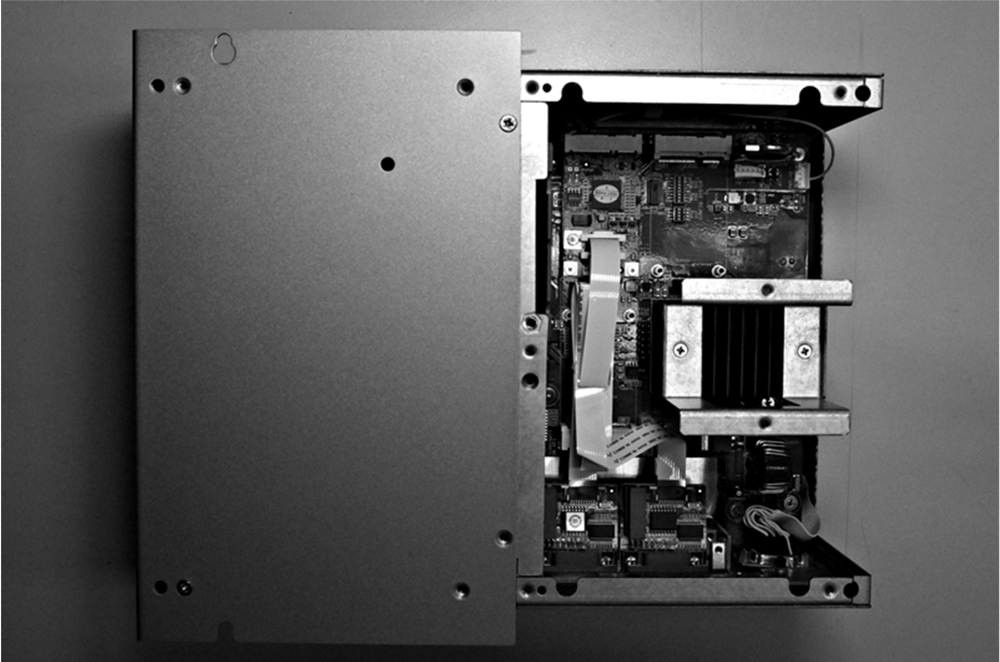

# Cable Routing

Cable Routing

Box iPC Optimized and HMIYMINSL44851:

Box iPC Optimized and HMIYMINSL42321:

Box iPC Optimized and HMIYMINSL24851:

Box iPC Optimized and HMIYMINSL22321:

Box iPC Universal/Box iPC Performance and HMIYMINSL44851:

Box iPC Universal/Box iPC Performance and HMIYMINSL42321:

Box iPC Universal/Box iPC Performance and HMIYMINSL24851:

Box iPC Universal/Box iPC Performance and HMIYMINSL22321:

