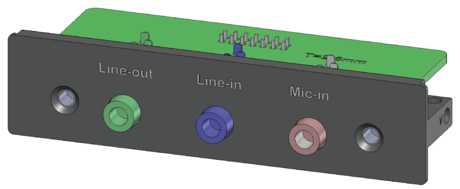

# Introduction

Introduction

The HMIYMINAUD1 is categorized as an audio interface (line in, line out, Mic in). The audio interface is composed of an audio I/O board (include metal plate), a cable for connecting I/O board and the Box iPC.

The figure shows the audio interface:

The figure shows the dimensions of the audio interface cable:

