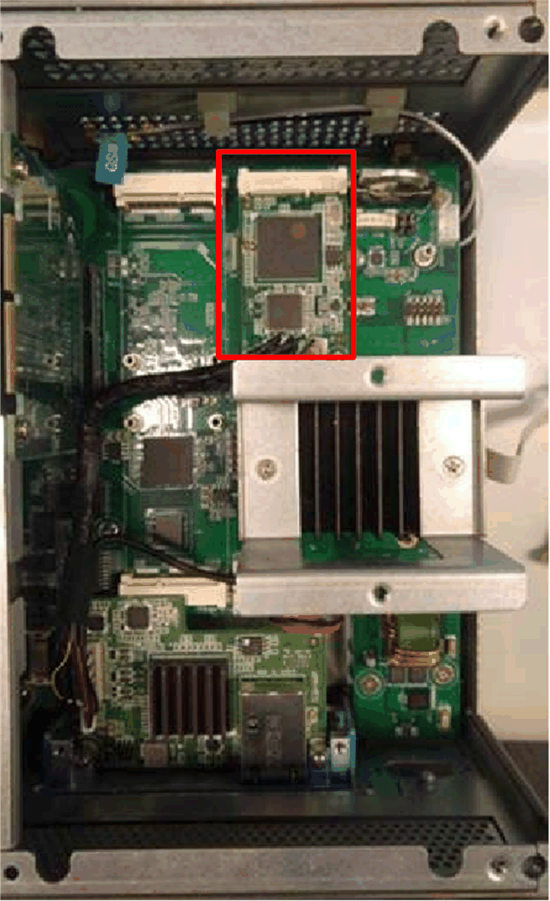

# Cable Routing

Cable Routing

Box iPC Optimized:

Box iPC Universal/Box iPC Performance:

NOTE:

oOnly one optional HMIYMINDP1 interface can be installed in the Box iPC.

oInstall the optional HMIYMINDP1 interface in the [top slot](Simple_panel_PC_-_Hardware_Modifications-12.htm#XREF_D_SE_0079520_5) of the Box iPC Universal/Box iPC Performance and the mini PCIe card on the second slot.

Box iPC Universal/Box iPC Performance with two optional Interfaces:

