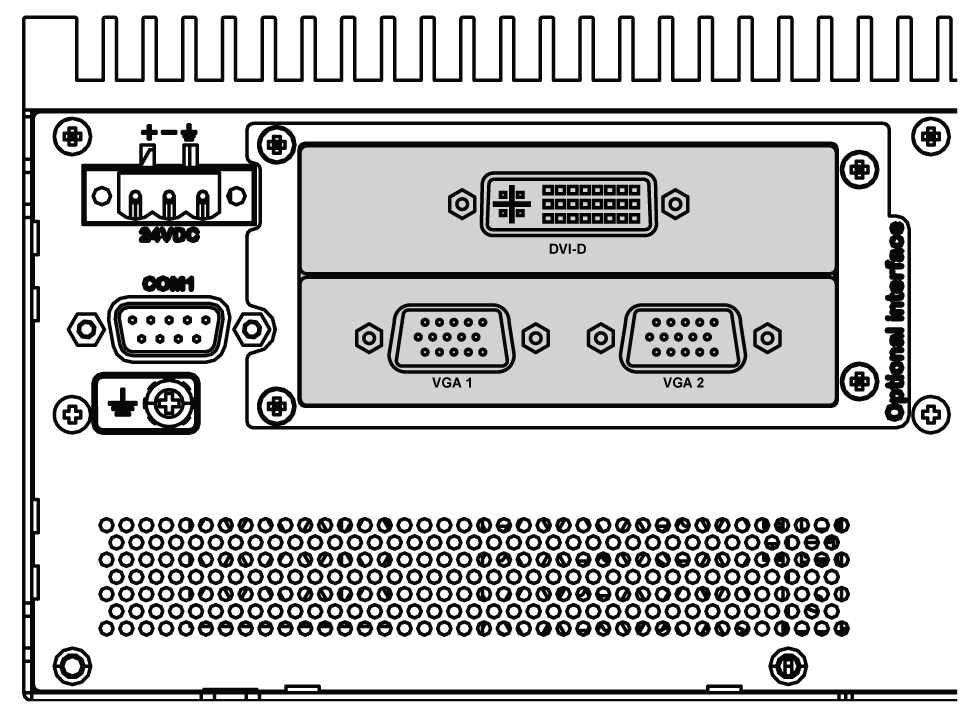
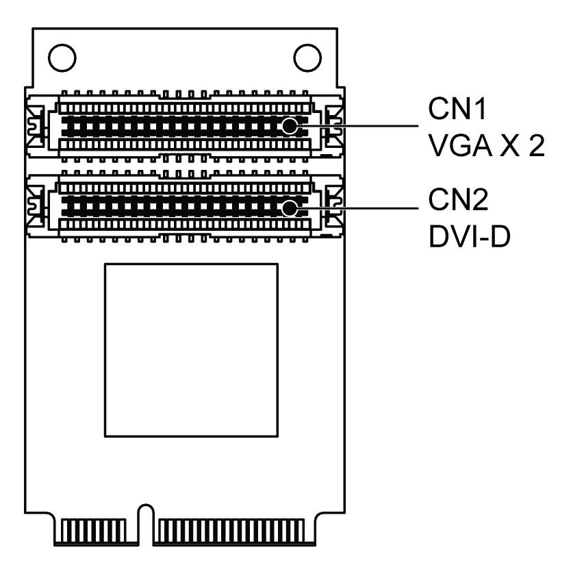

# HMIYMINVGADVID1 Optional Interface

HMIYMINVGADVID1 Optional Interface

The figure shows the HMIYMINVGADVID1 optional interface for 3 displays:

Two VGA for connection up to two displays (CN1):

One DVI-D for connection up to one display (CN2):

mini PCIe graphic card (1080 pixels) 1920 x 1080, vertical refresh rate up to 75 Hz:

NOTE: Dual display mode (CRT+CRT, supports single, clone, and dual mode).