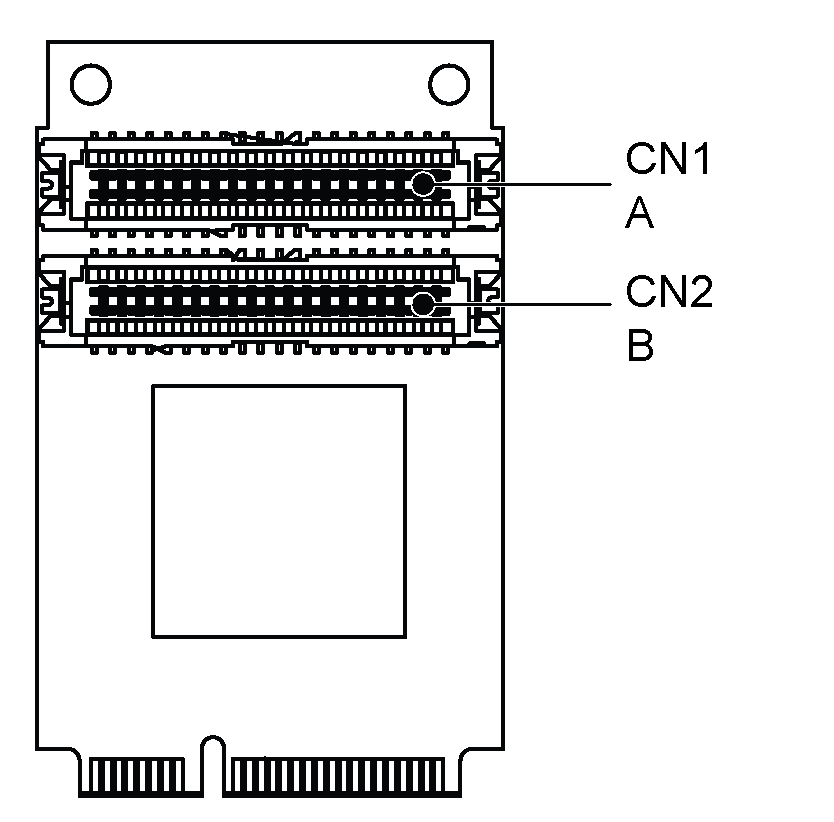

# HMIYMINDVII1 Optional Interface

HMIYMINDVII1 Optional Interface

The figure shows the HMIYMINDVII1 optional interface for 2 displays:

DVI-I cable with Y connection A and B:

mini PCIe graphic card (1080 pixels) 1920 x 1080, vertical refresh rate up to 75 Hz:

NOTE: On card has tape A on CN 1 and tape B on CN2. The cable A connect to A on mini PCIe module (CN1) and cable B connector to B on mini PCIe module (CN2).