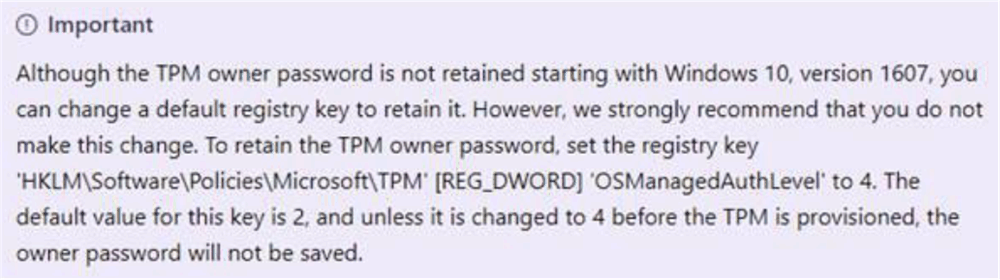

# About the TPM Owner Password

About the TPM Owner Password

Starting with Windows 10, version 1607, Windows do not retain the TPM owner password when provisioning the TPM. The password is set to a random high entropy value and then discarded.

Microsoft related link:<https://docs.microsoft.com/en-us/windows/security/hardware-protection/tpm/change-the-tpm-owner-password>

|  |
| --- |
| Caution_Color.gifCAUTION |
| UNINTENED EQUIPEMENT OPERATION |
| Follow Microsoft suggestion. We strongly recommend that you do not do this change. If you change the register value, then set the password manually. There are side effects happened and no guarantee and support from Microsoft and Schneider side. You need to take the responsibility for the result of this change. |
| Failure to follow these instructions can result in injury or equipment damage. |