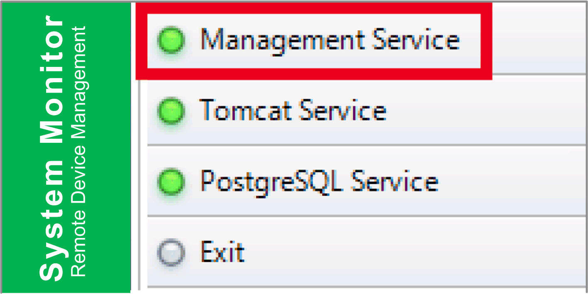

# Remote Manage Devices Any Time, Any Where

Remote Manage Devices Any Time, Any Where

System Monitor is a Console-Server-Agent web-based structure for cloud management. Agent here refers to Box iPC devices, and server refers to the server directly in contact with the agent. The server can be a physical entity located in a central control room, or a virtual host set up in a cloud. Console refers to a web-based interface that connects to the server and communicates with the agent through the server. Administrators can perform equipment status and maintenance checks on System Monitor console through an Internet browser at any time, from anywhere, using any connected device. The server-agent connection fit the MQTT communication protocol. This improves connection security and stability, and also decreases development time for System Monitor integration. The console-server-agent web-based structure not only lowers the difficulty of setting up System Monitor network environments when provisioning, but also provides a distributed connectivity structure that solves the challenges encountered with large-scale or multi-site device management. System Monitor is a real-time management platform that breaks geographical limitations. Administrators can manage all of their devices by simply using their PCs, smartphones, and tablets.

NOTE: MQTT (formerly message queue telemetry transport) is a publish-subscribe based messaging protocol for use on top of the TCP/IP protocol.

Click Management Service to start/stop main System Monitor management service:

