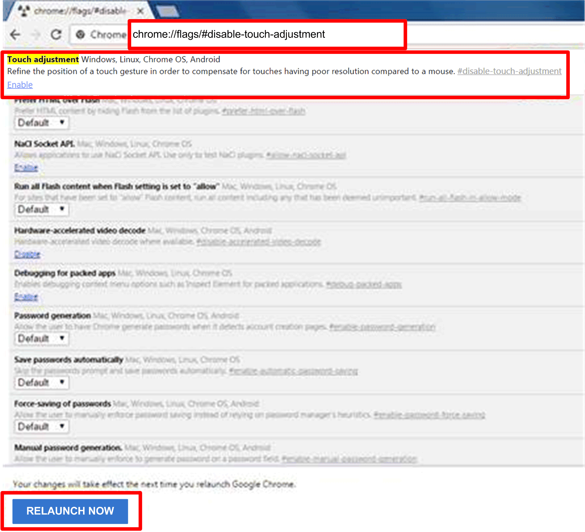

# Maintenance Status

Maintenance Status

| Step | Description |
| --- | --- |
| 1 | Maintenance status  You can modify the maintenance status (none / to be maintained / maintaining / finished) from the menu for each device:  G-SE-0043748.2.gif-high.gif |
| 2 | Devices administrator  Users with device management permissions can click the Admin field to pop up the selection dialog for administrator to reassign device administrator status to another account:  G-SE-0043738.2.gif-high.gif |
| 3 | View mode - Group status list  Click the Group tab to list groups under the selected account or group node. The group list shows all group names, group hardware status, and group software status:  G-SE-0043750.2.gif-high.gif      Group hardware status:  This field shows the number of all registered devices and incorrect hardware devices under this group.  Group software status:  This field shows the number of all registered devices and incorrect software devices under this group. |

NOTE: Use Chrome as default browser for System Monitor.

In the case, you experience difficulties to Add Devices with Touch, then:

oIn Chrome search bar, key in <chrome://flags/#disable-touch-adjustment>

oReplace the status of Touch adjustment from disable to enable.

oClick RELAUNCH NOW button.

