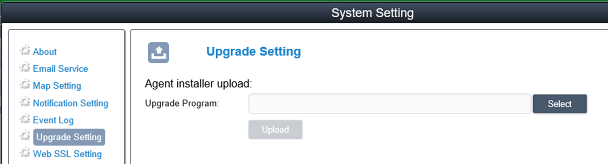

# Upgrade Setting

Upgrade Setting

Use ValidationCode\_Generator.exe tool to generate MD5 check code of uploading agent upgrade package. Input Check Code and select Upgrade Program to upload agent upgrade package to server. After uploading, system will auto check all connected agent devices and give hint tag of upgrading on corresponding device list when the user client logs in:

