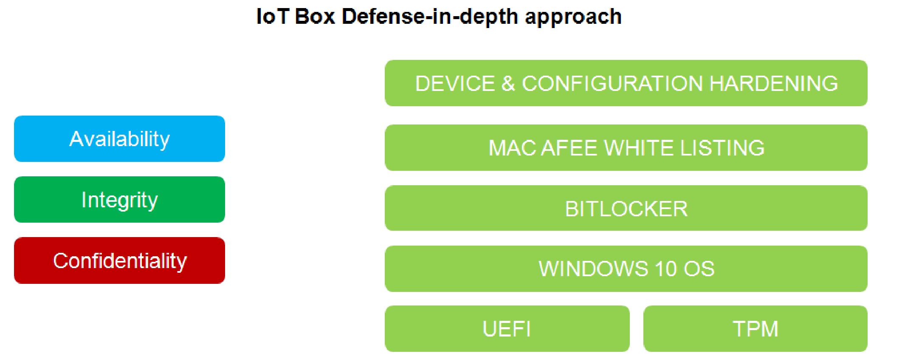

# Overview

Overview

It is a fact that Industrial and control systems are more and more vulnerable to cyber attacks due to their modern design:

oThey use commercial technologies.

oThey are more and more connected.

oThey can be remotely accessible.

oTheir strategic location in the industrial processes is a point of interest for hackers.

Industrial systems have also different cyber security objectives compared to typical IT systems.To secure properly the industrial installation, it is important to understand these differences. Three fundamental characteristics have to be considered:

oAvailability of the system: how to ensure that the system remains operational?

oIntegrity of the data: how to maintain the integrity of information?

oConfidentiality: how to avoid information disclosure?

The priorities between an industrial system and a typical IT system are not the same as described on the following diagrams:

A good recommendation to address these security objectives is to adopt a defense-in-depth approach matching these priorities.

The Box PC IIoT provides a defense-in-depth approach by default, thanks to the different security mechanisms it contains.

The Magelis Box iPC enhanced cyber security to access, communicate, and store information:

To keep the system as secured as possible, it is necessary to secure the environment where the Box is installed by following the standard recommendations described below.

Cybersecurity Support Portal: <http://www.schneider-electric.com/b2b/en/support/cybersecurity/overview.jsp>