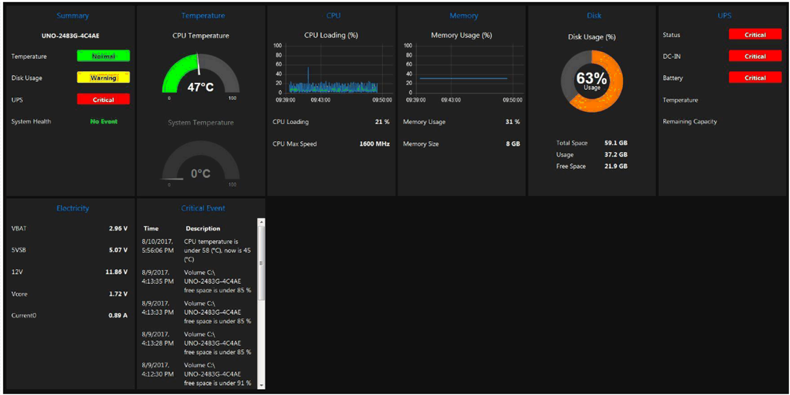

# Node-RED Dashboard

Node-RED Dashboard

You need to create your own UI to get hardware information fromSchneider-Electric Node. You can refer to the tutorial of Node-Red dashgoard guide from the following links:

o<http://noderedguide.com/tag/dashboard/>

o[http://noderedguide.com/tutorial-node-red-dashboards-creating-your-own-ui-widget//](http://noderedguide.com/tutorial-node-red-dashboards-creating-your-own-ui-widget/)

This graphic is an example of dashboard to view all hardware information.

