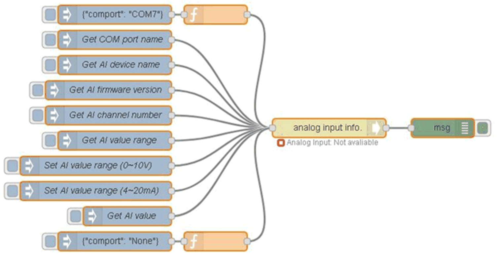

# Sample Flow

Sample Flow

You can create your own analog input module flow or you can select the Analog Input tab to get default analog input sample flow and the sample flow is as below:

| Step | Action |
| --- | --- |
| 1 | Select AI Module page. |
| 2 | Edit Node to change the setting:  G-SE-0068973.1.gif-high.gif |
| 3 | At first, COM port path setting is required to make analog input module connect to host. The other functions cannot be used before finishing analog input module connection step.  Set a COM port item in an analog input info node.  (COMx: X = number, for example, COM7, COM number depends on the host.)  G-SE-0071673.1.gif-high.gif      NOTE: It can also be set by Input {"comport": "COMx"} to analog input info. node.  (COMx: x=number, for example, COM7, COM number depends on the host.)  For example, if you want to set COM7, set msg.payload to {"comport": "COM7"} and send this message to this node.  G-SE-0071672.1.gif-high.gif |
| 4 | Select an item which you want to do in analog input info. node from Topic list.  G-SE-0071671.1.gif-high.gif |
| 5 | In analog input info node, select Get AI value from Topic list and set Channel Index field.  NOTE: f you want to target all the channels, you can set -1 in Channel Index field.  G-SE-0071670.1.gif-high.gif      NOTE: It can also be set by Input {"attribute name": true} in msg.payload to analog input info. node.  For example, if you want to get analog input value, set msg.payload to {"Get AI value": true, "chIdx": -1} and send this message to analog input info. node.  If you want to target all the channels, you can set "chIdx": -1.  If you want to target channel 2, you can set "chIdx": 2.  G-SE-0071669.1.gif-high.gif |
| 6 | If you do not need analog input module, you can set input {"comport": "None"} to disconnect the communication between host and analog input module. Disconnected step will finish after node status changes from connected to disconnected.  G-SE-0071668.1.gif-high.gif |
| 7 | Sample flow reference.  User can get all up-to-date sample flow from bellow link: C:\Program Files (x86)\Schneider Electric\IIoT\node\_modules\ node-red-contrib-seai. |