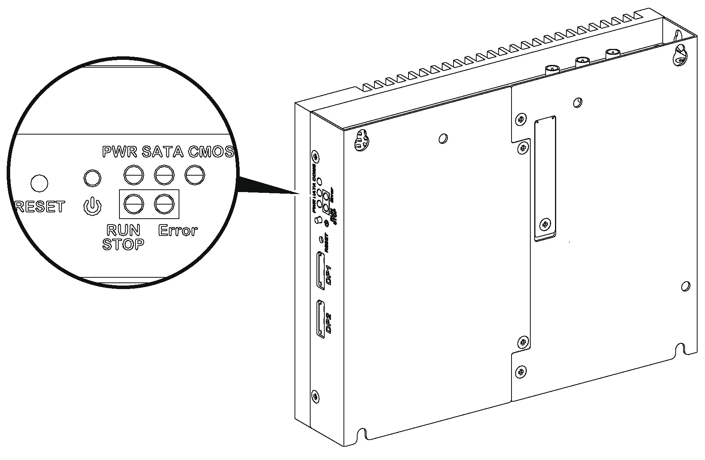
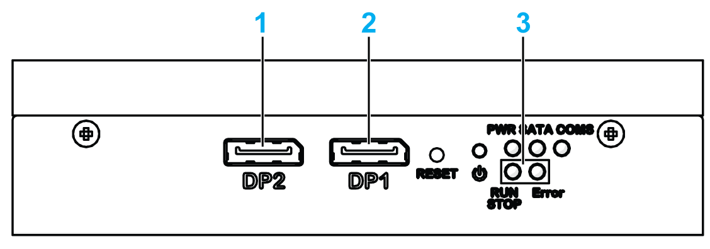
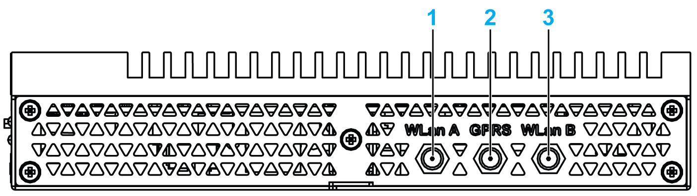
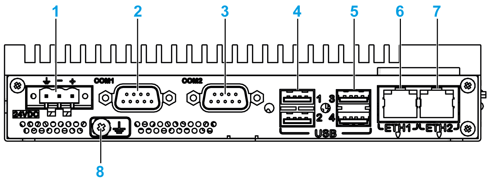
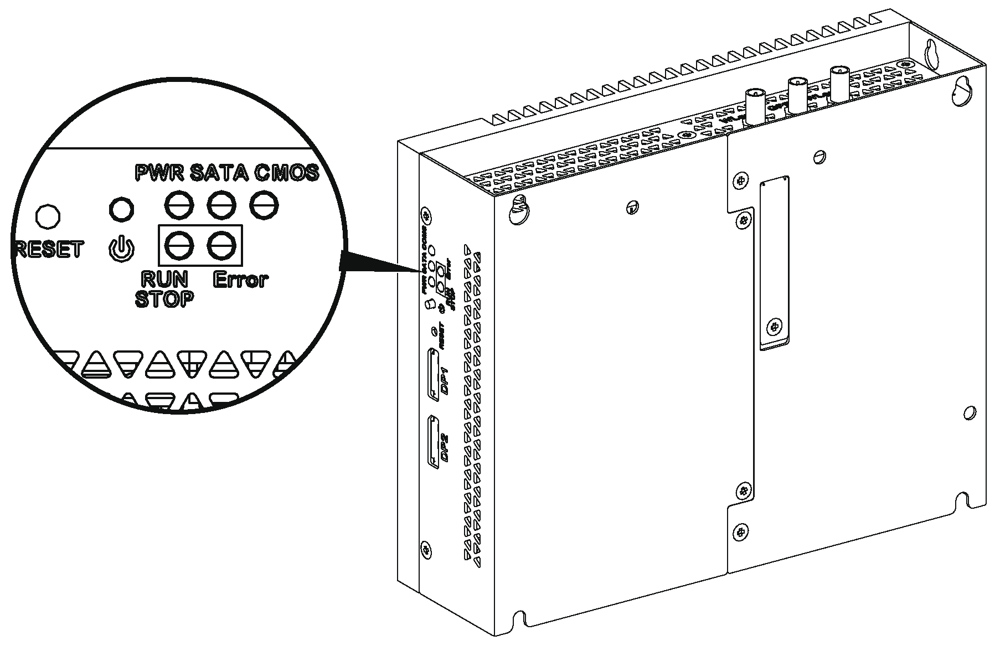
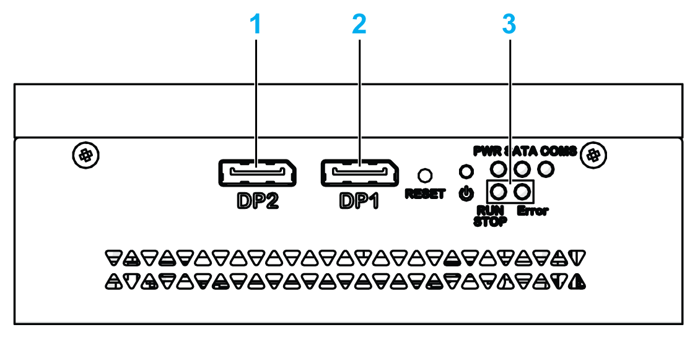
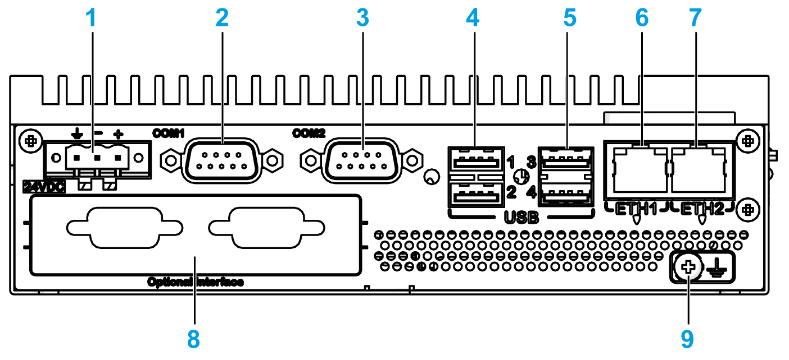

# Box iPC Optimized (HMIBMO) Description

Box iPC Optimized (HMIBMO) Description

Introduction

During operation, the surface temperature of the heat sink may exceed 70 °C (158 °F).

|  |
| --- |
| Warning_Color.gifWARNING |
| RISK OF BURNS |
| Do not touch the surface of the heat sink during operation. |
| Failure to follow these instructions can result in death, serious injury, or equipment damage. |

Box iPC Optimized Regular Description

Overview

   Power ON/OFF button, reset button, and LEDs

The table describes the meaning of the status indicators:

| Marking | LED | Color | State | Meaning |
| --- | --- | --- | --- | --- |
| PWR | Power | Green | On | Active (user operates Windows) (State 0). |
| Green | Flashing | Sleep (State 3). |
| Orange | On | Hibernate (State 4/State 5). |
| SATA | SATA | Green | Off | No storage data transmission. |
| On | Storage data transmission. |
| CMOS | Battery | Orange | On | RTC voltage < 2.65 Vdc. |
| Off | RTC voltage > 2.65 Vdc. |
| Programmable LED for optional control software | | | | |
| RUN/STOP | RUN/STOP from control software | Red | Off | Stop |
| Green | On | Run |
| Error | Error from control software | Red | Off | Control software has no error. |
| On | Control software has an error. |

Front View

1   DisplayPort 2

2   DisplayPort 1

3   LEDs and power/reset button

Top View

1   SMA connector for the WLan A external antenna

2   SMA connector for the GPRS/4G external antenna

3   SMA connector for the WLan B external antenna

Bottom View

1   DC power connector

2   COM1 port RS-232 (non-isolated)

3   COM2 port RS-232 (non-isolated), RS-422/485 (non-isolated)

4   USB1 and USB2 (USB 2.0)

5   USB3 and USB4 (USB 3.0)

6   ETH1 (10/100/1000 Mb/s) IEEE1588

7   ETH2 (10/100/1000 Mb/s) IEEE1588

8   Ground connection pin

Box iPC Optimized Expandable Description

Overview

   Power ON/OFF button, reset button, and LEDs

The table describes the meaning of the status indicators:

| Marking | LED | Color | State | Meaning |
| --- | --- | --- | --- | --- |
| PWR | Power | Green | On | Active (user operates Windows) (State 0). |
| Green | Flashing | Sleep (State 3). |
| Orange | On | Hibernate (State 4/State 5). |
| SATA | SATA | Green | Off | No storage data transmission. |
| On | Storage data transmission. |
| CMOS | Battery | Orange | On | RTC voltage < 3 Vdc. |
| Off | RTC voltage > 3 Vdc. |
| Programmable LED for optional control software | | | | |
| RUN/STOP | RUN/STOP from control software | Red | Off | Stop |
| Green | On | Run |
| ERR | Error from control software | Red | Off | Control software has no error. |
| On | Control software has an error. |

Front View

1   DisplayPort 2

2   DisplayPort 1

3   LEDs and power/reset button

Top View

1   SMA connector for the WLan A external antenna

2   SMA connector for the GPRS/4G external antenna

3   SMA connector for the WLan B external antenna

Bottom View

1   DC power connector

2   COM1 port RS-232 (non-isolated)

3   COM2 port RS-232 (non-isolated), RS-422/485 (non-isolated)

4   USB1 and USB2 (USB 2.0)

5   USB3 and USB4 (USB 3.0)

6   ETH1 (10/100/1000 Mb/s) IEEE1588

7   ETH2 (10/100/1000 Mb/s) IEEE1588

8   Optional interface

9   Ground connection pin

Box iPC Optimized and Display Description

Overview

NOTE:

oWindows setting (with drivers already installed): The Box iPC Optimized can support two DisplayPort at the same time when mounted with a display (HMIDM).

oAfter DisplayPort cable is plugged, Operating System must be reboot.

oFor connecting the Box iPC on display with DVI interface, use an active DP to DVI cable: HMIYADDPDVI11 (see in accessories).

Bottom View

1   Display

2   Optional AC power supply module (HMIYPSOMAC1 or HMIYMMAC1)

3   Box iPC

EIO0000002042.06

© 2019 Schneider Electric. All rights reserved.