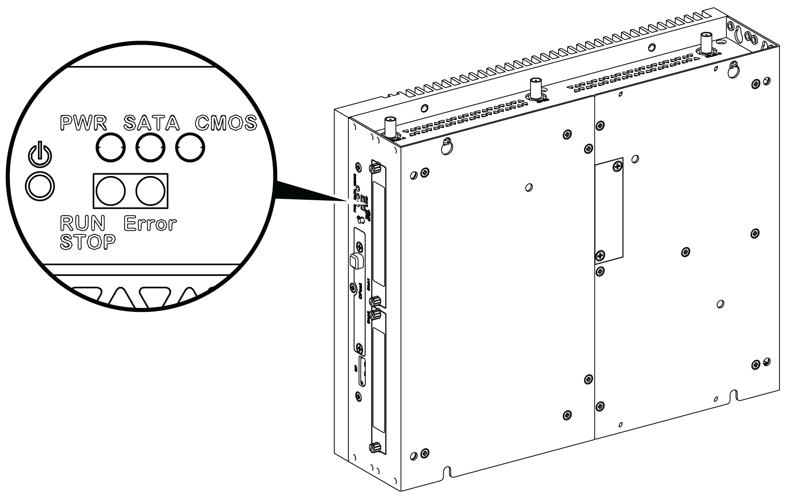
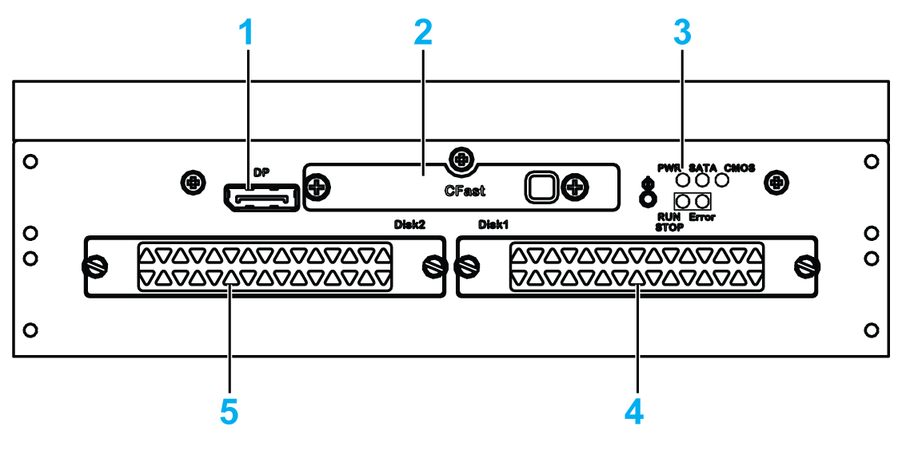
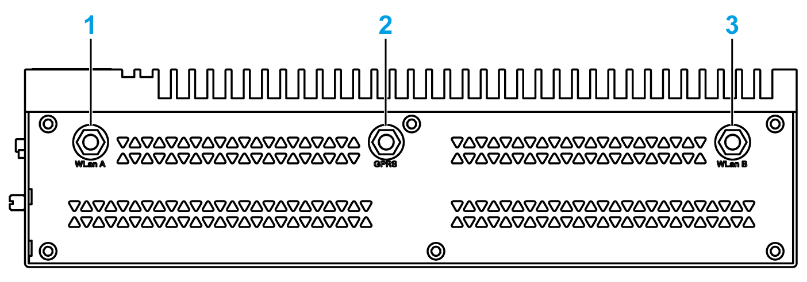
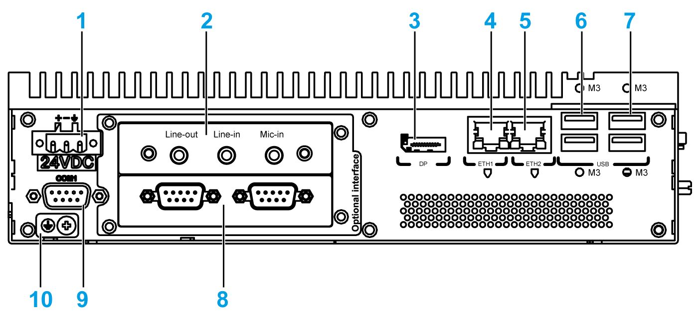
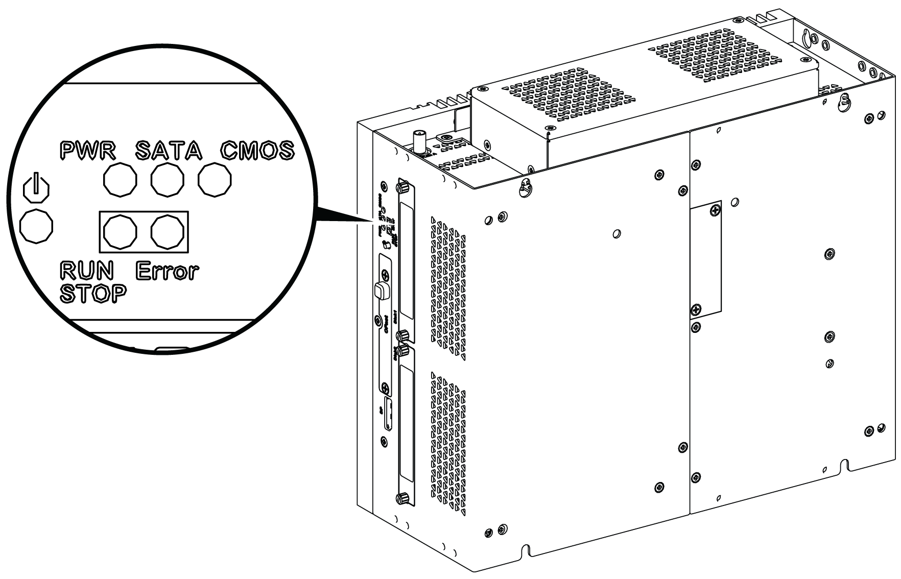
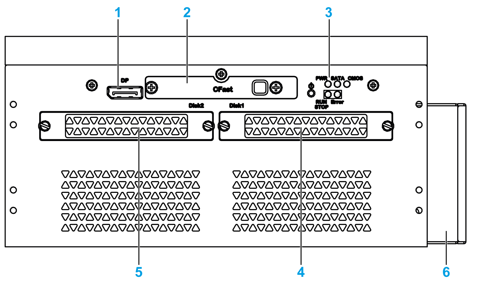
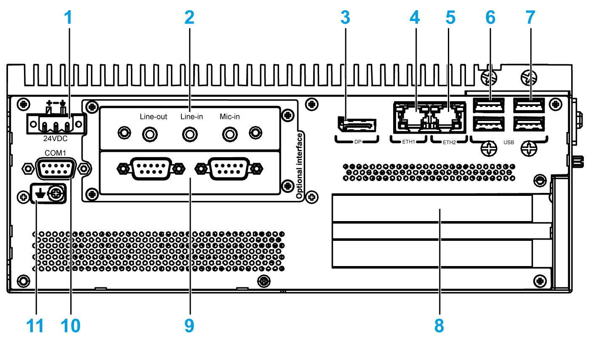

# Box iPC Universal and Performance (HMIBMU/HMIBMP) Description

Box iPC Universal and Performance (HMIBMU/HMIBMP) Description

Introduction

During operation, the surface temperature of the heat sink may exceed 70 °C (158 °F).

|  |
| --- |
| Warning_Color.gifWARNING |
| RISK OF BURNS |
| Do not touch the surface of the heat sink during operation. |
| Failure to follow these instructions can result in death, serious injury, or equipment damage. |

Box iPC 2-Slot Description

Overview

   Power ON/OFF button and LEDs

The table describes the meaning of the status indicators:

| Marking | LED | Color | State | Meaning |
| --- | --- | --- | --- | --- |
| PWR | Power | Green | On | Active (user operates Windows) (State 0). |
| Green | Flashing | Sleep (State 3). |
| Orange | On | Hibernate (State 4/State 5). |
| SATA | SATA | Green | Off | No storage data transmission. |
| On | Storage data transmission. |
| CMOS | Battery | Orange | On | RTC voltage < 2.65 Vdc. |
| Off | RTC voltage > 2.65 Vdc. |
| Programmable LED for optional control software | | | | |
| RUN/STOP | RUN/STOP from control software | Red | Off | Stop |
| Green | On | Run |
| ERR | Error from control software | Red | Off | Control software has no error. |
| On | Control software has an error. |

Front View

1   DisplayPort 2

2   Slide-in CFast slot

3   LEDs and power/reset button

4   HDD/SSD 1 (hot swap and can be RAID configuration)

5   HDD/SSD 2 (hot swap and can be RAID configuration)

Top View

1   SMA connector for the WLan external antenna

2   SMA connector for the GPRS/4G external antenna

3   SMA connector for the WLan external antenna

Bottom View

1   DC power connector

2   Optional interface 1

3   DisplayPort 1

4   ETH1 (10/100/1000 Mb/s) IEEE1588

5   ETH2 (10/100/1000 Mb/s) IEEE1588

6   USB1 and USB2 (USB 3.0)

7   USB3 and USB4 (USB 2.0)

8   Optional interface 2

9   COM1 port RS-232, RS-422/485 (isolated)

10   Ground connection pin

Box iPC 4-Slot Description

Overview

   Power ON/OFF button and LEDs

The table describes the meaning of the status indicators:

| Marking | LED | Color | State | Meaning |
| --- | --- | --- | --- | --- |
| PWR | Power | Green | On | Active (user operates Windows) (State 0). |
| Green | Flashing | Sleep (State 3). |
| Orange | On | Hibernate (State 4/State 5). |
| SATA | SATA | Green | Off | No storage data transmission. |
| On | Storage data transmission. |
| CMOS | Battery | Orange | On | RTC voltage < 2.65 Vdc. |
| Off | RTC voltage > 2.65 Vdc. |
| Programmable LED for optional control software | | | | |
| RUN/STOP | RUN/STOP from control software | Red | Off | Stop |
| Green | On | Run |
| ERR | Error from control software | Red | Off | Control software has no error. |
| On | Control software has an error. |

Front View

1   DisplayPort 2

2   Slide-in CFast slot

3   LEDs and power/reset button

4   HDD/SSD 1 (hot swap and can be RAID configuration)

5   HDD/SSD 2 (hot swap and can be RAID configuration)

6   Fan

Top View

1   SMA connector for the WLan external antenna

2   SMA connector for the GPRS/4G external antenna

3   SMA connector for the WLan external antenna

4   Fan

Bottom View

1   DC power connector

2   Optional interface 1

3   DisplayPort 1

4   ETH1 (10/100/1000 Mb/s) IEEE1588

5   ETH2 (10/100/1000 Mb/s) IEEE1588

6   USB1 and USB2 (USB 3.0)

7   USB3 and USB4 (USB 2.0)

8   PCI or PCIe (peripheral component interconnect express) slots

9   Optional interface 2

10   COM1 port RS-232, RS-422/485 (isolated)

11   Ground connection pin

Box iPC and Display Description

Overview

NOTE:

oThe Box iPC (HMIBMU/HMIBMP) can support two DisplayPort. When the Box iPC is mounted with the display, the DisplayPort 2 is not functional.

oAfter DisplayPort cable is connected, Operating System must be rebooted.

oFor connecting the Box iPC to a display with DVI interface, use an active DP to DVI cable: HMIYADDPDVI11 (see in accessories).

Bottom View

1   Display

2   Optional AC power supply module (HMIYMMAC1)

3   Box iPC

EIO0000002042.06

© 2019 Schneider Electric. All rights reserved.