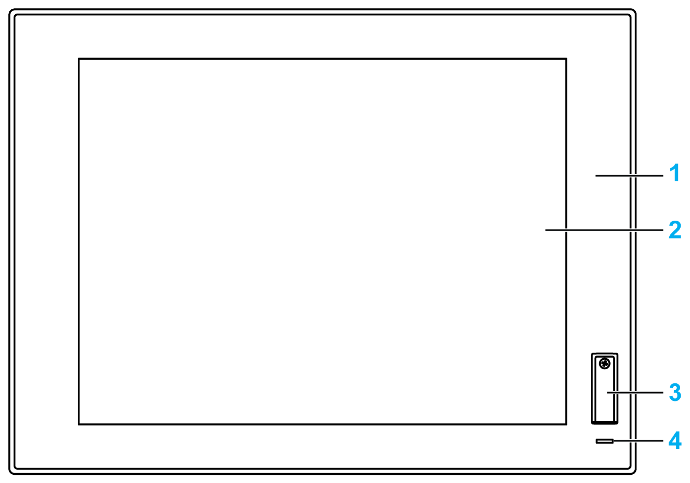
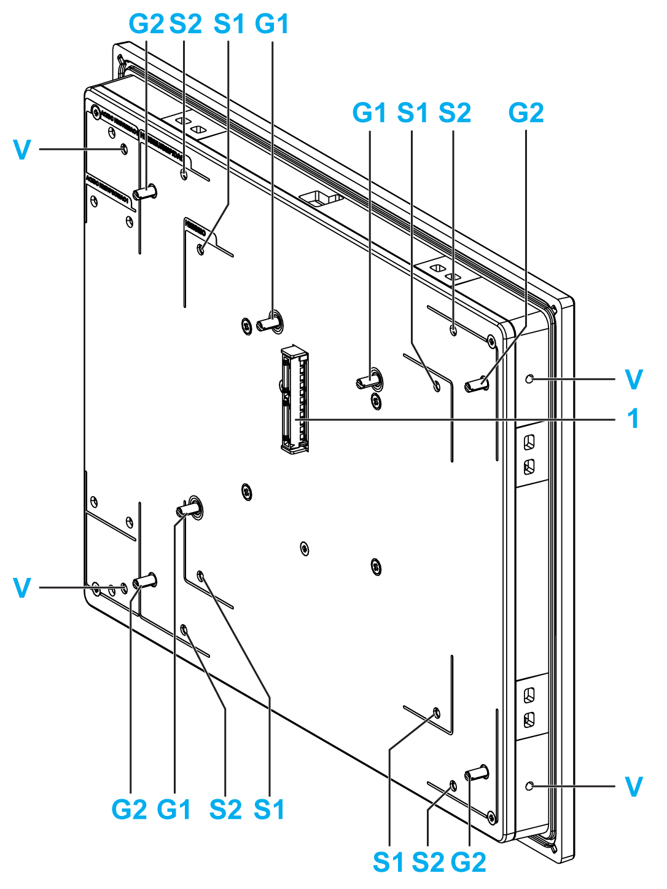

# Displays Description

Displays Description

Front View Displays 4:3 12” or 4:3 15”

The display 4:3 12” and 4:3 15” have a touch screen with analog-resistive touch technology that may operate abnormally when two or more points are touched.

|  |
| --- |
| Warning_Color.gifWARNING |
| UNINTENDED EQUIPMENT OPERATION |
| Do not touch two or more points on display. |
| Failure to follow these instructions can result in death, serious injury, or equipment damage. |

1   Panel (4:3 12” or 4:3 15”)

2   Single-touch panel

3   USB port (USB 2.0) and reset button

4   Status indicator

NOTE: If the display is connected with a Display Adapter, the reset button is only for the Display Adapter reset. If the display is connected with a Box iPC, the reset button is for the Box iPC reset.

NOTE: The front USB is a diagnostic interface for service and maintenance.

|  |
| --- |
| Warning_Color.gifWARNING |
| UNINTENDED EQUIPMENT OPERATION |
| oDo not use the front USB while the machine is in operation.  oAlways keep the cover in place during normal operation. |
| Failure to follow these instructions can result in death, serious injury, or equipment damage. |

Front View Displays W12”, W15”, W19” or W22”

The display W12”, W15”, W19” and W22” multi-touch have a touch screen with projected capacitive touch technology that may operate abnormally when the surface is wet.

|  |
| --- |
| Warning_Color.gifWARNING |
| LOSS OF CONTROL |
| oDo not touch the touch screen area during Operating System startup.  oDo not operate when the touch screen surface is wet.  oIf the touch screen surface is wet, remove any excessive water with a soft cloth before operation.  oMake sure to use only the authorized grounding configurations shown in the grounding procedure. |
| Failure to follow these instructions can result in death, serious injury, or equipment damage. |

NOTE:

oThe touch control is disabled in case of abnormal touch (like water) for a few seconds to avoid accidental touch. The normal touch function will be recovered a few seconds after removing the abnormal touch condition.

oDo not touch the touch screen area during Operating System startup since "touch panel firmware" initializes automatically when Windows starts up.

1   Panel (W12” or W15” or W19” or W22”)

2   Multi-touch panel

3   Status indicator

Status Indicator

The table describes the meaning of the status indicator of the Displays with Box iPC:

| Color | State | Meaning |
| --- | --- | --- |
| Green | On | Active (user operates Windows) (State 0). |
| Green | Flashing | Sleep (State 1/State 2/State 3). |
| Orange | On | Hibernate (State 4/State 5). |

The table describes the meaning of the status indicator of the Displays with Display Adapter:

| Color | State | Meaning |
| --- | --- | --- |
| Green | On | Active (user operates Windows) (State 0). |
| Orange | On | Sleep (State 1/State 2) and hibernate (State 3/State 4/State 5). |

Rear View Displays 4:3 15”, W15”, W19” or W22”

1   Panel connector for the Box iPC or Display Adapter

G1   Removal panel guide for the Box iPC Optimized

S1   Mounting hole for the Box iPC Optimized

G2   Removal panel guide for the Box iPC Universal/Performance or Display Adapter

S2   Mounting hole for the Box iPC Universal/Performance or Display Adapter

V   Mounting hole for the VESA (HMIYPVESA21 or HMIYPVESA41) kit

Rear View Displays 4:3 12” or W12”

1   Panel connector for the Box iPC or Display Adapter

G1   Removal panel guide for the Box iPC Optimized

S1   Mounting hole for the Box iPC Optimized

G2   Removal panel guide for the Box iPC Universal/Performance or Display Adapter

S2   Mounting hole for the Box iPC Universal/Performance or Display Adapter

V   Mounting hole for VESA (HMIYPVESA6X21)

EIO0000002042.06

© 2019 Schneider Electric. All rights reserved.