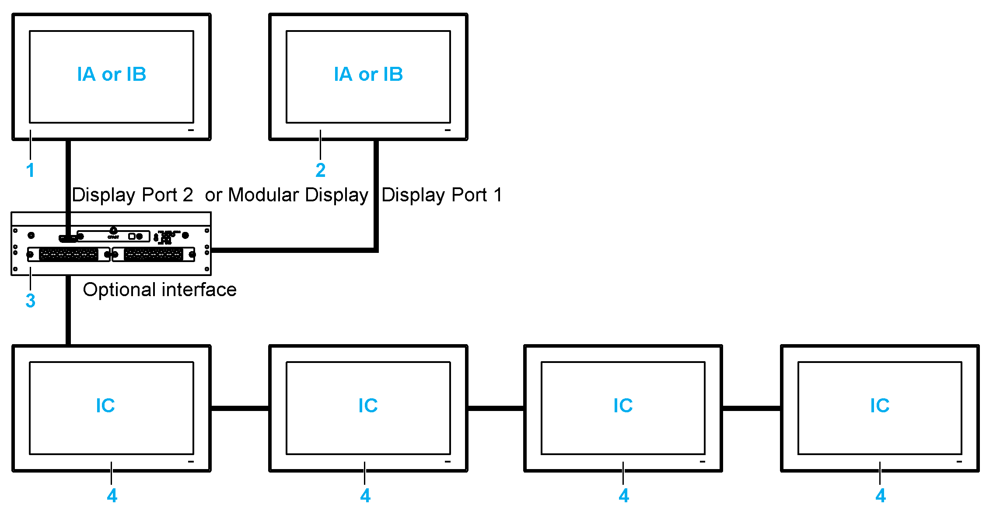
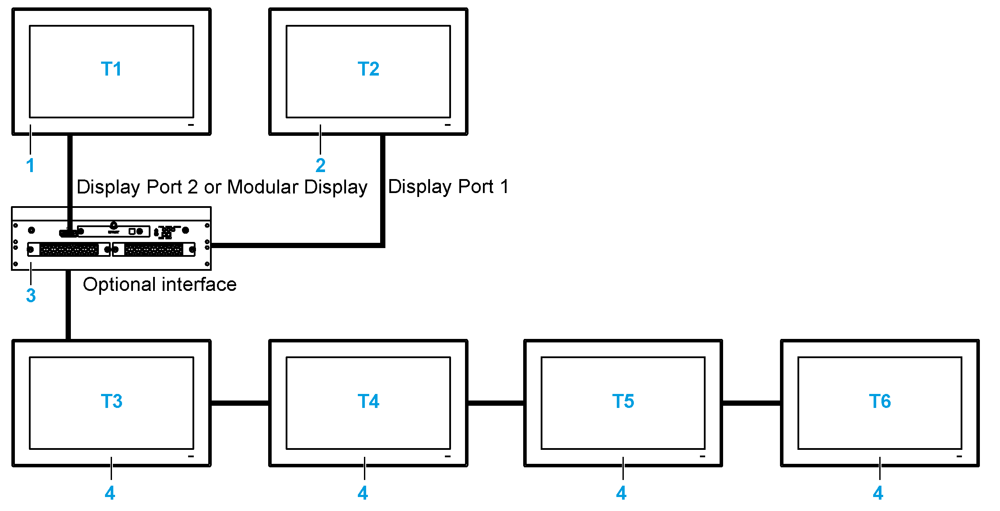
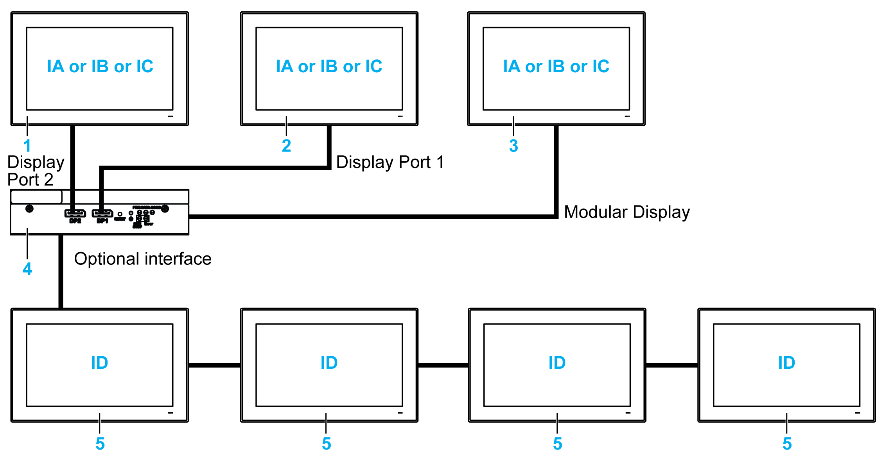
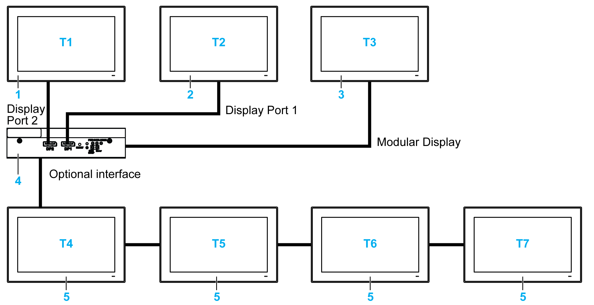
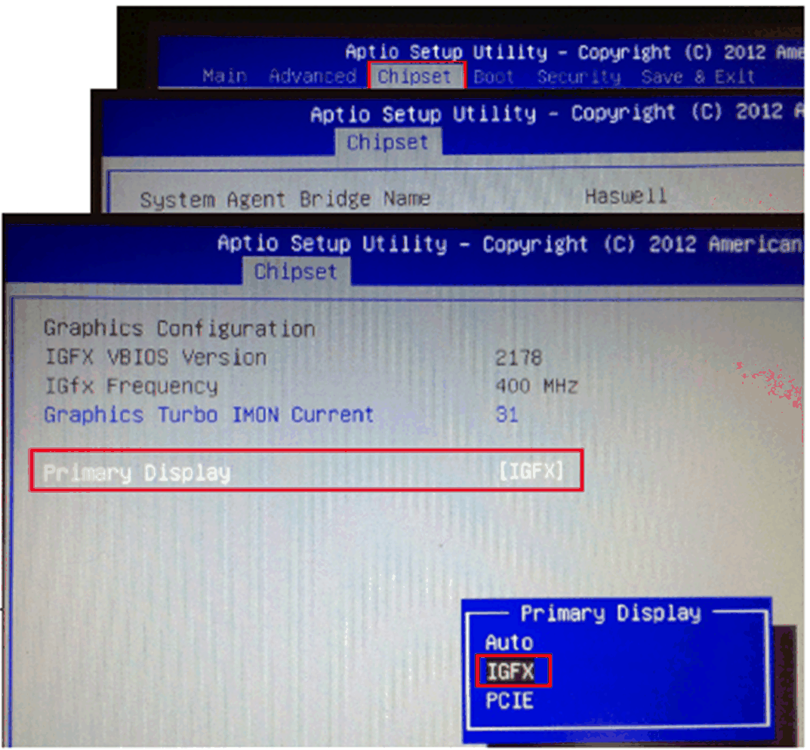

# Displays and Touch Behavior

Displays and Touch Behavior

Displays Behavior for HMIBMU/HMIBMP/HMIBMI

IA, IB, IC   Images (with Windows setting)

1   Local displays and Display Adapters

2   Display Adapters

3   Box iPC Universal/Performance/Optimized

4   Remote displays and Display Adapters with Receiver/Transmitter module

NOTE:

oThe resolution is defined by the Receiver module or Windows settings.

oThe HMIBMI has only one DisplayPort.

Touch Function Behavior for HMIBMU/HMIBMP/HMIBMI

T1, T2, T3, T4, T5, T6   Touch functions

1   Local displays and Display Adapters

2   Display Adapters

3   Box iPC Universal/Performance/Optimized

4   Remote displays and Display Adapters with Receiver/Transmitter module

NOTE: The HMIBMI has only one DisplayPort.

Displays Behavior for HMIBMO

IA, IB, IC, ID   Images (with Windows setting)

1   Display Adapters

2   Display Adapters

3   Local displays

4   Box iPC Optimized

5   Remote displays and Display Adapters with Receiver/Transmitter module

NOTE: The resolution is defined by the Receiver module or Windows settings.

Touch Function Behavior for HMIBMO

T1, T2, T3, T4, T5, T6, T7   Touch functions

1   Display Adapters

2   Display Adapters

3   Local displays

4   Box iPC Optimized

5   Remote displays and Display Adapters with Receiver/Transmitter module

Graphic Setting

For each display, a software tool is available to enable/disable touch-panel operation. You can disable up to three touch panels to monopolize the touch operation, the display order must match the tool. The exclusive Touch function is set to be effective for 100 ms even after a finger leaves the display.

Check that the BIOS Graphic of the Box iPC is set to {IGFX}, as follows:

1.BIOS > Chipset > System Agent (SA) Configuration

2.Graphics configuration

3.Primary Display > IGFX

4.Save and exit BIOS

Touch Setting

| Step | Action |
| --- | --- |
| 1 | Click the Search icon (for example WE8.1).  G-SE-0058525.3.gif-high.gif      NOTE:  oFor short distance display, make sure under extended mode to do tablet PC for display 2.  oSee extended mode |
| 2 | Type Tablet in the Search field and select Tablet PC Settings.  G-SE-0058526.2.gif-high.gif |
| 3 | Click Setup.  G-SE-0058527.2.gif-high.gif |
| 4 | Set the two touch screens separately following the instructions shown on the display.  G-SE-0058528.2.gif-high.gif |
| 5 | Set another touch screen.  G-SE-0061521.1.gif-high.gif |
| 6 | Finish |

Calibration of Resistive Displays 4:3 12” and 4:3 15”

NOTE:

oYou do not need to do calibration, only if the touch is not accurate.

oMake sure to do Tablet PC Settings. For details, refer to the [Touch Setting](#XREF_D_SE_0079503_41).

oOpen PenMount Control Panel from Task bar and click Assign ID button.

oCheck which controller ID is related with which display (by disconnecting cable, and so on,…)

| Step | Action |
| --- | --- |
| 1 | Modify the multiple display settings: select the display 2 and select show only on 2.  G-SE-0068222.1.gif-high.gif |
| 2 | Use PenMount Control Panel to disable other touch that does need require calibration.  G-SE-0061517.2.gif-high.gifG-SE-0068221.1.gif-high.gif |
| 3 | Click Standard Calibration.  G-SE-0061514.2.gif-high.gif |
| 4 | G-SE-0061516.1.gif-high.gif  Calibration touch screen: |
| 5 | Wait for positioning data processing.  Final touch and calibration complete:.  G-SE-0061513.1.gif-high.gif  NOTE: Repeat step 1...5 if you want to calibrate another displays. |
| 6 | Use PenMount Control Panel to enable touch.  G-SE-0068220.1.gif-high.gifG-SE-0068219.1.gif-high.gif |
| 7 | Change the multiple display settings: select the display 1 and select Extend these displays.  G-SE-0061520.2.gif-high.gif |

NOTE: The wide capacity displays (W12”, W15”, W19”, W22”) have default calibrations.

PenMount Touch Driver Installation for Third-Party PC

When connecting to a third-party PC, the touch driver must be installed.The driver is already installed on the Magelis Box iPC.

Use this process to install PenMount driver and Control Panel. The installation package and utility only have an English version (see the DVD delivered with the Display Adapter).

| Step | Action |
| --- | --- |
| 1 | Double-click Setup.exe in the PenMount Windows Universal Driver installation Package and click Next to start.  G-SE-0058395.1.gif-high.gif |
| 2 | Click I Agree to continue.  G-SE-0058394.1.gif-high.gif |
| 3 | Click Browse… to select the folder you want to install and click Install to continue.  G-SE-0058393.1.gif-high.gif      Result: Wait until the installation is finished.  G-SE-0058392.1.gif-high.gif |
| 4 | Click Finish to reboot the system.  G-SE-0058391.1.gif-high.gif |
| 5 | After reboot, the installation process is finished. Then, you can click PenMount Control Panel to adjust the settings of your touch panel.  G-SE-0058396.2.gif-high.gif |
| 6 | Assign the Controller ID for first time.  G-SE-0068225.1.gif-high.gif |
| 7 | If host PC has monitor (DM or third-party panel), modify the Table PC Settings for first time.  G-SE-0068224.1.gif-high.gif |

Disabling the Touch Function for a Display

| Step | Action |
| --- | --- |
| 1 | Click PenMount Monitor icon in the tray bar, the contextual menu displays the Control Panel. |
| 2 | Click the Control Panel. |
| 3 | Select the display and click Configure. |
| 4 | Select Exclusive Touch Utility. |
| 5 | Exclusive touch tool:  G-SE-0054103.2.gif-high.gif      NOTE: Exclusive touch tool cannot turn off the touch panel itself when operating. |
| 6 | Set Touch Enable to Off for each display. |

EIO0000002042.06

© 2019 Schneider Electric. All rights reserved.