# Display Dimensions

Display Dimensions

Display 4:3 12” Dimensions

Display 4:3 12” Dimensions with Fasteners

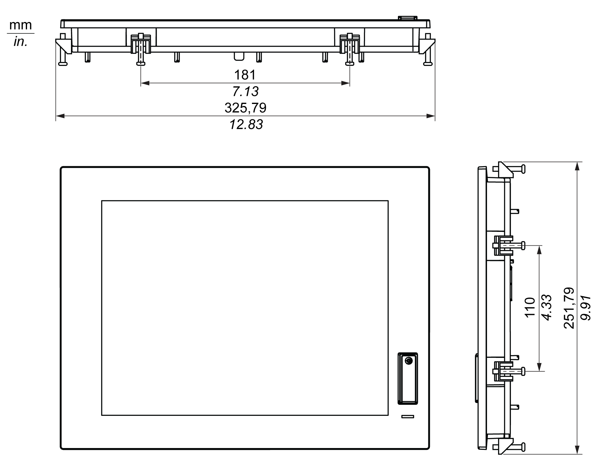

Display W12” Dimensions

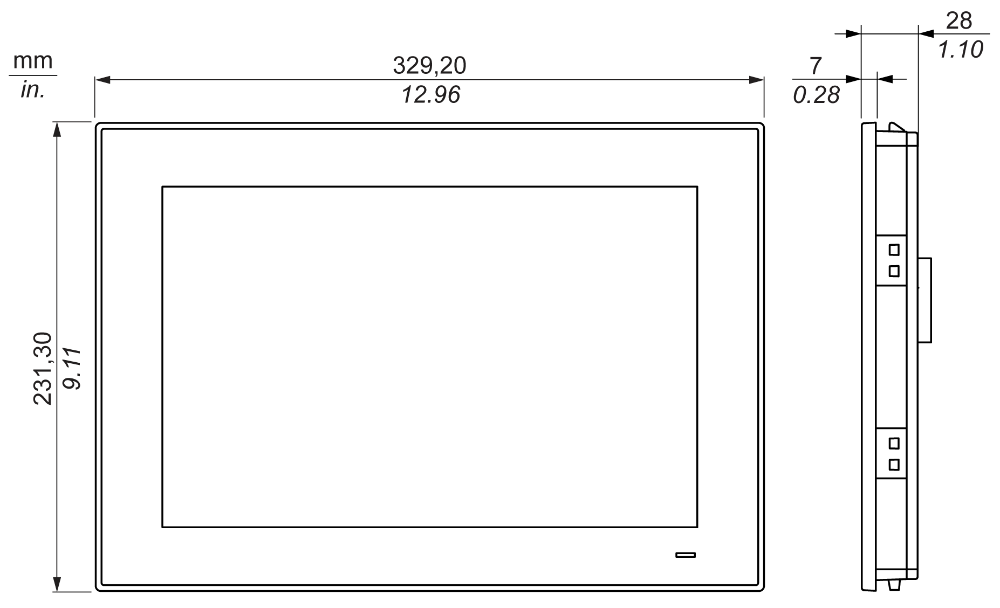

Display W12” Dimensions with Fasteners

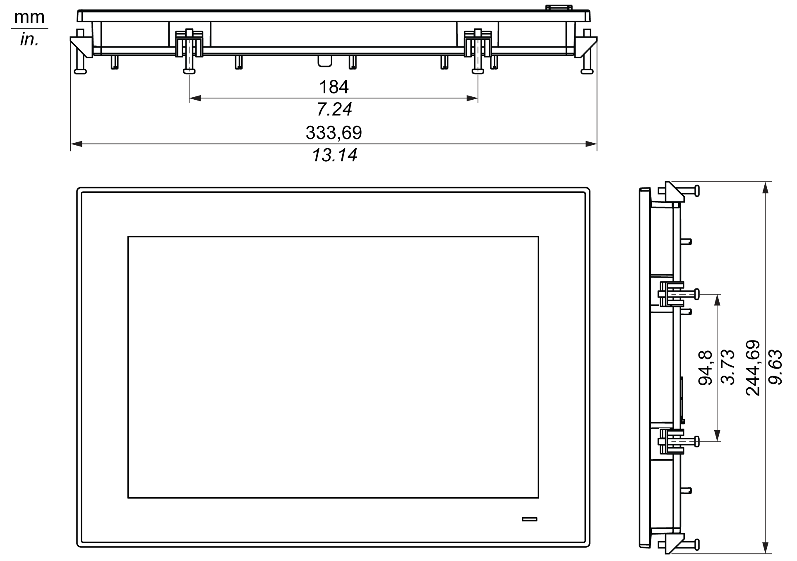

Display 4:3 15” Dimensions

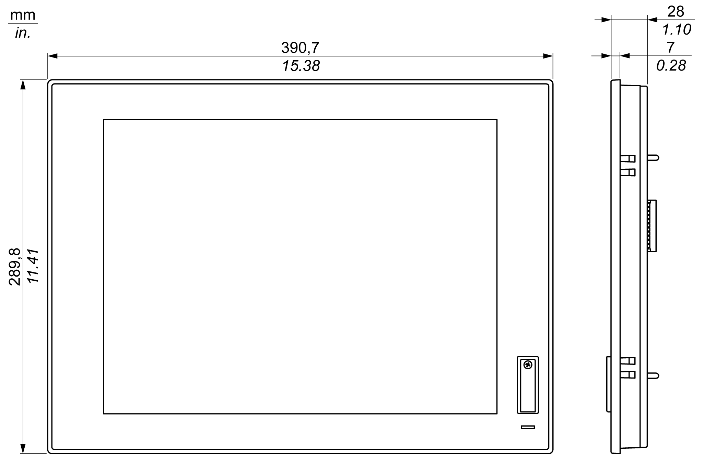

Display 4:3 15” Dimensions with Fasteners

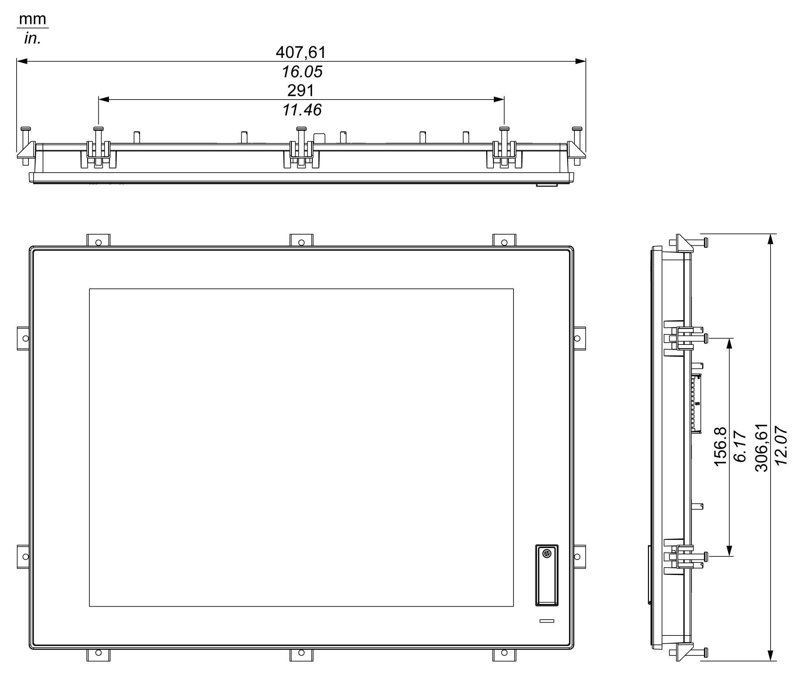

Display W15” Dimensions

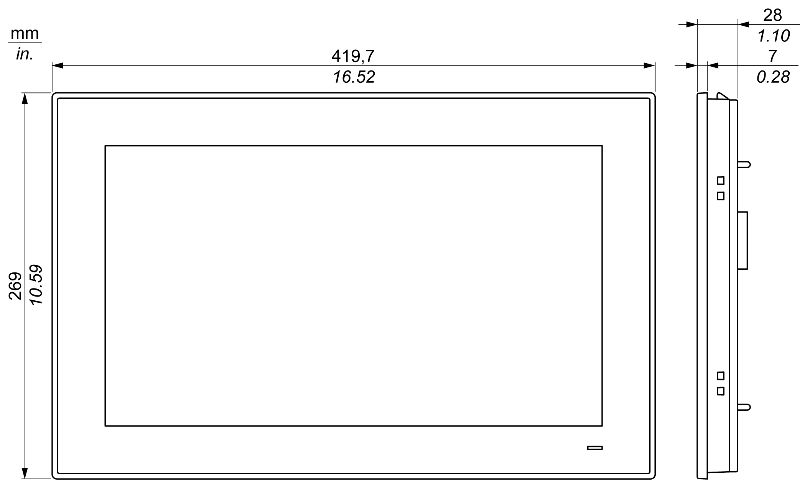

Display W15” Dimensions with Fasteners

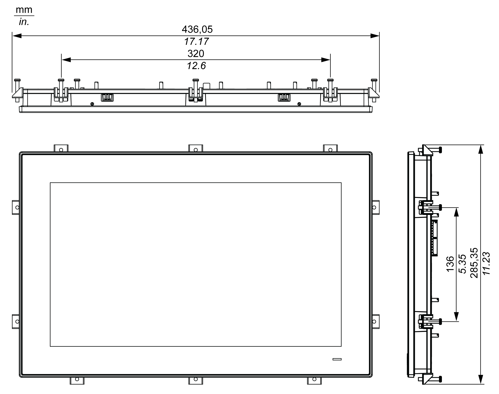

Display W19” Dimensions

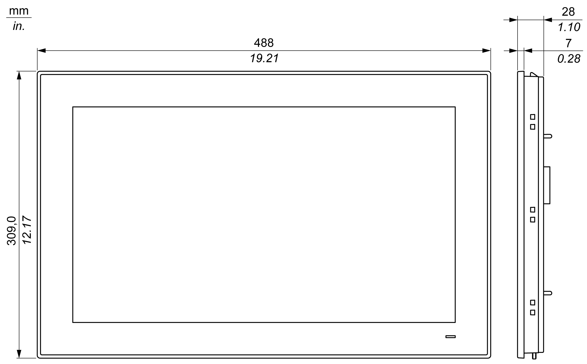

Display W19” Dimensions with Fasteners

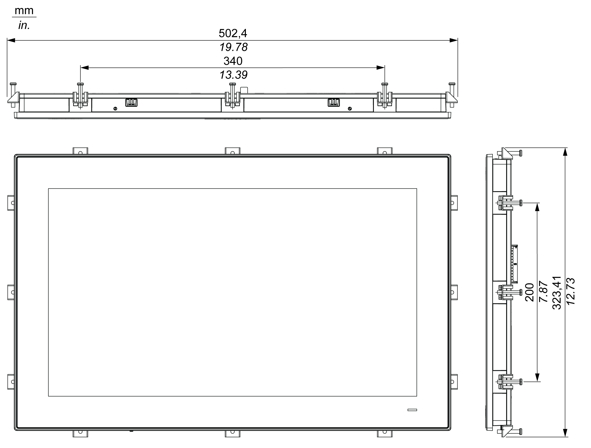

Display W22” Dimensions

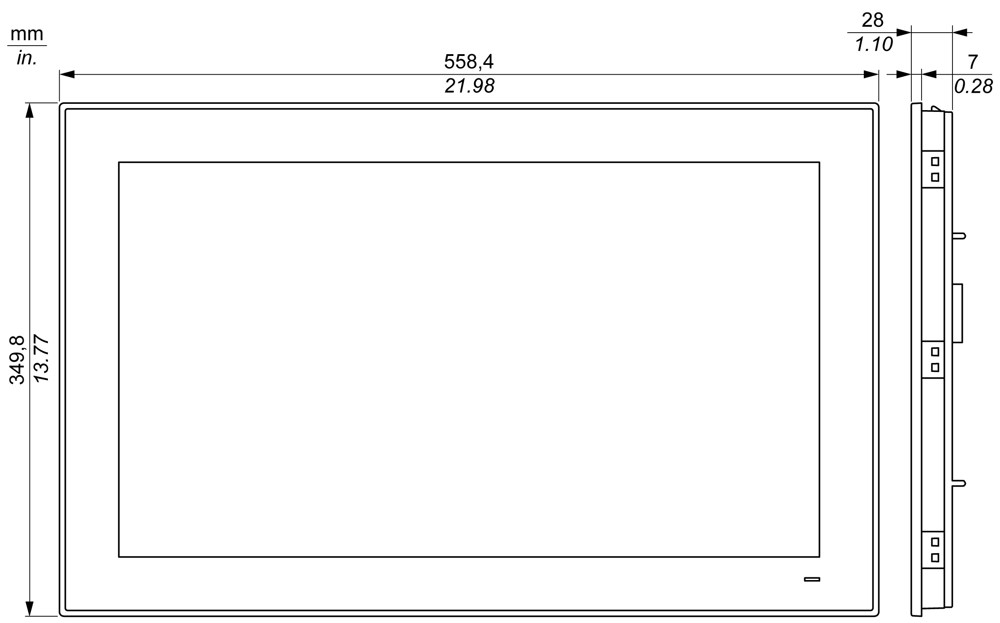

Display W22” Dimensions with Fasteners

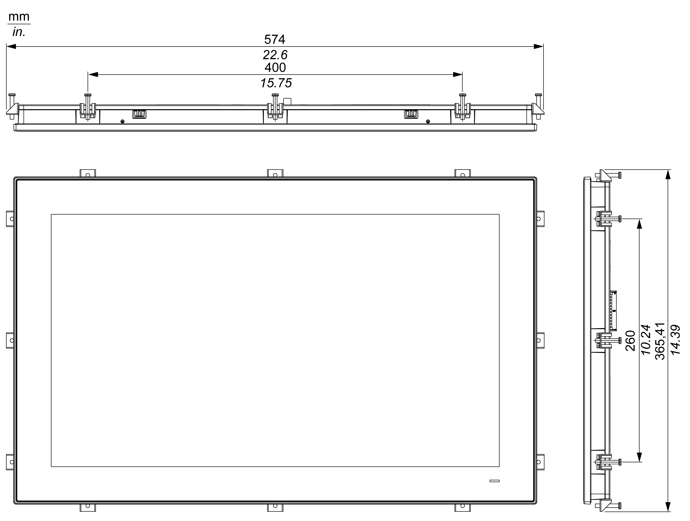

Installation Fastener Dimensions

Dimensional Tolerances

The table indicates the general tolerance for the dimensions:

| Nominal measurement range | General tolerance acc. DIN ISO 2768 medium |
| --- | --- |
| 6...30 mm (0.236...1.181 in) | ±0.2 mm (±0.0078 in) |
| 30...80 mm (1.181...3.149 in) | ±0.25 mm (±0.0098 in) |
| 80...180 mm (3.149...7.08 in) | ±0.3 mm (±0.012 in) |
| 180...600 mm (7.08...23.62 in) | ±0.5 mm (±0.02 in) |

EIO0000002042.06

© 2019 Schneider Electric. All rights reserved.