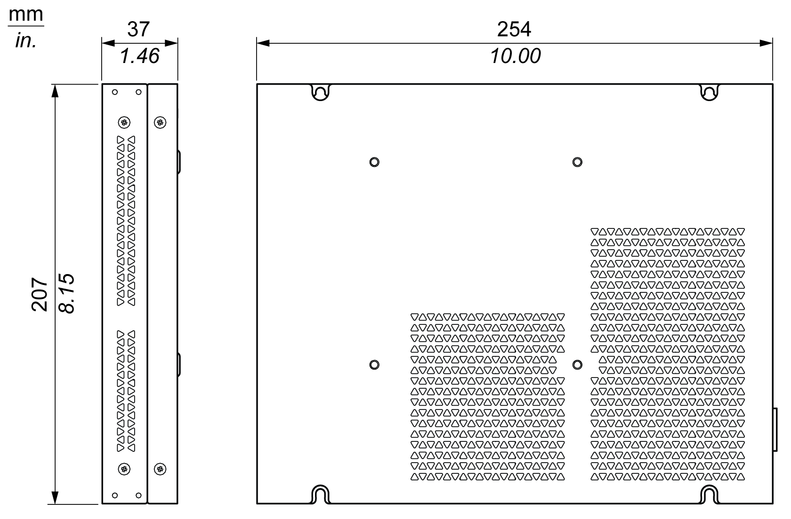

# Display Adapter Dimensions

Display Adapter Dimensions

Dimensions

Dimensional Tolerances

The table indicates the general tolerance for the dimensions:

| Nominal measurement range | General tolerance acc. DIN ISO 2768 medium |
| --- | --- |
| 30...80 mm (1.181...3.149 in) | ±0.25 mm (±0.0098 in) |
| 80...180 mm (3.149...7.08 in) | ±0.3 mm (±0.012 in) |
| 180...400 mm (7.08...15.747 in) | ±0.5 mm (±0.02 in) |

EIO0000002042.06

© 2019 Schneider Electric. All rights reserved.