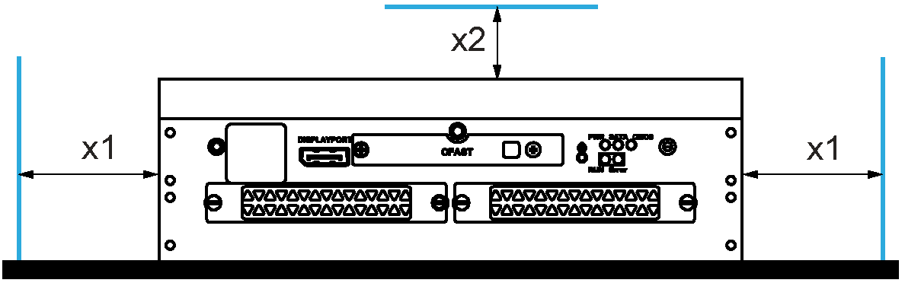

# Box iPC Installation

Box iPC Installation

Installation of the Box iPC Universal/Performance (HMIBMU/HMIBMP)

| Step | Action |
| --- | --- |
| 1 | Remove the power and confirm that the power supply is disconnected from its power source. |
| 2 | Wall mounting:  Fasten the Box iPC Universal/Performance on the cabinet with four M4 screws (6 mm (0.24 in)):  G-SE-0049176.3.gif-high.gif      NOTE:  oThe book mounting is not allowed for DNV (Det Norske Veritas) certified configuration.  oThe recommended torque to tighten these screws is 0.5 Nm (4.5 lb-in).  Horizontal mounting:  Fasten the Box iPC Universal/Performance with four M4 screws (8 mm (0.31 in)):  G-SE-0049177.4.gif-high.gif      NOTE:  oThe horizontal mounting is allowed with a temperature derating. (see [Environmental Characteristics](../iPC_-_Characteristics/iPC_-_Characteristics-6.htm#XREF_D_SE_0052277_1)).  oThe recommended torque to tighten these screws is 0.5 Nm (4.5 lb-in). |

Installation of the Box iPC Optimized (HMIBMI/HMIBMO)

| Step | Action |
| --- | --- |
| 1 | Remove the power and confirm that the power supply is disconnected from its power source. |
| 2 | Wall mounting:  Fasten the Box iPC on the cabinet with four M4 screws (8 mm (0.31 in)).  Book mounting:  Fasten the Box iPC on the cabinet with two M4 screws (8 mm (0.31 in)).  G-SE-0057689.1.gif-high.gif      NOTE: The recommended torque to tighten these screws is 0.5 Nm (4.5 lb-in).  Horizontal mounting:  Fasten the Box iPC with four M4 screws (8 mm (0.31 in)):  G-SE-0057688.2.gif-high.gif      NOTE:  oThe horizontal mounting is allowed with a temperature derating (see [Environmental Characteristics](../iPC_-_Characteristics/iPC_-_Characteristics-6.htm#XREF_D_SE_0052277_1)).  oThe recommended torque to tighten these screws is 0.5 Nm (4.5 lb-in). |

Mounting Orientation

The following figure shows the allowed mounting orientation for the Box iPC:

Spacing Requirements

In order to provide sufficient air circulation, mount the Box iPC so that the spacing on the top, bottom, and side is as follows:

1   Air out

2   Air in

x1   > 100 mm (3.93 in)

x2   > 50 mm (1.96 in)

Horizontal mounting:

x1   > 100 mm (3.93 in)

x2   > 50 mm (1.96 in)

Installation Din-Rail Mounting of the Box iPC Optimized (HMIBMI/HMIBMO)

| Step | Action |
| --- | --- |
| 1 | Remove the power and confirm that the power supply is disconnected from its power source. |
| 2 | Fasten the Din-rail bracket (HMIYADBMODIN11) to the Box iPC with three M3 screws (6 mm (0.23 in)):  G-SE-0057683.1.gif-high.gif |
| 3 | Hook the Box iPC Optimized with bracket on the mounting rail:  G-SE-0057684.1.gif-high.gif |

EIO0000002042.06

© 2019 Schneider Electric. All rights reserved.