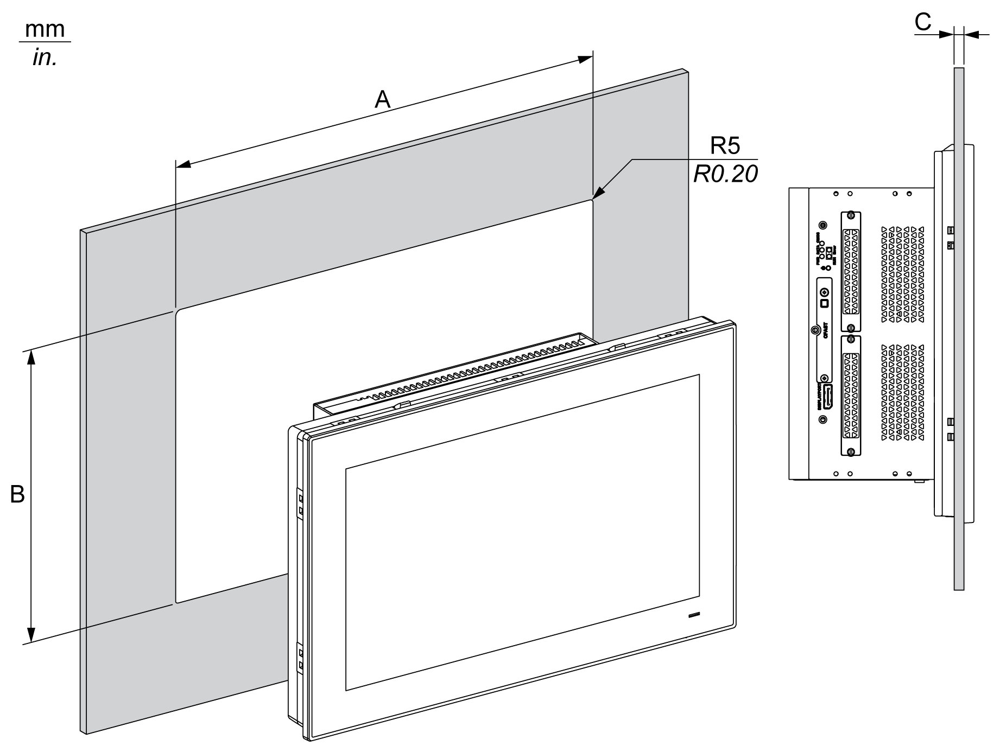
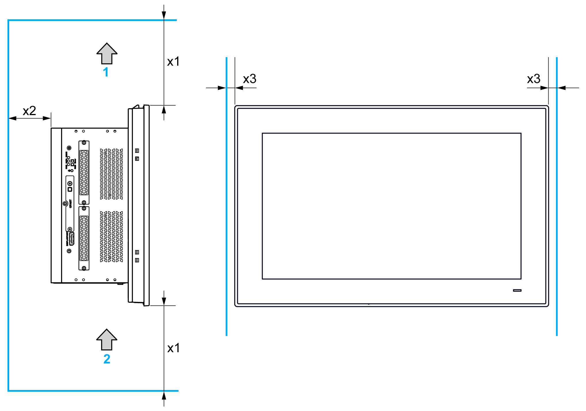

# Display and Box iPC Installation

Display and Box iPC Installation

Panel Cut Dimensions

For cabinet installation, you need to cut the correctly sized opening in the installation panel according to the model of display.

| Display Cut-out | A | B | C | R |
| --- | --- | --- | --- | --- |
| 4:3 12” | 301.5 ±0.5 mm  (11.87 ±0.02 in) | 227.5 ±0.4 mm  (8.95 ±0.02 in) | 2...4 mm  (0.08...0.16 in) | 5 mm  (0.20 in) |
| W12” | 310 ±0.7 mm  (12.2 ±0.03 in) | 221 ±0.4 mm  (8.7 ±0.02 in) | 2...6 mm  (0.08...0.24 in) |
| 4:3 15” | 383.5 ±0.7 mm  (15.1 ±0.03 in) | 282.5 ±0.4 mm  (11.12 ±0.02 in) |
| W15” | 412.4 ±0.7 mm  (16.24 ±0.03 in) | 261.7 ±0.4 mm  (10.3 ±0.02 in) |
| W19” | 479.3 ±1 mm  (18.87 ±0.04 in) | 300.3 ±0.7 mm  (11.82 ±0.03 in) |
| W22” | 550.3 ±1 mm  (21.67 ±0.04 in) | 341.8 ±0.7 mm  (13.46 ±0.03 in) |

NOTE:

oEnsure that the thickness of the installation panel is relevant.

oAll installation panel surfaces used should be strengthened. Due consideration should be given to the weight of the display, especially if high levels of vibration are expected and the installation panel can move. Attach metal reinforcing strips to the inside of the panel near the panel cut-out to increase the strength of the installation panel.

oEnsure that all installation tolerances are maintained.

oThe display is designed for use on a flat surface of a Type 4X enclosure (indoor use only).

Vibration and Shocks

Take extra care with respect to vibration levels when installing or moving the Box iPC. If you move the Box iPC while it is installed in a rack equipped with caster wheels, it may undergo excessive shock and vibration.

|  |
| --- |
| Caution_Color.gifCAUTION |
| EXCESSIVE VIBRATION |
| oPlan your installation activities so that shock and vibration tolerances in the unit are not exceeded.  oEnsure that the installation panel opening and thickness are within the specified tolerances.  oBefore mounting the Magelis Industrial PC into a cabinet or panel, ensure that the installation gasket is in place. The installation gasket provides additional protection from vibration.  oTighten the installation fasteners using a torque of 0.5 Nm (4.5 lb-in). |
| Failure to follow these instructions can result in injury or equipment damage. |

Installation Gasket

The gasket is required to meet the protection ratings (IP66 or Type 4X indoor) of the display.

NOTE: IP66 is not part of UL certification.

|  |
| --- |
| Caution_Color.gifCAUTION |
| LOSS OF SEAL |
| oInspect the gasket prior to installation or reinstallation, and periodically as required by your operating environment.  oReplace the gasket if visible scratches, tears, dirt, or excessive wear are noted during inspection.  oDo not stretch the gasket unnecessarily or allow the gasket to contact the corners or edges of the frame.  oEnsure that the gasket is fully seated in the installation groove.  oInstall the Magelis Industrial PC into a panel that is flat and free of scratches or dents.  oTighten the installation fasteners using a torque of 0.5 Nm (4.5 lb-in). |
| Failure to follow these instructions can result in injury or equipment damage. |

Installation of the Display

The installation gasket and the installation fasteners are required for the installation of the display. The panel mounting process of the installation can be completed by one person.

|  |
| --- |
| Caution_Color.gifCAUTION |
| OVERTORQUE AND LOOSE HARDWARE |
| oDo not exert more than 0.5 Nm (4.5 lb-in) of torque when tightening the installation fastener, enclosure, accessory, or terminal block screws. Tightening the screws with excessive force can damage the installation fastener.  oWhen fastening or removing screws, ensure that they do not fall inside the Magelis Industrial PC chassis. |
| Failure to follow these instructions can result in injury or equipment damage. |

NOTE: The installation fasteners are required to meet the protection ratings (IP66 or Type 4X indoor) of the display. IP66 is not part of UL certification.

| Step | Action |
| --- | --- |
| 1 | Remove all power and confirm that the power supply is disconnected from its power source. |
| 2 | Check that the gasket is correctly attached to the display.  NOTE: When checking the gasket, avoid contact with the sharp edges of the display frame, and insert the gasket completely into its groove. |
| 3 | Fasten the Box iPC on the rear side of the display with four screws:  G-SE-0043771.1.gif-high.gif      NOTE: The recommended torque to tighten these screws is 0.5 Nm (4.5 lb-in). |
| 4 | Release the two screws at the bottom:  G-SE-0042245.2.gif-high.gif |
| 5 | Loosen the cross-slotted screws from the top of the display to raise the snap hook. You do not need a screw driver to raise the snap hook of the Display 4:3 12”:  G-SE-0042246.3.gif-high.gif    1   Display W12”, 4:3 15”, W15”, W19” and W22”  2   Display 4:3 12”  Note:  oOne snap hook for the display W12” and 4:3 12”  oTwo snap hooks for the display 4:3 15”, W15”, W19” and W22” |
| 6 | Install the display in the panel opening and push it into the wall. The snap hook holds the display in place:  G-SE-0038233.3.gif-high.gif |

Spacing Requirements

In order to provide sufficient air circulation, mount the display so that the spacing above, below, and on the sides of the unit is as follows:

1   Air out

2   Air in

x1   > 100 mm (3.93 in)

x2   > 50 mm (1.96 in)

x3   > 15 mm (0.59 in)

Mounting Orientation

The following figure shows the allowed mounting orientation for the display:

Installation with the VESA (Video Electronics Standards Association)

|  | Display | | | | | |
| --- | --- | --- | --- | --- | --- | --- |
| W12” | 4:3 12” | W15” | 4:3 15” | W19” | W22” |
| Box iPC Universal/Performance (HMIBMU/HMIBMP) 2-Slot | HMIYPVESA6X21 | | HMIYPVESA21 | | | |
| Box iPC Universal/Performance (HMIBMU/HMIBMP) 4-Slot | not possible | | HMIYPVESA41 | | | |
| Box iPC Optimized (HMIBMI/HMIBMO) | HMIYPVESA6X21 | | HMIYPVESA21 | | | |
| Display Adapter | available without adapter | | | | | |

Follow these steps to install the Box iPC with the VESA:

| Step | Action |
| --- | --- |
| 1 | Put the VESA mounting kit on the rear side of the Box iPC:  G-SE-0043152.3.gif-high.gif    1   HMIYPVESA21 or HMIYPVESA41  2   HMIYPVESA6X21 for the display W12” and 4:3 12” |
| 2 | Fasten the VESA (HMIYPVESA21 or HMIYPVESA41) mounting kit on the rear side of the Box iPC Universal/Performance with six M4 screws (8 mm (0.31 in)):  Fasten the VESA (HMIYPVESA6X21) mounting kit on the rear side of the Box iPC Optimized with four M4 screws (8 mm (0.31 in)):  G-SE-0042932.3.gif-high.gif    1   HMIYPVESA21 or HMIYPVESA41 plate position (size 100 x 100 mm (3.94 x 3.94 in))  2   VESA mount screws for attachment  3   HMIYPVESA6X21 plate position (size 100 x 100 mm (3.94 x 3.94 in))  NOTE: The recommended torque to tighten these screws is 0.5 Nm (4.5 lb-in). |
| 3 | Install your support in the corresponding holes as shown. Fasten the VESA support with four M4 screws (10 mm (0.39 in)). Verify that the angle of the Box iPC is tilted no more than the amount allowed by the mounting orientation requirements.  G-SE-0043268.2.gif-high.gif    1   HMIYPVESA21 or HMIYPVESA41  2   HMIYPVESA6X21  NOTE: The recommended torque to tighten these screws is 0.5 Nm (4.5 lb-in). |

EIO0000002042.06

© 2019 Schneider Electric. All rights reserved.