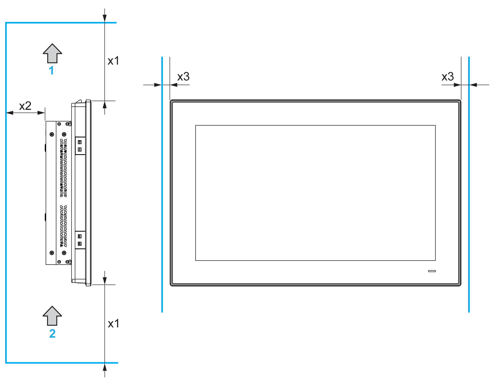
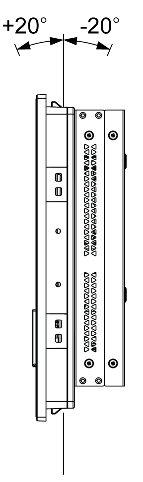

# Display and Display Adapter Installation

Display and Display Adapter Installation

Panel Cut Dimensions

For cabinet installation, you need to cut the correctly sized opening in the installation panel according to the model of [display](Box_PC_-_Installation-4.htm#XREF_D_SE_0050639_24).

Installation Gasket

The gasket is required to meet the protection ratings (IP66 or Type 4X indoor) of the display.

NOTE: IP66 is not part of UL certification.

|  |
| --- |
| Caution_Color.gifCAUTION |
| LOSS OF SEAL |
| oInspect the gasket prior to installation or reinstallation, and periodically as required by your operating environment.  oReplace the gasket if visible scratches, tears, dirt, or excessive wear are noted during inspection.  oDo not stretch the gasket unnecessarily or allow the gasket to contact the corners or edges of the frame.  oEnsure that the gasket is fully seated in the installation groove.  oInstall the Magelis Industrial PC into a panel that is flat and free of scratches or dents.  oTighten the installation fasteners using a torque of 0.5 Nm (4.5 lb-in). |
| Failure to follow these instructions can result in injury or equipment damage. |

Installation of the Display

The installation gasket and the installation fasteners are required for the easy installation of the display. The panel mounting process of the installation can be completed by one person.

NOTE: For installation, the suggested mounting panel thickness is above 2 mm (0.079 in).

|  |
| --- |
| Caution_Color.gifCAUTION |
| OVERTORQUE AND LOOSE HARDWARE |
| oDo not exert more than 0.5 Nm (4.5 lb-in) of torque when tightening the installation fastener, enclosure, accessory, or terminal block screws. Tightening the screws with excessive force can damage the installation fastener.  oWhen fastening or removing screws, ensure that they do not fall inside the Magelis Industrial PC chassis. |
| Failure to follow these instructions can result in injury or equipment damage. |

| Step | Action |
| --- | --- |
| 1 | Remove all power and confirm that the power supply is disconnected from its power source. |
| 2 | Check that the gasket is correctly attached to the display.  NOTE: When checking the gasket, avoid contact with the sharp edges of the display frame, and insert the gasket completely into its groove. |
| 3 | Fasten the Display Adapter on the rear side of the display with four screws:  G-SE-0053847.1.gif-high.gif |
| 4 | Fasten the Display Adapter on the rear side of the display with four M4 screws (6 mm (0.24 in)):  G-SE-0053855.1.gif-high.gif |
| 5 | Install the display in the panel opening, refer to Installation of the display[.](Box_PC_-_Installation-4.htm#XREF_D_SE_0050639_18)  G-SE-0053853.1.gif-high.gif |
| 6 | Do not tilt the display any more than the amount allowed by the mounting orientation requirements. |

Spacing Requirements

In order to provide sufficient air circulation, mount the Display Adapter so that the spacing above, below, and on the sides of the unit is as follows:

1   Air out

2   Air in

x1   > 100 mm (3.93 in)

x2   > 50 mm (1.96 in)

x3   > 15 mm (0.59 in)

Mounting Orientation

The following figure shows the allowed mounting orientation for the display with the Display Adapter:

Installation of the Receiver module and the Transmitter module on Display Adapter

|  |
| --- |
| Caution_Color.gifCAUTION |
| OVERTORQUE AND LOOSE HARDWARE |
| oDo not exert more than 0.5 Nm (4.5 lb-in) of torque when tightening the installation fastener, enclosure, accessory, or terminal block screws. Tightening the screws with excessive force can damage the installation fastener.  oWhen fastening or removing screws, ensure that they do not fall inside the Magelis Industrial PC chassis. |
| Failure to follow these instructions can result in injury or equipment damage. |

| Step | Action |
| --- | --- |
| 1 | Unscrew the Transmitter module and Receiver module panel covers from the Display Adapter:  G-SE-0054006.1.gif-high.gif |
| 2 | Pull the panel covers from the Display Adapter:  G-SE-0054007.1.gif-high.gif |
| 3 | Insert the Transmitter module (HMIYDATR11) and Receiver module (HMIYDARE11) in the respective slots in the Display Adapter.  G-SE-0054008.1.gif-high.gif    1    Transmitter module  2    Receiver module  NOTE: The Receiver module must be mounted before the Display Adapter mount on display. |
| 4 | Fasten the covers with screws.  G-SE-0054009.1.gif-high.gif |
| 5 | Install the Display Adapter on the display, refer to Installation of the display. |

Installation with the VESA

| Step | Action |
| --- | --- |
| 1 | There are four VESA holes on the rear side of the Display Adapter:  G-SE-0054010.1.gif-high.gif    1   VESA holes (size 100 x 100 mm (3.94 x 3.94 in)) |
| 2 | Install your support in the corresponding holes as shown. Fasten the VESA support with four M4 screws (10 mm (0.39 in)). verify that the angle of the Box iPC is tilted no more than the amount allowed by the mounting orientation requirements.  G-SE-0054011.1.gif-high.gif      NOTE: The recommended torque to tighten these screws is 0.5 Nm (4.5 lb-in). |

EIO0000002042.06

© 2019 Schneider Electric. All rights reserved.