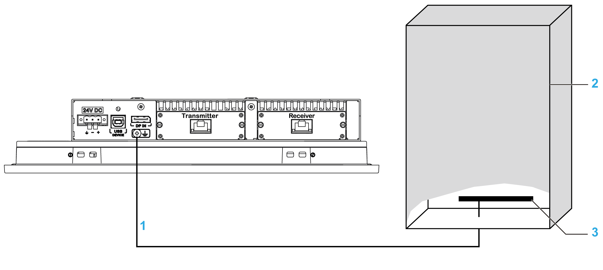
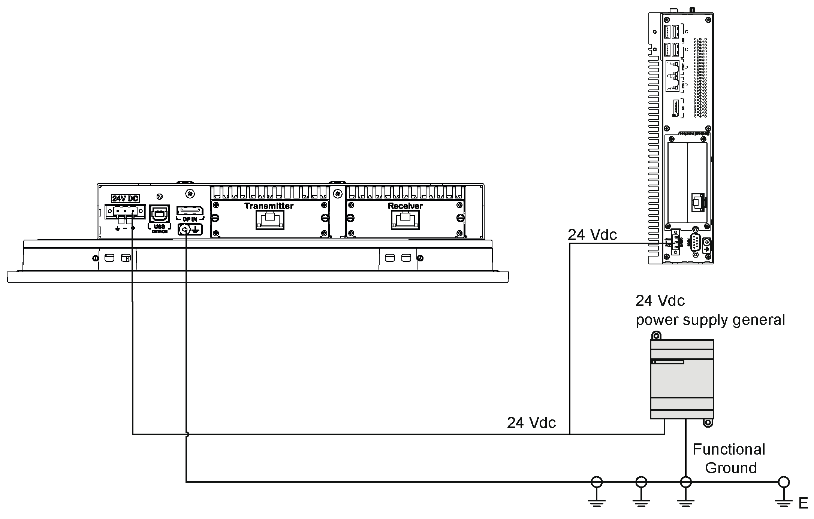

# Grounding

Grounding

Overview

The grounding resistance between the Box iPC ground wire and the ground must be 100 Ω or less. When using a long grounding wire, check the resistance and, if required, replace the wire with a thicker wire and place it in a duct.

The table shows the maximum length for the wires:

| Wire cross-section | Maximum line length |
| --- | --- |
| 1.3 mm2 (AWG 16) | 30 m (98 ft) |
| 60 m (196 ft) round trip |

Grounding Procedure

|  |
| --- |
| Warning_Color.gifWARNING |
| UNINTENDED EQUIPMENT OPERATION |
| oUse only the authorized grounding configurations shown below.  oConfirm that the grounding resistance is 100 Ω or less.  oTest the quality of your ground connection before applying power to the device. Excessive noise on the ground line can disrupt operations of the Magelis Industrial PC. |
| Failure to follow these instructions can result in death, serious injury, or equipment damage. |

The Box iPC and the Display Adapter ground have 2 connections:

oDC Supply voltage

oGround connection pin

The Box iPC connections (common use for HMIBMU/HMIBMP/HMIBMI/HMIBMO):

1   Ground connection pin (functional ground connection pin)

2   Switching cabinet

3   Grounding strip

The Display Adapter connections:

1   Ground connection pin (functional ground connection pin)

2   Switching cabinet

3   Grounding strip

| Step | Action |
| --- | --- |
| 1 | Ensure all of the following is done for the system wiring:  oConnect the cabinet to ground.  oEnsure that all cabinets are grounded together.  oConnect the ground of the power supply to the cabinet.  oConnect the ground pin of the Box iPC to the cabinet.  oConnect the I/O to the controller if needed.  oConnect the power supply to the Box iPC. |
| 2 | Check that the grounding resistance is 100 Ω or less. |
| 3 | When connecting the SG line to another device, ensure that the design of the system/connection does not produce a ground loop.  NOTE: The SG and ground connection screw are connected internally in the Box iPC. |
| 4 | Use 1.3 mm2 (AWG 16) wire to make the ground connection. Create the connection point as close to the Box iPC as possible and make the wire as short as possible. |

Grounding I/O Signal Lines

The Box iPC HMIBMI, HMIPCC•2L, HMIPCC•2N, HMIPCCL2B5, HMIPCCL2B6 and the displays HMIDM9521, HMIDMA521 are not certified for use in Class I Division 2 hazardous (classified) locations.

|  |
| --- |
| Danger_Color.gifDANGER |
| POTENTIAL FOR EXPLOSION IN HAZARDOUS LOCATION |
| Do not use these products in hazardous locations. |
| Failure to follow these instructions will result in death or serious injury. |

The HMIBMP, HMIBMU, HMIBMO, HMIPCCP2B, HMIPCCU2B, HMIPCCL2B1...4, HMIPCCL2D1...4, HMIPCCL2J1...4, HMIPCCL261...4, HMIPCCL271...4, HMIPCCU26, HMIPCCU27, HMIPCCU2D, HMIPCCU2J, HMIPCCP26, HMIPCCP27, HMIPCCP2D, HMIPCCP2J, and the Display Adapter HMIDADP11 are certified for use in Class I Division 2 hazardous (classified) location (see chapter "Certifications and Standards"). Observe the following:

|  |
| --- |
| Warning_Color.gifWARNING |
| EXPLOSION HAZARD |
| oAlways confirm the ANSI/ISA 12.12.01 and CSA C22.2 N°213 hazardous location rating of your device before installing or using it in a hazardous location.  oTo power on or power off a Magelis Industrial PC installed in a Class I, Division 2 hazardous location, you must either:  oUse a switch located outside the hazardous environment, or  oUse a switch certified for Class I, Division 1 operation inside the hazardous area.  oSubstitution of any components may impair suitability for Class I, Division 2.  oDo not connect or disconnect equipment unless power has been switched off or the area is known to be non-hazardous. This applies to all connections including power, ground, serial, parallel, network, and rear USB connections.  oNever use unshielded / ungrounded cables in hazardous locations.  oWhen enclosed, keep enclosure doors and openings closed at all times to avoid the accumulation of foreign matter inside the workstation.  oDo not open lid nor use the USB connectors in hazardous locations.  oDo not expose to direct sunlight or UV light source. |
| Failure to follow these instructions can result in death, serious injury, or equipment damage. |

Electromagnetic radiation may interfere with the control communications of the Box iPC.

|  |
| --- |
| Warning_Color.gifWARNING |
| UNINTENDED EQUIPMENT OPERATION |
| oIf wiring of I/O lines near power lines or radio equipment is unavoidable, use shielded cables and ground one end of the shield to the Magelis Industrial PC ground connection screw.  oDo not wire I/O lines in proximity to power cables, radio devices, or other equipment that may cause electromagnetic interference. |
| Failure to follow these instructions can result in death, serious injury, or equipment damage. |

EIO0000002042.06

© 2019 Schneider Electric. All rights reserved.