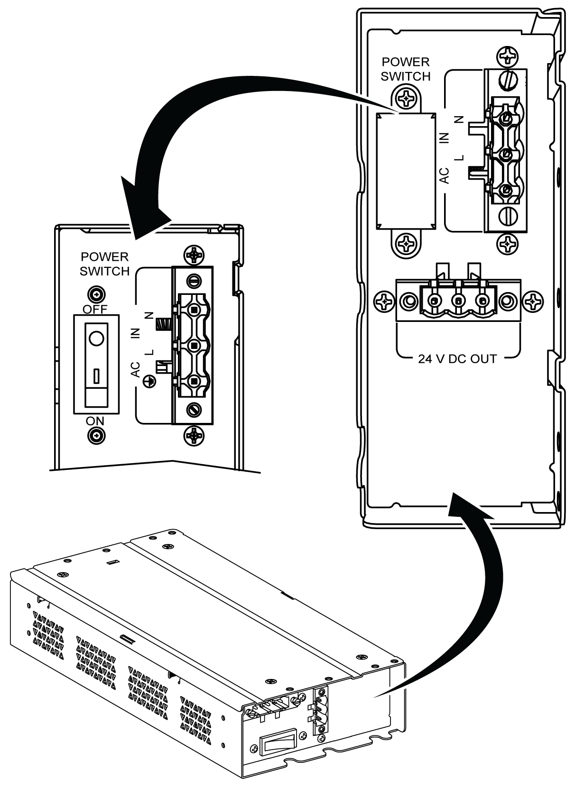
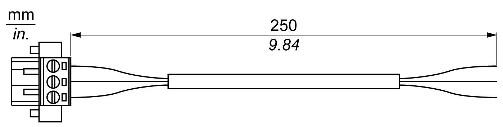
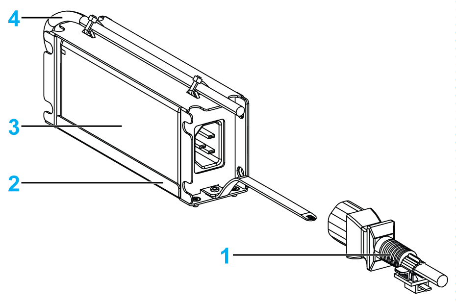

# AC Power Supply Module Description

AC Power Supply Module Description

Overview

The AC power supply module (HMIYMMAC1) can optionally be mounted on the Box iPC or Display Adapter (HMIDADP11) to be operated with 100...240 Vac.

If there is not a classified hazardous location, the AC power supply module (HMIYPSOMAC1) can optionally be mounted on the Display Adapter (HMIDADP11) to be operated with 100...240 Vac.

The table shows the AC power supplies associated with the Box iPC or Display Adapter (HMIDADP11):

| AC power supply | HMIBMU/HMIBMP | HMIBMI/HMIBMO | Display Adapter | Hazardous location |
| --- | --- | --- | --- | --- |
| HMIYPSOMAC1 (60 W) | – | X | X | – |
| HMIYMMAC1 (100 W) | X | X | X | X |

NOTE: The AC power supply module (HMIYMMAC1) must be PV 02 or above for use with Display Adapter (HMIDADP11) for hazardous locations.

AC Power Supply Module (HMIYMMAC1) Description

The figure shows the AC power supply module:

The figure shows the DC power cable of the AC power supply module:

The figure shows the dimensions of the AC power supply module:

The table gives the technical data of the AC power supply module:

| Features | PV01 values | PV02 values |
| --- | --- | --- |
| Nominal input voltage | 100...240 Vac | |
| Frequency | 47...63 Hz | |
| Power switch | Yes | |
| Internal fuse | 3.15 A | |
| Nominal output voltage | 24 Vdc | |
| Output current | 4.6 A maximum | 5.5 A maximum |
| Operation temperature | 0...50 °C (32...122 °F) | -20...55 °C (-4...131 °F) |
| Weight | 0.8 kg (1.76 lb) | |

NOTE: PV02 combination only with HMIBMI/HMIBMO and Display Adapter certified ATEX/C1D2.

AC Power Supply Module (HMIYPSOMAC1) Description

This figure shows the AC power supply module:

1   AC power cord

2   Mounting bracket

3   AC power supply

4   DC power cord

The table provides technical data for the AC power supply module:

| Element | Characteristics |
| --- | --- |
| Input | 90...260 Vac / 47...63 Hz / 1.6 A at 100 Vac |
| Output | 24 Vdc / 2.62 A maximum |
| Inrush current | 70 A at 230 Vac |
| Environment | |
| Operation temperature | 0...70 °C (32...158 °F), see derating curve |
| Storage temperature | -40...85 °C (-40...185 °F) |
| Relative humidity: | 0...95 %, non-condensing |

Operation temperature of the AC power supply derating curve:

EIO0000002042.06

© 2019 Schneider Electric. All rights reserved.