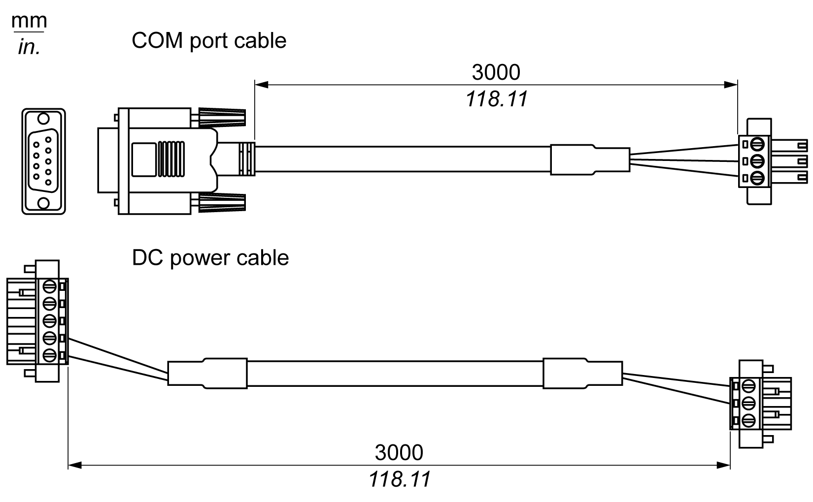
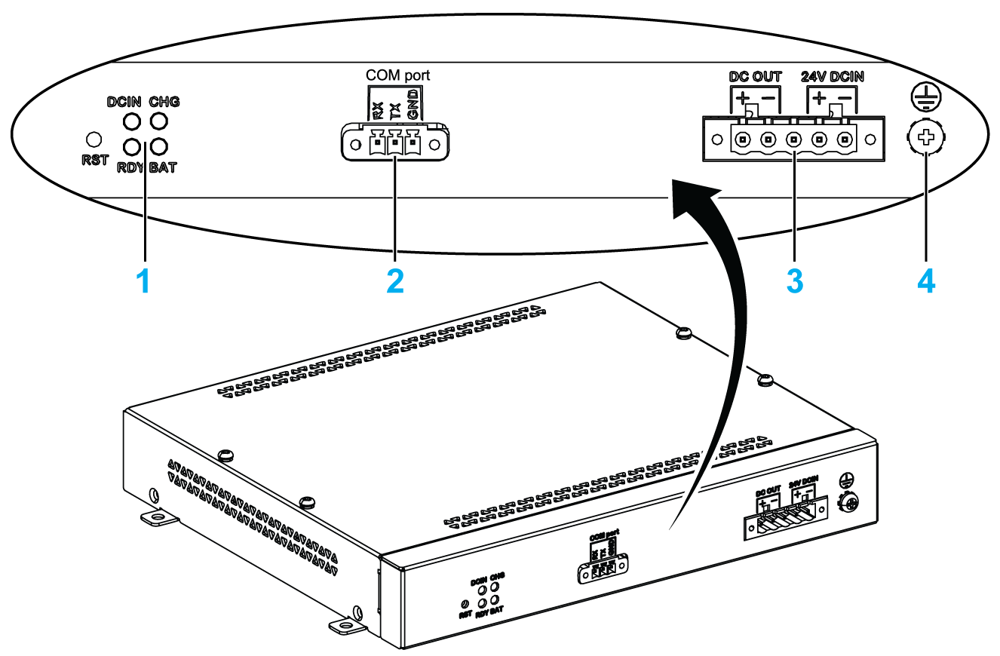

# UPS Module - Description and Installation

UPS Module - Description and Installation

Overview

|  |
| --- |
| Danger_Color.gifDANGER |
| EXPLOSION, FIRE, OR CHEMICAL HAZARD |
| Handling and storage:  oStore in cool, dry and ventilated rooms with impermeable surfaces and appropriate containment in case of leakage.  oProtect from adverse weather conditions and keep separate from incompatible materials during storage and transport.  oA sufficient supply of water must be located nearby.  oDamage to containers where batteries are stored and transported must be prevented.  oKeep away from fire, sparks, and excessive heat. |
| Failure to follow these instructions will result in death or serious injury. |

The uninterrupted power supply (UPS) option (HMIYMUPSKT1) includes a battery cell, a charger circuit, and a power path switch circuit. When battery capacity is not full, the charger circuit charges the battery cell automatically.

NOTE: If the UPS is configured and is activated in Standard System monitor or Node-Red System Monitor, the UPS is available.

The figure shows the UPS module:

The figure shows the UPS module cables:

The main features of the UPS option are:

oLong-lasting, maintenance-free rechargeable batteries

oCommunication via integrated interfaces

UPS Principle

With the optional UPS module, the Box iPC completes write operations even when it is turned off while write operations are being executed. When the UPS module detects a power off, it switches to battery operation immediately without interruption.

NOTE:

oThe connected monitor is not handled by the UPS and shut-off when the power is exhausted.

oOnly use COM1 of the Box iPC to connect to UPS module.

There are two configurations for UPS module:

oUPS module: The power source of the UPS module is from DC input power.

oUPS and AC power supply modules: The power source of the module is from AC input power.

This figure shows the UPS module (HMIYMUPSKT1) with the AC power supply module (HMIYMMAC1) and the Box iPC with the COM port cable and the DC power cable of the UPS cable kit (HMIYCABUPS31):

The Box iPC can get battery information from the COM port. Only COM1 can be used to detect UPS module information. The communication module of the optional interface cannot be used for UPS module; otherwise, it damages the Box iPC.

|  |
| --- |
| NOTICE |
| UNINTENDED EQUIPMENT OPERATION |
| o Use only COM1 port to detect UPS module information.  oUse only D-Sub 9-pin connector cables with a locking system in good condition. |
| Failure to follow these instructions can result in equipment damage. |

The table describes the additional modules for the UPS:

| Input power | UPS | Additional modules | Reference |
| --- | --- | --- | --- |
| DC | No | – | – |
| Yes | UPS module / UPS cables | HMIYMUPSKT1 / HMIYCABUPS31 |
| AC | No | AC power supply module | HMIYMMAC1 |
| Yes | UPS module / UPS cable and AC power supply module | HMIYMUPSKT1 / HMIYCABUPS31 and HMIYMMAC1 |

NOTE:

The UPS is not compatible with:

oPCIe/PCI cards and Ethernet PoE optional interface,

oPCIe/PCI cards and display.

UPS Module Description

The UPS module is subject to wear and should be replaced regularly, depending on the battery status. This information is displayed by Standard System monitor or Node-Red. The Health status shows when the battery needs to be changed.

NOTE: After going into backup mode, if no power is supplied during the next 5 minutes, then the UPS removes the 24 Vdc supply.

The behavior depends on the power mode setting (AT or ATX) in the Box iPC BIOS menu. The UPS sends event ask operation system shut down before backup power is exhausted.

When power is supplied to the UPS again;

oin AT mode, the Box iPC restarts automatically.

oin ATX mode, you need to push power button for system restart.

The figure shows the UPS module (HMIYMUPSKT1):

1   LEDs ([DCIN / CHG / RDY/ BAT]) and reset button ([RST])

2   Communication port connector ([COM port / PWR])

3   DC power connector ([DC OUT / 24V DCIN])

4   Ground connection pin

The table describes the meaning of the status indicator:

| Marking | Color | State | Meaning |
| --- | --- | --- | --- |
| DCIN | Green | ON | The input source is OK. |
| 1 Hz Flashing | DCIN loss up to 5 minutes. |
| OFF | DCIN loss. |
| CHG | Green | ON | The battery of the UPS module is loading. |
| 0.5 Hz Flashing | The temperature of the battery is > 60 °C (remains flashing until the temperature is < 55 °C). |
| 1 Hz Flashing | The battery is charging. |
| OFF | The battery capacity is over 90 % (charging not required). |
| RDY | Blue | ON | The UPS module is ready. |
| OFF | The UPS module is not functioning. |
| BAT | Yellow | 0.5 Hz Flashing | The temperature of the battery is > 60 °C (remains flashing until the temperature is < 55 °C) or less than 15 % charge. |
| OFF | The battery is not detected. |

NOTE: The button RST is used to reset the UPS module.

The table shows the technical data of the UPS module:

| Features | Values |
| --- | --- |
| UPS | |
| Input voltage | 18...36 Vdc |
| Output voltage | 24 Vdc |
| Output current | 3 A |
| Communication port | COM port / RS-232 |
| Back-up time | 10 minutes (battery 70 % fulled) |
| Operating temperature | 0...45 °C (32...113 °F) |
| Mounting | Desktop mount |
| Battery cells | |
| Capacity: | 27.5 Wh (2.73 Ah, 4S1P) |
| Maximum discharger current | 9 A (if discharged at high rate and high temperature frequently, the battery life will be shortened) |
| Charging current (max) | 1 A |
| Operating voltage | 12...16 Vdc |
| Cycle life of recharging | 300 times |
| Operating temperature | Charge: 0...45 °C (32...113 °F)  Discharge: 0...60 °C (32...140 °F) |
| Typical recharge time at low battery | 4 hours |
| Weight | 1.15 Kg (2.53 lbs) |

The figure shows the dimensions of the UPS module (HMIYMUPSKT1) equipped with the optional AC power supply module (HMIYMMAC1):

Installing Instructions

Before installing the UPS system, shut down Windows operating system in an orderly fashion and remove the power from the device.

|  |
| --- |
| DangerElectrical_Color.gifDanger_Color.gifDANGER |
| HAZARD OF ELECTRIC SHOCK, EXPLOSION OR ARC FLASH |
| oRemove all power from the device before removing any covers or elements of the system, and prior to installing or removing any accessories, hardware, or cables.  oUnplug the power cable from both the Magelis Industrial PC and the power supply.  oAlways use a properly rated voltage sensing device to confirm that power is off.  oReplace and secure all covers or elements of the system before applying power to the unit.  oUse only the specified voltage when operating the Magelis Industrial PC. The AC unit is designed to use 100...240 Vac input. The DC unit is designed to use 24 Vdc input. Always check whether your device is AC or DC powered before applying power. |
| Failure to follow these instructions will result in death or serious injury. |

|  |
| --- |
| Caution_Color.gifCAUTION |
| OVERTORQUE AND LOOSE HARDWARE |
| oDo not exert more than 0.5 Nm (4.5 lb-in) of torque when tightening the installation fastener, enclosure, accessory, or terminal block screws. Tightening the screws with excessive force can damage the installation fastener.  oWhen fastening or removing screws, ensure that they do not fall inside the Magelis Industrial PC chassis. |
| Failure to follow these instructions can result in injury or equipment damage. |

By adding the charging circuit in the Box iPC housing, installation is reduced to merely attaching the connection cable to the UPS module mounted next to the Box iPC.

NOTE: Due to the construction of these batteries, you can store and operate the UPS module in any position.

| Step | Action |
| --- | --- |
| 1 | Disconnect the power supply of the Box iPC. |
| 2 | Touch the housing or ground connection (not the power supply) to discharge any electrostatic charge from your body. |
| 3 | Mount the AC power supply module on the UPS module with the four screws supplied:  G-SE-0045410.5.gif-high.gif |
| 4 | Install the UPS module (HMIYMUPSKT1). The installation requires four M4 screws:  G-SE-0045827.5.gif-high.gif |
| 5 | Connect the two UPS cables (HMIYCABUPS31) to the UPS module. Be sure to use the correct connection terminals. |
| 6 | Connect the DC power cable of the UPS module to the DC power connector of the Box iPC  Connect the COM port cable of the UPS module to the [COM1] port of the Box iPC:  G-SE-0045750.5.gif-high.gif      Tighten the connected cables in the screw clamps. |
| 7 | Connect the AC power supply module ([24V DCOUT]) to the DC power cable ([24V DCIN]) of the UPS module:  G-SE-0045414.5.gif-high.gif |
| 8 | Connect the AC power cable ([AC IN]) of the AC power supply module:  G-SE-0045569.4.gif-high.gif |

| Step | Action |
| --- | --- |
| 1 | Disconnect the power supply of the Box iPC. |
| 2 | Touch the housing or ground connection (not the power supply) to discharge any electrostatic charge from your body. |
| 3 | Install the UPS module (HMIYMUPSKT1). The installation requires four x M5 screws and four washers.  Connect the two UPS cables (HMIYCABUPS31) to the UPS module. Connect the DC power cable to the DC power connector of the Box iPC and connect the communication cable (COM port) to the COM1 port RS-232 of the Box iPC:  G-SE-0043027.4.gif-high.gif      Tighten the connected cables in the screw clamps. |
| 4 | Connect the DC power supply ([24V DCIN]) of the UPS module from its power source:  G-SE-0045411.2.gif-high.gif |

EIO0000002042.06

© 2019 Schneider Electric. All rights reserved.