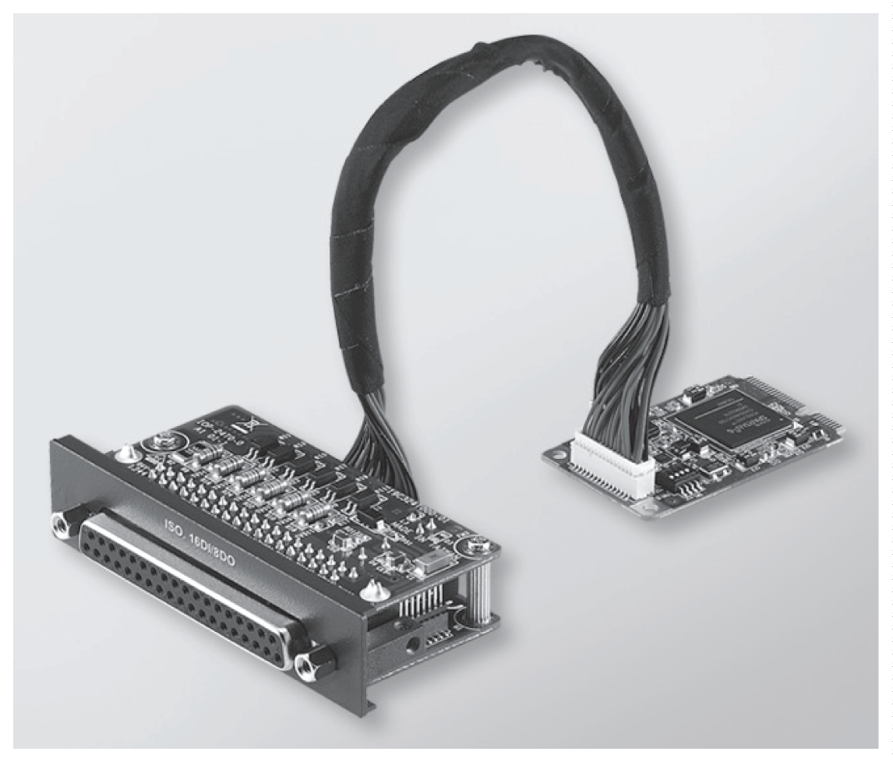
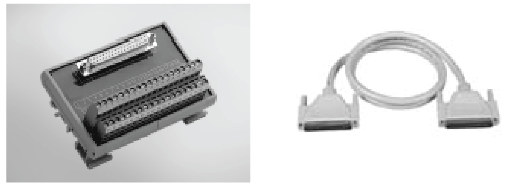
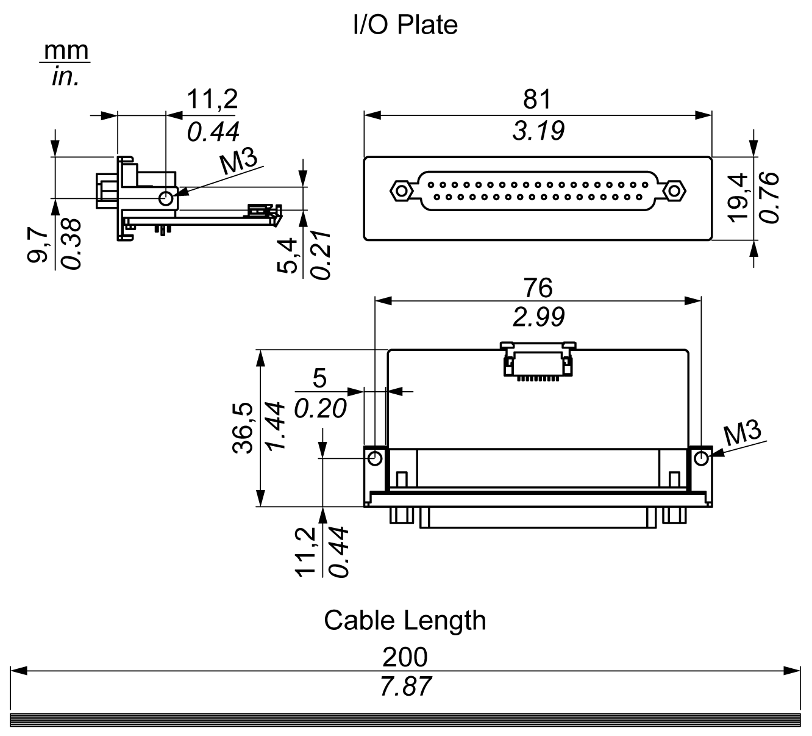

# 16DI/8DO Interface Description

16DI/8DO Interface Description

Introduction

The HMIYMINIO1 is categorized as a digital input/output module. It can be associated with a DIN rail terminal card, and is compatible with the mini PCIe card.

During card installation, there is no need to set jumpers or DIP switches. Instead, all bus-related configurations such as base I/O address and interrupt are automatically done by the Plug-and-Play function.

The HMIYMINIO1 has a built-in DIP switch that helps define each ID of the card when multiple 16DI/8DO interface has been installed.

The HMIYMINIO1 offers two counter inputs which can perform event counting, frequency measurement and pulse width measurement. The counters on the interface have a counter value match interrupt function. When this interrupt function is enabled, an interrupt signal is generated if the counter value reaches a pre-set counter match value. The counter continues to count until an overflow occurs; then it goes back to its reset value zero and continue the counting process. You can set each individual counter channel to count either falling edge (high-to-low) or rising edge (low-to-high) signals.

The figure shows the 16DI/8DO interface:

The figure shows the 16DI/16DO DIN rail terminal card and cable:

The figure shows the dimensions of the 16DI/8DO interface:

16DI/8DO Interface

The table shows technical data for the 16DI/8DO interface:

| Element | Characteristics |
| --- | --- |
| General | |
| Bus type | mini PCIe card revision 1.2 |
| Connectors | 1 x socket D-Sub 37-pin |
| Power consumption | Typical: 400 mA at 3.3 Vdc, maximum: 520 mA at 3.3 Vdc |
| Isolated digital input | |
| Input channels | 16 |
| Input voltage (wet contact) | Logic 0: 0...3 Vdc, logic 1: 10...30 Vdc |
| Input voltage (dry contact) | Logic 0: open, logic 1: shorted to GND |
| Input current | 10 Vdc at 2.97 mA, 20 Vdc at 6.35 mA, 30 Vdc at 9.73 mA |
| Input resistance | 5 KΩ |
| Interrupt capable channels | 2, IDI0 and IDI8 |
| Isolation protection | 2,500 Vdc |
| Over voltage protection | 70 Vdc |
| ESD protection | 4 kV (contact) 8 kV (air) |
| Opto-isolator response | 50 μs |
| Isolated digital output | |
| Output channels | 8 |
| Output type | MOSFET |
| Output voltage | 5...30 Vdc |
| Sink current | Maximum 100 mA/channel |
| Isolation protection | 2,500 Vdc |
| Opto-isolator response | 50 μs |
| Counter | |
| Channels | 2 |
| Resolution | 32 bit |
| Maximum input frequency | 1 kHz |

16DI/8DO Connections

The table shows the D-Sub 37-pin assignments:

| Assignment | Description | D-Sub 37-pin socket connector |
| --- | --- | --- |
| IDI0...15 | Isolated digital input | G-SE-0044098.1.gif-high.gif |
| ID0...7 | Isolated digital output |
| ECOM0 | External common of IDI0...7 |
| ECOM1 | External common of IDI8...15 |
| PCOM | Free wheeling common diode for IDO |
| EGND | External ground |
| GATE0...1 | Counter gate input |
| CLK0...1 | Counter n clock input |
| N/C | Not connected |

Switch and Jumper Settings

The jumper JP1 on the position 0 (default), load default while reset (default). The jumper JP1 on the position 1 (enabled), keeps the last status after reset.

The table shows the switch SW1 to set the ID of the 16DI/8DO interfaces:

| ID3 | ID2 | ID1 | ID0 | ID | Switch SW1 |
| --- | --- | --- | --- | --- | --- |
| 1 | 1 | 1 | 1 | 0 | G-SE-0047197.1.gif-high.gif |
| 1 | 1 | 1 | 0 | 1 |
| 1 | 1 | 0 | 1 | 2 |
| 1 | 1 | 0 | 0 | 3 |
| 1 | 0 | 1 | 1 | 4 |
| 1 | 0 | 1 | 0 | 5 |
| 1 | 0 | 0 | 1 | 6 |
| 1 | 0 | 0 | 0 | 7 |
| 0 | 1 | 1 | 1 | 8 |
| 0 | 1 | 1 | 0 | 9 |
| 0 | 1 | 0 | 1 | 10 |
| 0 | 1 | 0 | 0 | 11 |
| 0 | 0 | 1 | 1 | 12 |
| 0 | 0 | 1 | 0 | 13 |
| 0 | 0 | 0 | 1 | 14 |
| 0 | 0 | 0 | 0 | 15 |

Compatibility Table

| Part number | Description | HMIBMP/HMIBMU | HMIBMI/HMIBMO Expandable |
| --- | --- | --- | --- |
| HMIYMINIO1 | Interface 16 DI/8DO, 1 x DB 37, 2 m cable | Yes | Yes |

Cable Routing

Box iPC Optimized:

HMIBMP/HMIBMU:

Device Manager and Hardware Installation

Install the optional interface into the Box iPC first, then install the driver. The driver installation media for the 16DI/8DO interface is included in the recovery media (USB key). After the interface is installed, you can verify whether it is properly installed on your system through the Device Manager

NOTE: If you see your device name listed on it but marked with an exclamation sign !, it means that your interface has not been correctly installed. In this case, remove the device from the Device Manager by selecting its device name and press the Remove button. Then go through the driver installation process again.

After the 16DI/8DO interface is properly installed into the Box iPC, you can now configure your device using the navigator.

EIO0000002042.06

© 2019 Schneider Electric. All rights reserved.