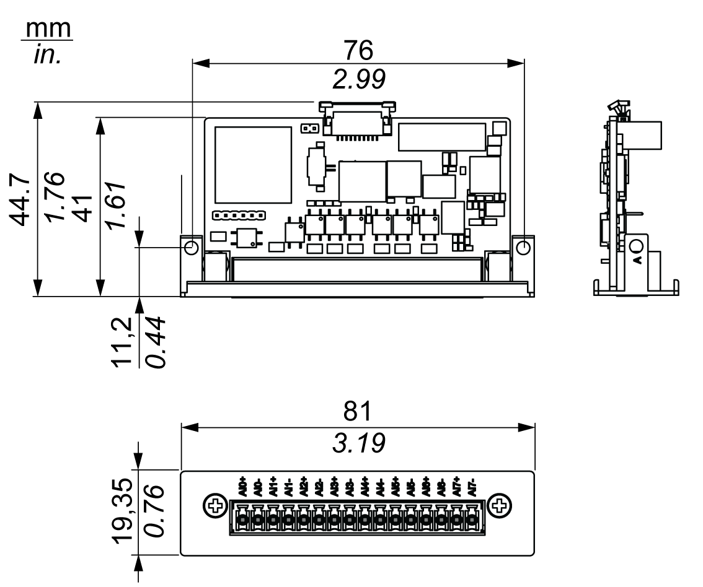
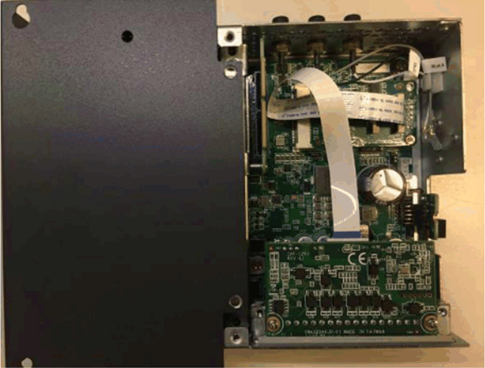
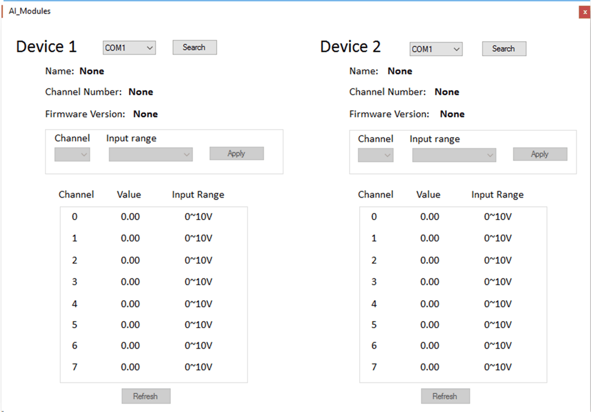

# 8 x Analog Input Interface Description

8 x Analog Input Interface Description

Introduction

The HMIYMIN8AI1 is categorized as an analog input module. It is compatible with the mini PCIe card.

The figure shows the 8 analog input interface:

The figure shows the dimensions:

Characteristics

The table shows technical data:

| Element | Characteristics |
| --- | --- |
| Input channel | 8 (differential) |
| Input range | 0...10 V |
| Accuracy | ± 0.1% or better (voltage) at 25 °C |
| Resolution | 16 bits |
| Calibration | Auto calibration |
| Sampling rate | 10 samples/second for total channels (when eight channels are activated, average 1 sample/second per channel) |
| Span drift | ±25 ppm |

8 Analog Input Connections

Compatibility Table

| Part number | Description | HMIBMP/HMIBMU | HMIBMI/HMIBMO Expandable |
| --- | --- | --- | --- |
| HMIYMIN8AI1 | Interface 8 x analog input | Yes | Yes |

Cable Routing

Device Manager and Hardware Installation

Install the optional interface into the Box iPC first, then install the driver. The driver installation media for the 8 analog input interface is included in the recovery media (USB memory key). After the interface is installed, you can verify whether it is properly installed on your system through the Device Manager

NOTE: If you see your device name listed on it but marked with an exclamation sign !, it means that your interface has not been correctly installed. In this case, remove the device from the Device Manager by selecting its device name and press the Remove button. Then go through the driver installation process again.

After the 8 analog input interface is properly installed into the Box iPC, you can now configure your device using the navigator.

Analog Input Module Utility for System Monitor

NOTE:

The following are the two methods to get analog input module information:

oIf you are using the IIoT Node-Red OS SKU, please get analog input module information in [analog input node](../Box_PC_-_IIoT_Box_Project_Cyber_Security/Box_PC_-_IIoT_Box_Project_Cyber_Security-4.htm#XREF_D_SE_0084242_36).

oFor the OS with System Monitor SKU, install the analog input module utility from USB key, in optional interface devices list.

| Step | Action |
| --- | --- |
| 1 | Install the driver (\CDM v2.12.00 WHQL Certified.exe). |
| 2 | Install the drivers (\VC\_redist.x86.exe and \vcredist.x86.exe). |
| 3 | Copy EAPI\_AI\ai\_value\_range\_infor.json to C:\Windows. |
| 4 | Copy EAPI\_AI\win32\libEApi-AI.dll to C:\Windows\SysWOW64. |
| 5 | Copy EAPI\_AI\x64\libEApi-AI.dll to C:\Windows\System32. |

NOTE: You can get all the files you need from the Recovery USB key:\Optional Interfaces drivers\AI-module.

Analog Input Module Utility

| Steps | Description |
| --- | --- |
| COM port selection | Shows the COM ports on the device |
| Search button | Gets all information from the COM port selected |
| Name | Device name. For example, 8 x Analog Input Interface, 2 x Analog Input Interface |
| Channel number | 2 channel, 8 channel |
| Firmware Version | The version of firmware |
| Channel | Channel selection:  oA: 2 channel: 0-1  oB: 8 channel: 0-7 |
| Input range selection | 0-10 V, 4-20 mA:  oA: 2 channel: 0-10 V, 4-20 mA  oB: 8 channel: 0-10 V |
| Apply button | Sets the value (Channel, Input Range) to analog input module |
| Refresh button | Gets all values from the device |

Search, Apply, Refresh Utilities

| Step | Action |
| --- | --- |
| 1 | Select a COM port from the list.  G-SE-0071650.1.gif-high.gif |
| 2 | Click Search to get all information of the selected COM port.  G-SE-0071649.1.gif-high.gif |
| 3 | Select a channel number and input range form the lists. |
| 4 | Click Apply to set the value.  G-SE-0071652.1.gif-high.gif |
| 5 | Click Refresh to get all information again.  G-SE-0071651.1.gif-high.gif |

EIO0000002042.06

© 2019 Schneider Electric. All rights reserved.