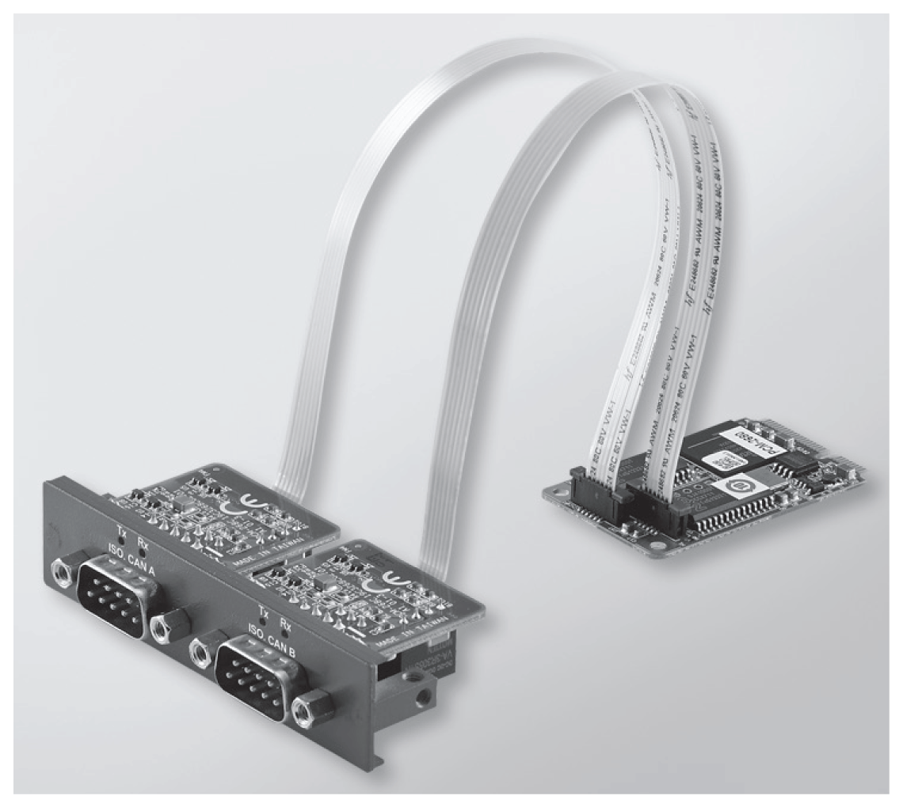

# CANopen Interface Description

CANopen Interface Description

Introduction

The HMIYMINCAN1 is categorized as industrial communication with fieldbus protocol modules. It is compatible with the mini PCIe card.

The figure shows the CANopen interface:

The figure shows the dimensions of the CANopen interface:

CANopen Interface Description

The table shows technical data for the CANopen interface:

| Features | Values |
| --- | --- |
| General | |
| Bus type | Mini PCIe card revision 1.2 |
| Connector | 2 x plug D-Sub 9-pin |
| Power consumption | 400 mA at 5 Vdc |
| Communication | |
| Protocol | CAN 2.0 A/B |
| Signal support | CAN\_H, CAN\_L |
| Speed | 1 Mb/s |
| CAN frequency | 16 MHz |
| Termination resistor | 120 Ω (selected by jumper) |

Connections

This interface is used to connect the Box iPC to remote equipment, via a cable. The connector is a D-Sub 9-pin plug connector.

By using a long PLC cable to connect to the Box iPC, it is possible that the cable can be at an electrical potential that is different from the electrical potential of the panel, even if both are connected to ground.

The table shows the D-Sub 9-pin assignments:

| Pin | Assignment | D-Sub 9-pin plug male connector |
| --- | --- | --- |
| 1 | – | G-SE-0009066.2.gif-high.gif |
| 2 | CAN\_L |
| 3 | GND |
| 4 | – |
| 5 | – |
| 6 | – |
| 7 | CAN\_H |
| 8 | – |
| 9 | – |

NOTE: You can set the terminator resistor by jumper setting. The position (pin 1-2) is for the value of the terminator resistor of 120 ohm. The position (pin 2-3) is for without terminator resistor.

Any excessive weight or stress on communication cables may disconnect the equipment.

|  |
| --- |
| Caution_Color.gifCAUTION |
| LOSS OF POWER |
| oEnsure that communication connections do not place excessive stress on the communication ports of the Magelis Industrial PC.  oSecurely attach communication cables to the panel or cabinet.  oUse only D-Sub 9-pin cables with a locking system in good condition. |
| Failure to follow these instructions can result in injury or equipment damage. |

Compatibility Table

| Part number | Description | HMIBMU/HMIBMP | HMIBMI/HMIBMO Expandable |
| --- | --- | --- | --- |
| HMIYMINCAN1 | Interface fieldbus, 2 x CANopen | Yes | Yes |

Cable Routing

Box iPC Optimized:

Box iPC Universal/Box iPC Performance:

Device Manager and Hardware Installation

Install the optional interface into the Box iPC first, then install the driver. The driver installation media for the CANopen interface is included in the recovery media (USB key). After the interface is installed, you can verify whether it is properly installed on your system through the Device Manager

NOTE: If you see your device name listed on it but marked with an exclamation sign !, it means that your Interface has not been correctly installed. In this case, remove the device from the Device Manager by selecting its device name and press the Remove button. Then go through the driver installation process again.

After the CANopen interface is properly installed into the Box iPC, you can now configure your device using the navigator.

The CANopen protocol Library provides a C application programming interface (API) for accessing the CANopen network protocol stack of nodes. It is easy to use, configure, start, and monitor the CANopen devices careless CAN bus, developer focused on CANopen application functionality:

oRead and write object dictionary (local or by SDO)

oControl or monitor the node NMT state (NMT master)

oPDO transmission mode: on request, by SYNC, time driven, event driven

oSupport 512 TPDOs and 512 RPDOs

oSYNC producer and consumer

oHeartbeat producer and consumer

oEmergency objects

EIO0000002042.06

© 2019 Schneider Electric. All rights reserved.