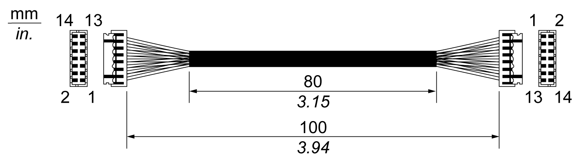

# Audio Interface (for Box iPC Universal/Performance) Description

Audio Interface (for Box iPC Universal/Performance) Description

Introduction

The HMIYMINAUD1 is categorized as an audio interface (line in, line out, Mic in). The audio interface is composed of an audio I/O board (include metal plate), a cable for connecting I/O board and the Box iPC.

The figure shows the audio interface:

The figure shows the dimensions of the audio interface cable:

Audio Interface

The table shows technical data for the audio interface:

| Element | Characteristics |
| --- | --- |
| Connectors | line in, line out, mic in |
| Audio output type | stereo |

Compatibility Table

| Part number | Description | HMIBMP/HMIBMU | HMIBMI/HMIBMO Expandable |
| --- | --- | --- | --- |
| HMIYMINAUD1 | Interface audio BKT, 1 x LI/LO/MIC | Yes(1) | N/A |
| (1) Only support one HMIYMINAUD1. | | | |

Cable Routing

Box iPC Universal/Box iPC Performance:

EIO0000002042.06

© 2019 Schneider Electric. All rights reserved.