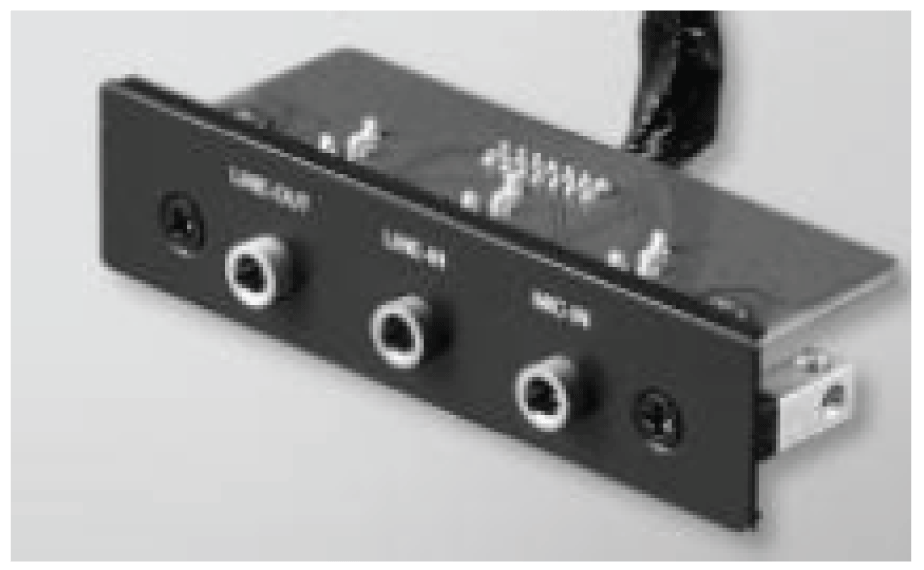
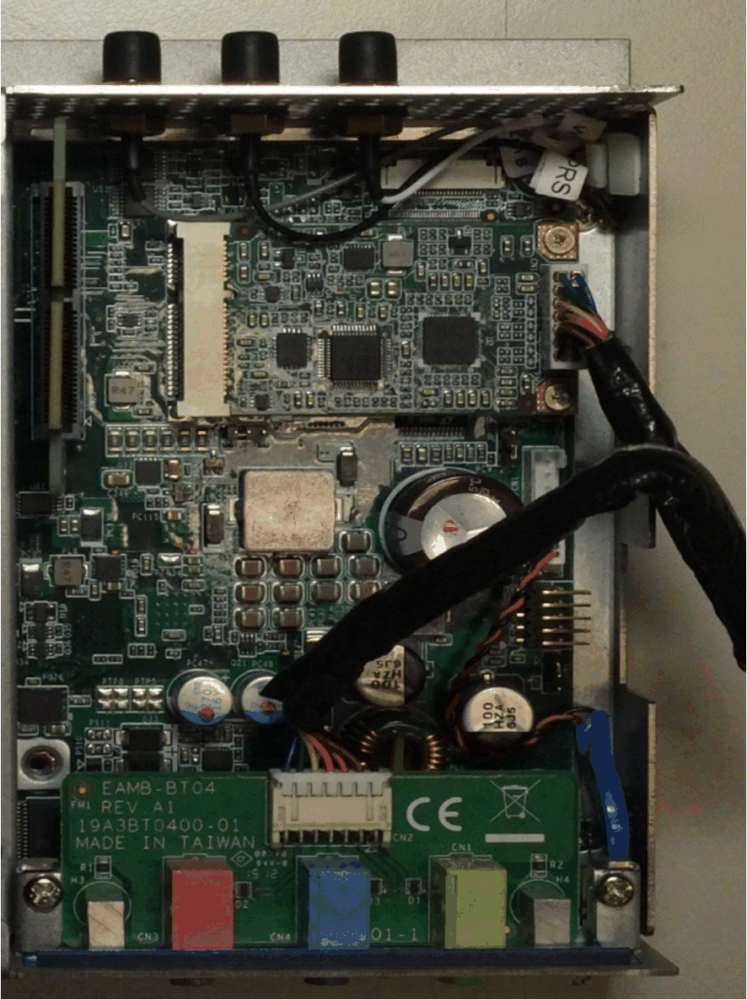
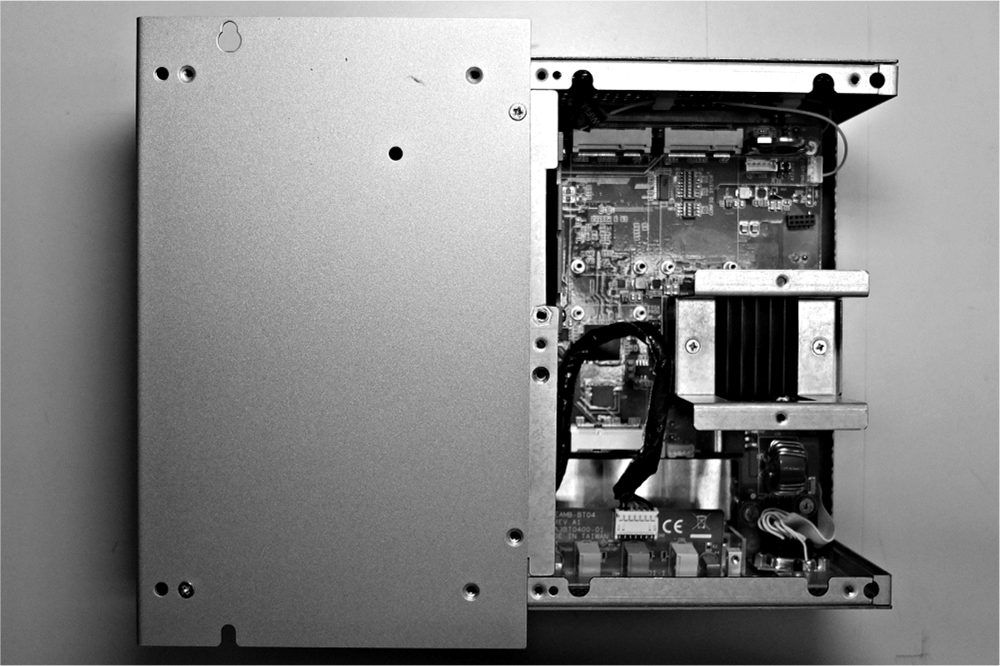

# Audio Interface Description

Audio Interface Description

Introduction

The HMIYMINAUD21 is categorized as an audio interface (line in, line out, Mic in). The audio interface is composed of an audio I/O board (include metal plate), a cable for connecting I/O board and the Box iPC.

The figure shows the audio interface:

Audio Interface

The table shows technical data for the audio interface:

| Element | Characteristics |
| --- | --- |
| Connectors | Line in, line out, mic in |
| Audio output type | Stereo |

Compatibility Table

| Part number | Description | HMIBMP/HMIBMU | HMIBMI/HMIBMO Expandable |
| --- | --- | --- | --- |
| HMIYMINAUD21 | Interface audio BKT, 1 x LI/LO/MIC | Yes(1) | Yes |
| (1) Only support one HMIYMINAUD1. | | | |

Cable Routing

Box iPC Optimized:

Box iPC Universal/Box iPC Performance:

Installation Remark

HMIBMP/HMIBMU has Line in/Line out/MIC already and suggest buying HMIYMINAUD1.

Interface Installation

Before installing or removing a mini PCIe card, shut down Windows operating system in an orderly fashion and remove the power from the device.

|  |
| --- |
| NOTICE |
| ELECTROSTATIC DISCHARGE |
| Take the necessary protective measures against electrostatic discharge before attempting to remove the Magelis Industrial PC cover. |
| Failure to follow these instructions can result in equipment damage. |

|  |
| --- |
| Caution_Color.gifCAUTION |
| OVERTORQUE AND LOOSE HARDWARE |
| oDo not exert more than 0.5 Nm (4.5 lb-in) of torque when tightening the installation fastener, enclosure, accessory, or terminal block screws. Tightening the screws with excessive force can damage the installation fastener.  oWhen fastening or removing screws, ensure that they do not fall inside the Magelis Industrial PC chassis. |
| Failure to follow these instructions can result in injury or equipment damage. |

NOTE: Remove the power before attempting this procedure.

| Step | Action |
| --- | --- |
| 1 | Release the screw:  G-SE-0062759.1.gif-high.gif |
| 2 | Install audio mini PCIe card in the connector:  G-SE-0062762.1.gif-high.gif |
| 3 | Tear down optional interface bracket:  G-SE-0062761.1.gif-high.gif |
| 4 | Install interface bracket and connect the cable:  G-SE-0062760.1.gif-high.gif |

EIO0000002042.06

© 2019 Schneider Electric. All rights reserved.