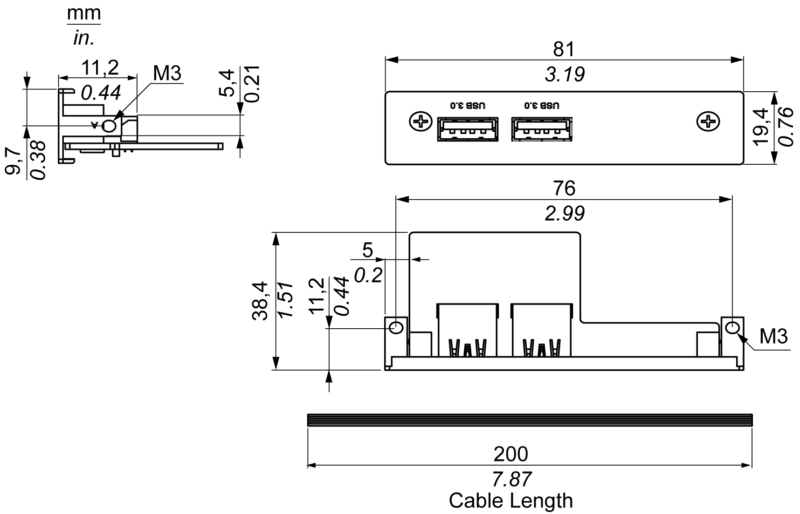
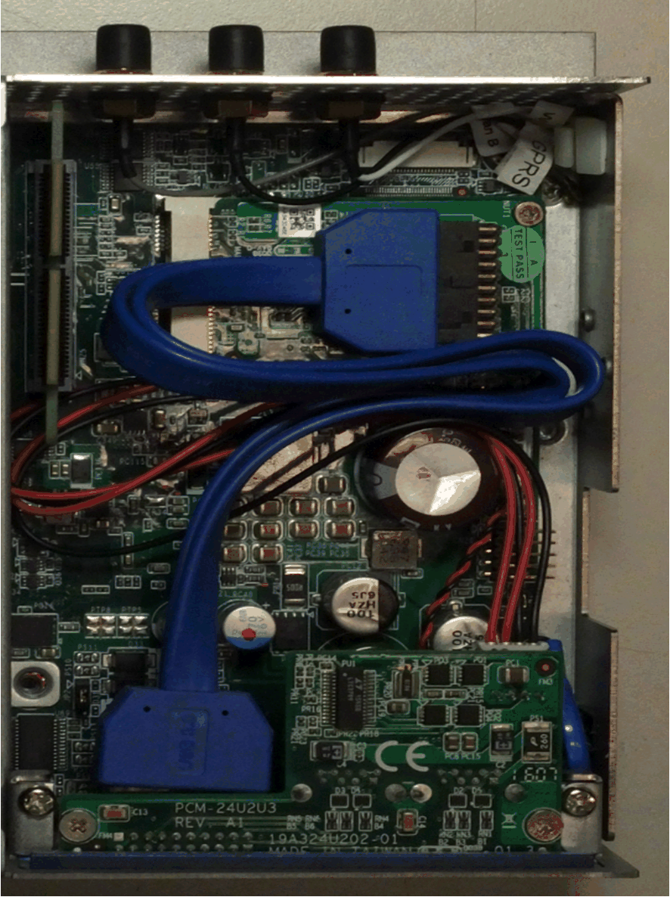
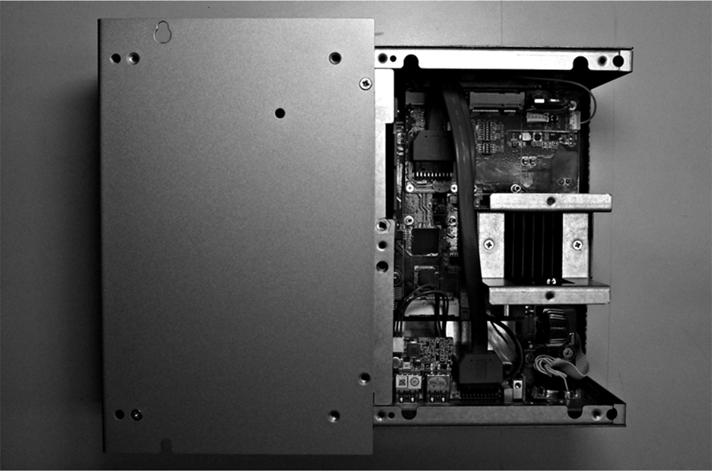

# USB Interface Description

USB Interface Description

Introduction

The HMIYMINUSB1 are categorized as communication modules. It is all compatible with the mini PCIe card.

The figure shows the USB interface:

The figure shows the dimensions of the USB interface:

USB Interface

The table shows technical data for the USB interface:

| Element | Characteristics |
| --- | --- |
| General | |
| Bus type | Mini PCIe card revision 1.2 |
| Connector | 2 x ports USB 3.0 |
| Power consumption | +5 Vdc / 900 mA power output to USB device |
| Communication | |
| Protocol | Universal serial Bus 3.0 specification Rev. 1.0 |
| Speed | Low speed: 1.5 Mb/s, full speed: 12 Mb/s, high speed: 480 Mb/s, super speed: 5 Gb/s |

Compatible Table

| Part number | Description | HMIBMP/HMIBMU | HMIBMI/HMIBMO Expandable |
| --- | --- | --- | --- |
| HMIYMINUSB1 | Interface USB 3.0, 2 x USB | Yes(1)/(2) | Yes |
| (1) Only support one HMIYMINUSB1 in HMIBMP/HMIBMU.  (2) HMIYMINDP1 and HMIYMINUSB1 cannot use together in HMIBMP/HMIBMU. | | | |

Cable Routing

Box iPC Optimized:

Box iPC Universal/Box iPC Performance:

Device Manager and Hardware Installation

Install the optional interface into the Box iPC first, then install the driver. The driver installation media is included in the recovery media (USB key). After the interface is installed, you can verify whether it is properly installed on your system through the Device Manager.

EIO0000002042.06

© 2019 Schneider Electric. All rights reserved.