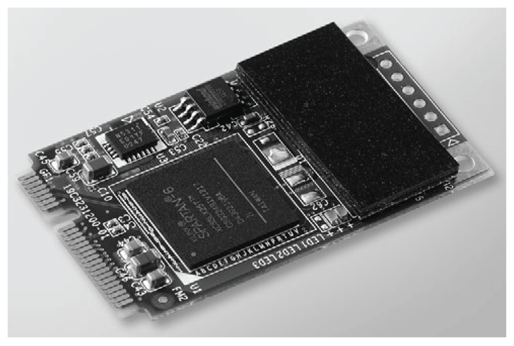

# NVRAM Card Description

NVRAM Card Description

Introduction

The HMIYMINNVRAM1 is categorized as industrial storage or a memory card for the mini PCIe slot.

The figure shows the NVRAM card:

NVRAM Card Description

The table shows the technical data of the NVRAM card:

| Features | Values |
| --- | --- |
| General | |
| Bus type | mini PCIe card revision 1.2 |
| Power consumption | 3.3 Vdc at 150 mA |
| Memory | |
| Size | 2 MB |
| Read/write speed | 6 Mb/s |
| Maximum magnetic field immunity during writing | 8000 A/m |
| Maximum magnetic field immunity during read or standby | 8000 A/m |

Compatibility Table

| Part number | HMIBMU/HMIBMP | HMIBMI/HMIBMO |
| --- | --- | --- |
| HMIYMINNVRAM1 | Yes | Yes |

Device Manager and Hardware Installation

Install the optional interface into the Box iPC first, then install the driver. The driver installation media is included in the recovery media (USB key). After the interface module is installed, you can verify whether it is properly installed on your system through the Device Manager.

EIO0000002042.06

© 2019 Schneider Electric. All rights reserved.