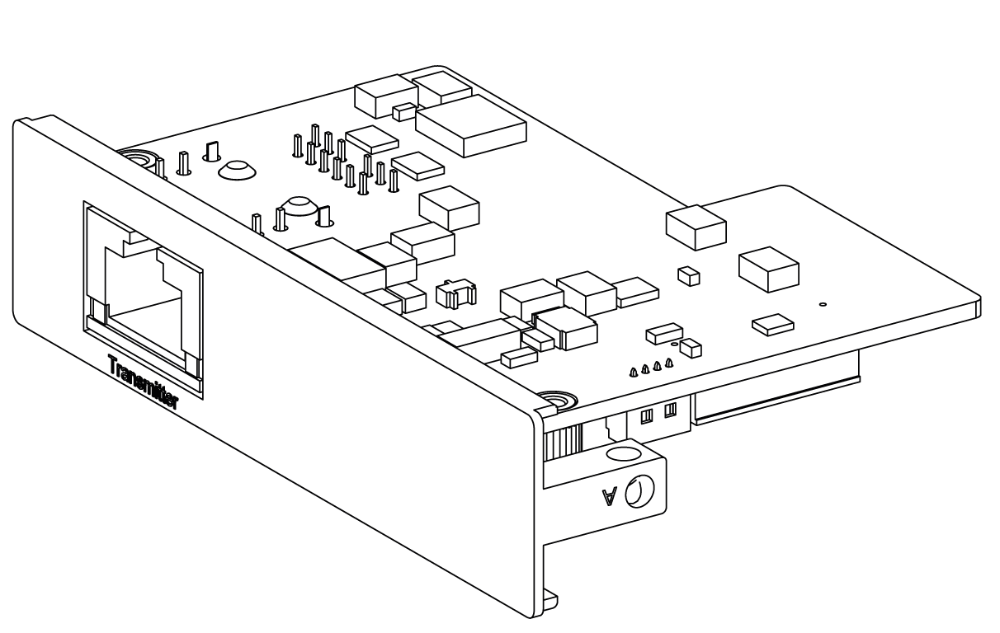
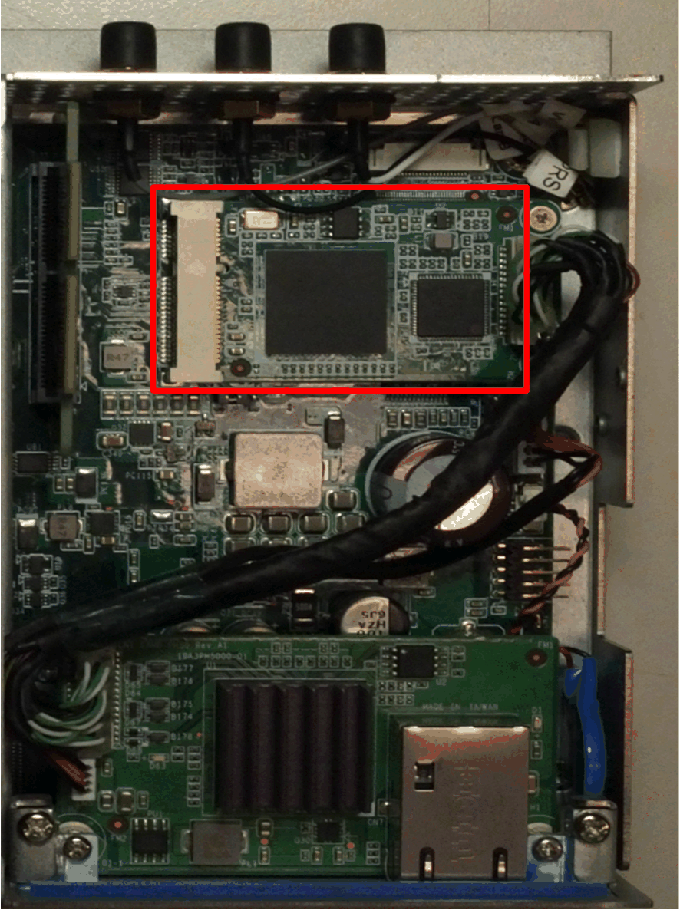
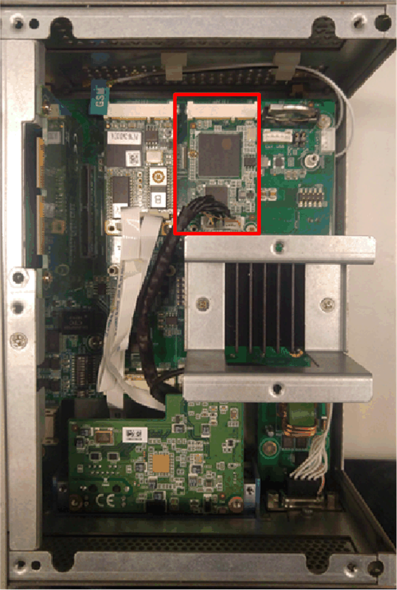

# mini PCIe to Display Adapter Interface Description

mini PCIe to Display Adapter Interface Description

Introduction

The HMIYMINDP1 is categorized as industrial communication interface.

The mini PCIe to Display Adapter Interface:

Dimensions of the mini PCIe to Display Adapter Interface:

Description

Technical data for the mini PCIe to Display Adapter Interface:

| Features | Values |
| --- | --- |
| General | |
| Bus type | mini PCIe card revision 1.2 |
| Connectors | RJ45 port x1 |
| Power consumption | Max. 3.3 W |
| Optional temperature | 0...45 °C (113 °F) |
| Communication | |
| Graphic support | Support 2D |
| Output interface | RJ45 |
| Output resolution | Up to 1920 x 1080 |
| Point-to-point transmit distance | 100 m (328 ft) |
| Cable | CAT6 Ethernet cable (CAT5e under condition, see note below) |

NOTE: The CAT5e cable may be used for limited length, according to environment conditions and with the maximum screen resolution of 1920 x 1080 pixels.

Compatible Table

| Part number | Description | HMIBMP/HMIBMU | HMIBMI/HMIBMO Expandable |
| --- | --- | --- | --- |
| HMIYMINDP1 | mini PCIe to Display Adapter Interface | Yes(1)/(2)/(3) | Yes(3) |
| NOTE: HMIYMINDP1 with Box iPC is target to bundle with DM and the Display Adapter together for long-distance purpose.  (1) HMIYMINDP1 cannot use with HMIYMINDVII1 or HMIYMINVGADVID1.  (2) HMIYMINDP1 cannot use with HMIYMINUSB1. | | | |

Cable Routing

Box iPC Optimized:

Box iPC Universal/Box iPC Performance:

NOTE:

oOnly one optional HMIYMINDP1 interface can be installed in the Box iPC.

oInstall the optional HMIYMINDP1 interface in the [top slot](Simple_panel_PC_-_Hardware_Modifications-12.htm#XREF_D_SE_0079520_5) of the Box iPC Universal/Box iPC Performance and the mini PCIe card on the second slot.

Box iPC Universal/Box iPC Performance with two optional Interfaces:

Device Manager and Hardware Installation

The driver installation media is included in the recovery media (USB key). After the interface is installed, you can verify whether it is properly installed on your system through the Device Manager.

Remote Displays Installation and Transmitter for Remote Display Driver Installation

| Step | Action |
| --- | --- |
| 1 | Connect the mini PCIe to Display Adapter Interface to the Display Adapter ([see remote display configuration](../Simple_Panel_PC_-_Physical_Overview/Simple_Panel_PC_-_Physical_Overview-7.htm#XREF_D_SE_0079502_28)).  G-SE-0068226.1.gif-high.gif      NOTE:  oUse the CAT5e/CAT6 cable to connect the mini PCIe Interface and the first Display Adapter Receiver module. Use the CAT5e/CAT6 cable to connect the Transmitter module to the Receiver module of the next Display Adapter  oTo set up the mini PCIe to Display Adapter Interface, you need to install the driver in display on host PC.  oIf host has not a display, then use the Box iPC DP port to connect the third-party panel. |
| 2 | Open the Optional Interfaces drivers folder and select Transmitter Interface:  G-SE-0065092.1.gif-high.gif |
| 3 | Execute CP210x\_Windows\_Drivers\CP210xVCPInstaller\_x64.exe or CP210xVCPInstaller\_x86.exe. |
| 4 | Execute Graphic\Win7\setup.exe or Graphic\Win8.1\setup.exe or Graphic\Win10\setup.exe to install graphic driver. |
| 5 | The system will automatically change the recommended resolution (by detecting first display) to fit the panel size. [Refer to default resolution setting](../Simple_Panel_PC_-_Physical_Overview/Simple_Panel_PC_-_Physical_Overview-7.htm#XREF_D_SE_0079502_30).  G-SE-0068218.1.gif-high.gif |
| 6 | For display on host PC:  1.Set tablet PC for each remote displays.  2.Do calibration for 4:3 12” and 4:3 15” (resistive) only if touch calibration is not correct.  G-SE-0068228.1.gif-high.gif    DM   Display module  DA   Display Adapter  PWR   Power |
| 7 | Once the remote displays set up are ready, the display on host PC can be removed if not used.  G-SE-0068223.1.gif-high.gif |

Transmitter for Remote Display Driver Uninstall

| Step | Action |
| --- | --- |
| 1 | Execute Setup.exe to uninstall the mini PCIe to Display Adapter Interface driver and graphic driver. |

EIO0000002042.06

© 2019 Schneider Electric. All rights reserved.