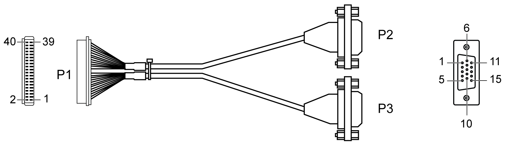
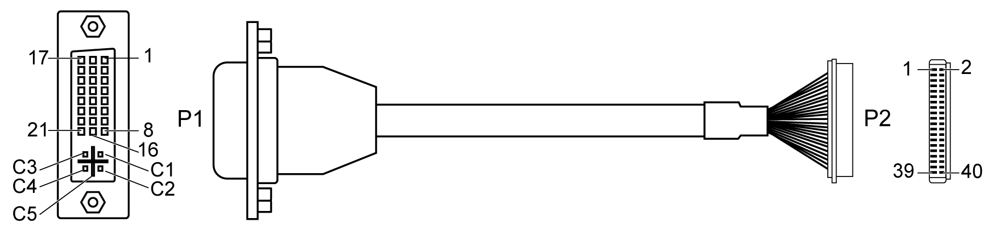
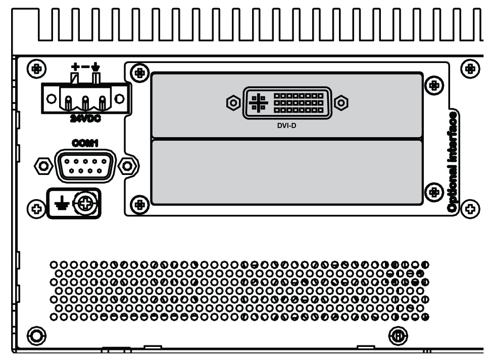
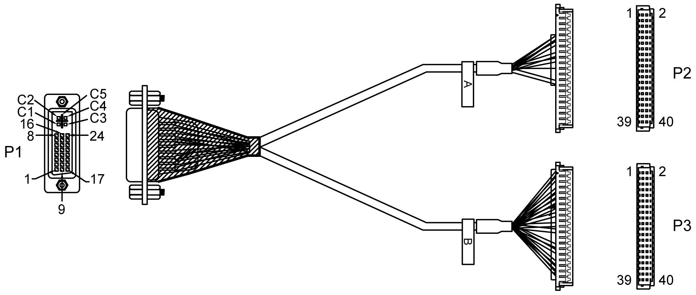
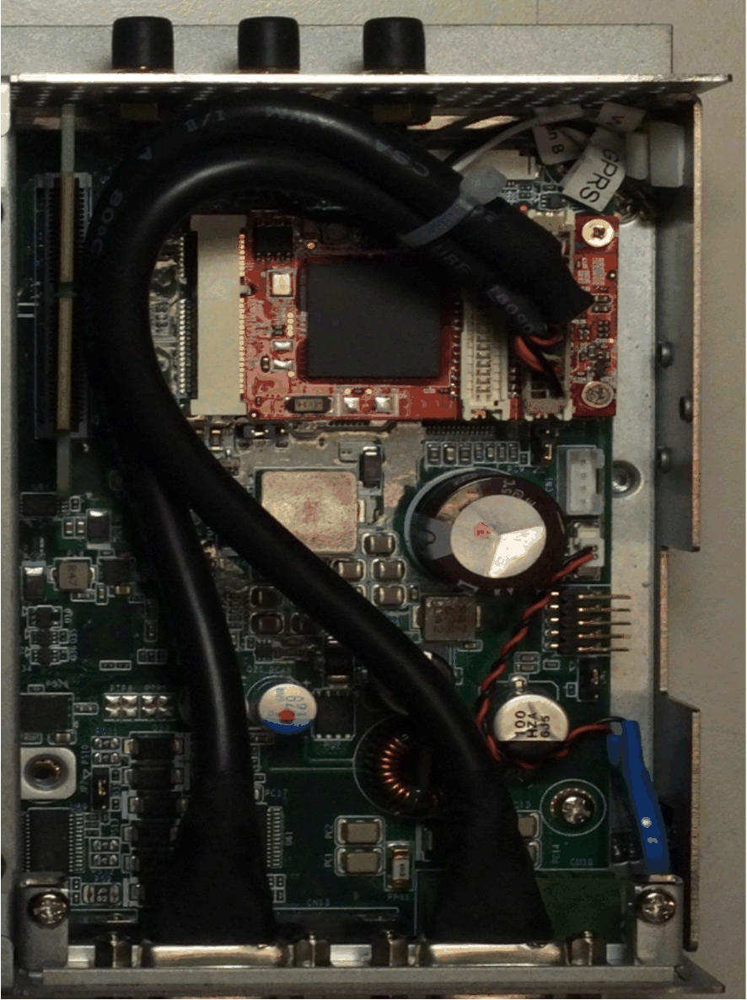

# VGA and DVI Interface Description

VGA and DVI Interface Description

Introduction

The HMIYMINVGADVID1 (interface 2 x VGA and 1 x DVI-D) is categorized as industrial module. It is compatible with the mini PCIe card. The Video Graphic card supports Full HD 1920 x 1080 definition and dual display mode. Two different screen images can be displayed on the two VGA ports (DVI-D is clone image of the first VGA). The two VGA connectors with analog signal require one optional interface slot, and the DVI-D connector with digital signal requires a second optional interface slot.

The HMIYMINDVII1 (interface 1 x DVI-I) is categorized as industrial module. It is compatible with the mini PCIe card. The DVI-I connector requires one external interface slot.

Magelis Box iPC supported:

| Supported Model | VGA-0 | VGA-1 | DVI-D | DVI - I |
| --- | --- | --- | --- | --- |
| Box iPC Optimized/Universal/Performance  (1 optional interface) | – | – | – | Independent (extend) |
| Box iPC Universal/Performance  (2 optional interface) | Independent (extend) | Clone | | – |

NOTE: It supports only 2D function when you use interface of VGA/DVI mini PCIe card display as main display.

HMIYMINVGADVID1 Optional Interface

The figure shows the HMIYMINVGADVID1 optional interface for 3 displays:

Two VGA for connection up to two displays (CN1):

One DVI-D for connection up to one display (CN2):

mini PCIe graphic card (1080 pixels) 1920 x 1080, vertical refresh rate up to 75 Hz:

NOTE: Dual display mode (CRT+CRT, supports single, clone, and dual mode).

HMIYMINDVII1 Optional Interface

The figure shows the HMIYMINDVII1 optional interface for 2 displays:

DVI-I cable with Y connection A and B:

mini PCIe graphic card (1080 pixels) 1920 x 1080, vertical refresh rate up to 75 Hz:

NOTE: On card has tape A on CN 1 and tape B on CN2. The cable A connect to A on mini PCIe module (CN1) and cable B connector to B on mini PCIe module (CN2).

Compatibility Table

| Part number | Description | HMIBMP/HMIBMU | HMIBMI/HMIBMO Expandable |
| --- | --- | --- | --- |
| HMIYMINVGADVID1 | Interface 1 DVI-D, 2 x VGA, two brackets | Yes(2)/(3)/(4) | Yes(1)/(4) |
| HMIYMINDVII1 | Interface 1 DVI-I | Yes(2)/(3)/(4) | Yes(4) |
| (1) Only support one Interface bracket; either with 2 x VGA or DVI-D bracket.  (2) HMIYMINDVII1 and HMIYMINVGADVID1 cannot use together.  (3) HMIYMINDP1 cannot use with HMIYMINDVII1 or HMIYMINVGADVID1.  (4) Remove the existing driver when you want to install HMIYMINDP1 or HMIYMINDVII1 or HMIYMINVGADVID1. | | | |

Cable Routing

Box iPC Optimized and HMIYMINVGADVID1:

Box iPC Optimized and HMIYMINDVII1:

Box iPC Optimized and HMIYMINVGADVID1:

Box iPC Universal/Box iPC Performance and HMIYMINVGADVID1:

Box iPC Universal/Box iPC Performance and HMIYMINDVII1:

Interface Installation

Before installing or removing a mini PCIe card, shut down Windows operating system in an orderly fashion and remove the power from the device.

|  |
| --- |
| NOTICE |
| ELECTROSTATIC DISCHARGE |
| Take the necessary protective measures against electrostatic discharge before attempting to remove the Magelis Industrial PC cover. |
| Failure to follow these instructions can result in equipment damage. |

|  |
| --- |
| Caution_Color.gifCAUTION |
| OVERTORQUE AND LOOSE HARDWARE |
| oDo not exert more than 0.5 Nm (4.5 lb-in) of torque when tightening the installation fastener, enclosure, accessory, or terminal block screws. Tightening the screws with excessive force can damage the installation fastener.  oWhen fastening or removing screws, ensure that they do not fall inside the Magelis Industrial PC chassis. |
| Failure to follow these instructions can result in injury or equipment damage. |

NOTE: Remove the power before attempting this procedure.

The table describes how to install a VGA or DVI interface of the Box iPC Universal/Performance:

| Step | Action |
| --- | --- |
| 1 | Release the screw:  G-SE-0062702.1.gif-high.gif |
| 2 | Install the mini PCIe card in the connector:  G-SE-0062719.2.gif-high.gif |
| 3 | Tear down optional interface bracket:  G-SE-0062717.1.gif-high.gif |
| 4 | 2 x VGA:  G-SE-0062716.1.gif-high.gif      G-SE-0062713.2.gif-high.gif |
| 5 | DVI-I:  G-SE-0062715.1.gif-high.gif      G-SE-0062710.3.gif-high.gif      DVI-D:  G-SE-0062712.2.gif-high.gif |
| 6 | Lock screws:  G-SE-0062714.1.gif-high.gif      G-SE-0062711.1.gif-high.gif |
| 7 | Install 2 x VGA interface bracket and connect the cable (analog signal):  G-SE-0062709.1.gif-high.gif |
| 8 | Install DVI-D interface bracket and connect the cable (digital signal):  G-SE-0062708.1.gif-high.gif      Install DVI-I interface bracket and connect the cable (analog signal):  G-SE-0062707.1.gif-high.gif |

The table describes how to install a VGA or DVI interface of the Box iPC Optimized:

| Step | Action |
| --- | --- |
| 1 | Release the screw:  G-SE-0062703.1.gif-high.gif |
| 2 | Install the mini PCIe card in the connector:  G-SE-0062718.1.gif-high.gif |
| 3 | Tear down optional interface bracket:  G-SE-0062720.1.gif-high.gif |
| 4 | 2 x VGA:  G-SE-0062716.1.gif-high.gif      G-SE-0062713.2.gif-high.gif |
| 5 | DVI-I:  G-SE-0062715.1.gif-high.gif      G-SE-0062710.3.gif-high.gif      DVI-D:  G-SE-0062712.2.gif-high.gif |
| 6 | Lock screws:  G-SE-0062714.1.gif-high.gif      G-SE-0062711.1.gif-high.gif |
| 7 | Install 2 x VGA interface bracket and connect the cable (analog signal):  G-SE-0062706.1.gif-high.gif      NOTE: The requirement of Phillips screw driver is type size 2. The recommended torque to tighten these screws is 0.5 Nm (4.5 lb-in). |
| 8 | Install DVI-D interface bracket and connect the cable (digital signal):  G-SE-0062705.1.gif-high.gif      NOTE: The requirement of Phillips screw driver is type size 2. The recommended torque to tighten these screws is 0.5 Nm (4.5 lb-in). |
| 9 | Install DVI-I interface bracket and connect the cable (analog signal):  G-SE-0062704.1.gif-high.gif      NOTE: The requirement of Phillips screw driver is type size 2. The recommended torque to tighten these screws is 0.5 Nm (4.5 lb-in). |

Device Manager and Hardware Installation

Install the optional interface into the Box iPC first, then install the driver. The driver installation media is included with the USB memory key of the Box iPC. After the interface is installed, you can verify whether it is properly installed on your system through the Device Manager.

Graphic Setting

For each display, a software tool is available to enable/disable touch-panel operation. You can disable up to three touch panels to monopolize the touch operation, the display order must match the tool. The exclusive Touch function is set to be effective for 100 ms even after a finger leaves the display.

Check that the BIOS Graphic of the Box iPC is set to {IGFX}, as follows:

1.BIOS > Chipset > System Agent (SA) Configuration

2.Graphics configuration

3.Primary Display > IGFX

4.Save and exit BIOS

EIO0000002042.06

© 2019 Schneider Electric. All rights reserved.