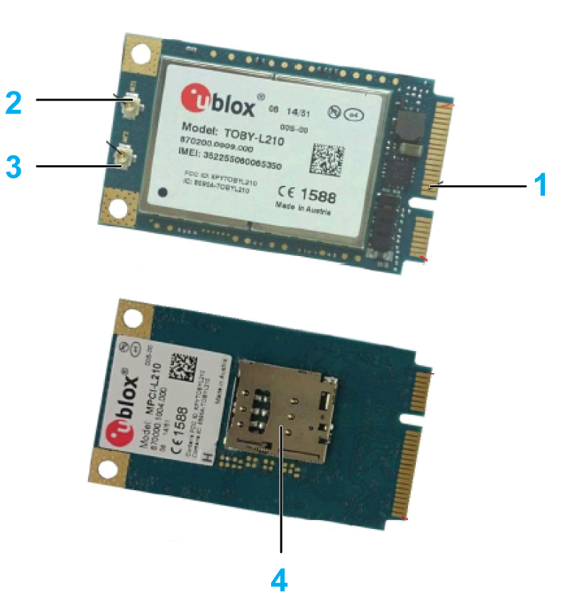
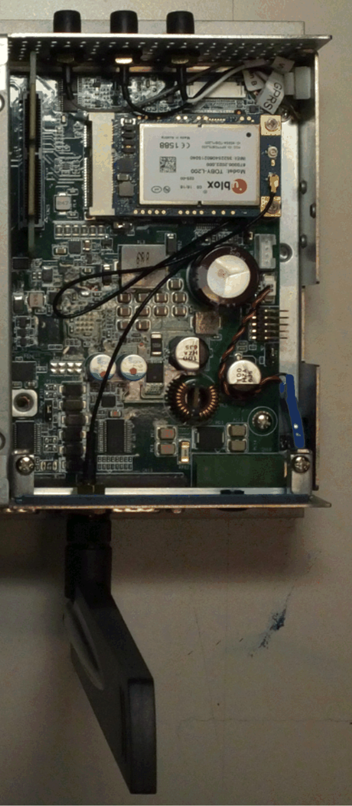
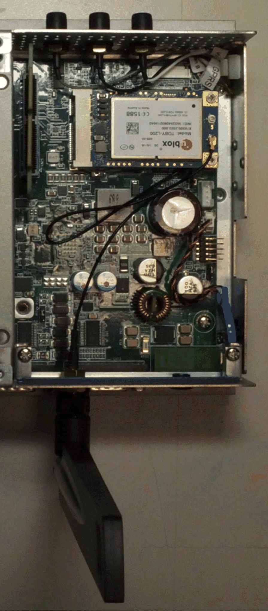
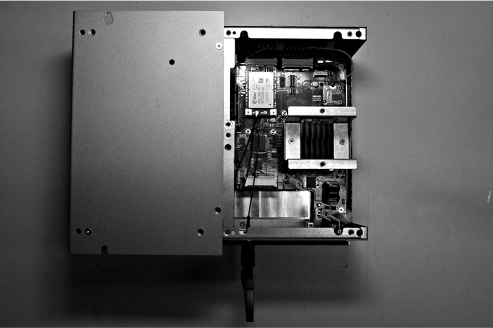

# 4G Cellular Description

4G Cellular Description

Introduction

The HMIYMIN4GEU1 and HMIYMIN4GUS1 are categorized as industrial communication modules.

The HMIYMIN4GEU1 is mini PCIe GPRS 4G for Europe and Asia frequencies.The kit including SIM card holder and external antennas.

The HMIYMIN4GUS1 is mini PCIe GPRS 4G for North America frequencies.The kit including SIM card holder and external antennas.

This figure shows the mini PCIe GPRS 4G cellular:

1   mini PCIe connector

2   RF main antenna connector (use this for connection to the Box iPC)

3   RF diversity antenna connector

4   SIM holder

NOTE: You can use the SIM holder (micro SIM 3FF, 12 x 15 mm) slot on 4G module to get 4G access.

Description

The table shows technical data:

| Features | Values |
| --- | --- |
| General | |
| Bus type | SIM card |
| Power consumption | 3.3 Vdc x 2.6 A |
| Optional temperature | 0...45 °C (113 °F) |

Compatibility Table

| Part number | Description | HMIBMP/HMIBMU | HMIBMI/HMIBMO Expandable |
| --- | --- | --- | --- |
| HMIYMIN4GUS1 | 4G cellular for US, 1 x antenna | Yes | Yes |
| HMIYMIN4GEU1 | 4G cellular for EU/ASIA, 1 x antenna | Yes | Yes |

Cellular View

Box iPC Optimized and HMIYMIN4GUS1:

Box iPC Optimized and HMIYMIN4GEU1:

Box iPC Universal/Box iPC Performance and HMIYMIN4GUS1:

Box iPC Universal/Box iPC Performance and HMIYMIN4GEU1:

Cellular Installation

Before installing or removing a mini PCIe card, shut down Windows operating system in an orderly fashion and remove all power from the device.

|  |
| --- |
| NOTICE |
| ELECTROSTATIC DISCHARGE |
| Take the necessary protective measures against electrostatic discharge before attempting to remove the Magelis Industrial PC cover. |
| Failure to follow these instructions can result in equipment damage. |

|  |
| --- |
| Caution_Color.gifCAUTION |
| OVERTORQUE AND LOOSE HARDWARE |
| oDo not exert more than 0.5 Nm (4.5 lb-in) of torque when tightening the installation fastener, enclosure, accessory, or terminal block screws. Tightening the screws with excessive force can damage the installation fastener.  oWhen fastening or removing screws, ensure that they do not fall inside the Magelis Industrial PC chassis. |
| Failure to follow these instructions can result in injury or equipment damage. |

NOTE: Remove the power before attempting this procedure.

There are two methods to install 4G cellular, either through optional interface, or directly using internal pre-install SMA cable to GPRS.

| Step | Action |
| --- | --- |
| 1 | Release the screw:  G-SE-0062686.1.gif-high.gif |
| 2 | Install the 4G mini PCIe card in the connector:  G-SE-0062699.2.gif-high.gif |
| 3 | Put ring into the cable and the SMA cable into the bracket:  G-SE-0062697.2.gif-high.gif    1   Ring |
| 4 | Put washer into the SMA connector and the combination nut:  G-SE-0062695.2.gif-high.gif      1   Washer |
| 5 | Tear down optional interface bracket:  G-SE-0062694.1.gif-high.gif |
| 6 | Release screws. Combination:  G-SE-0062692.1.gif-high.gif |
| 7 | Install antenna interface bracket and connect the cable:  G-SE-0062691.1.gif-high.gif      NOTE: When using a mini PCIe card with an external cable attached, install a clamp or other device to secure the cable. |
| 8 | G-SE-0062751.2.gif-high.gif    1   Antenna |

| Step | Action |
| --- | --- |
| 1 | Release the screw:  G-SE-0062752.1.gif-high.gif |
| 2 | Install the 4G mini PCIe card in the connector:  G-SE-0062755.2.gif-high.gif |
| 3 | Put ring into the cable and the SMA cable into the bracket:  G-SE-0062697.2.gif-high.gif    1   Ring |
| 4 | Put washer into the SMA connector and the combination nut:  G-SE-0062695.2.gif-high.gif      1   Washer |
| 5 | Tear down optional interface bracket:  G-SE-0062693.1.gif-high.gif |
| 6 | Release screws. Combination  G-SE-0062692.1.gif-high.gif |
| 7 | Install antenna interface bracket and connect the cable:  G-SE-0062688.1.gif-high.gif      NOTE: When using a mini PCIe card with an external cable attached, install a clamp or other device to secure the cable. |
| 8 | G-SE-0062751.2.gif-high.gif    1   Antenna |

| Step | Action |
| --- | --- |
| 1 | Release the screw:  G-SE-0062686.1.gif-high.gif |
| 2 | Install the 4G mini PCIe card in the connector:  G-SE-0062699.2.gif-high.gif |
| 3 | Connect pre-install SMA cable:  G-SE-0062689.1.gif-high.gif       GPRS/ANT1: supports both Tx and Rx, providing the main antenna interface. |

| Step | Action |
| --- | --- |
| 1 | Release the screw:  G-SE-0062752.1.gif-high.gif |
| 2 | Install the 4G mini PCIe card in the connector:  G-SE-0062755.2.gif-high.gif |
| 3 | Connect pre-install SMA cable:  G-SE-0062753.2.gif-high.gif       GPRS/ANT1: supports both Tx and Rx, providing the main antenna interface. |

Device Manager and Hardware Installation

Install the 4G cellular into the Box iPC first, then install the driver. The driver installation media is included in the recovery media (USB key). After the 4G cellular is installed, you can verify whether it is properly installed on your system through the Device Manager.

4G Module Driver Installation

| Step | Action |
| --- | --- |
| 1 | Install the driver:  Double-click Schneider 4G to execute  G-SE-0065587.1.gif-high.gif |
| 2 | Install RNDIS:  oThe 4G module needs to be in RNDIS mode and the 4G module driver default setting is RNDIS mode.  oIf your operating system does not have a RNDIS driver, double-click Install in EWM-RNDIS to execute.  G-SE-0065550.1.gif-high.gif      NOTE: For more details, refer to How to select RNDIS class from Device Management.  G-SE-0065587.1.gif-high.gif |
| 3 | After the driver is installed, check the connection with m-connect.  Execute m-connect.  G-SE-0065547.1.gif-high.gif |
| 4 | Result: m-connect window opens.  The user needs to reenter the PIN code once system power off and on again if SIM card has PIN code protection.  Enter the SIM card PIN Code:  G-SE-0065865.1.gif-high.gif      NOTE: Not all SIM cards need PIN code protection, depends on the carrier. |
| 5 | Result: m-connect window opens.  Follow the steps:  G-SE-0065546.1.gif-high.gif |
| 6 | Follow the instructions on the screen.  G-SE-0065545.1.gif-high.gif      Result: m-connect window refreshes displaying the connection details. |
| 7 | Click Settings > Set Connection Parameters.  G-SE-0065544.1.gif-high.gif      NOTE: If you use 3G SIM card or in the 3G network, press Activate button to active network.  Result: m-connect with APN settings dialog box appears.  G-SE-0065543.1.gif-high.gif |
| 8 | Enter the settings.  Result: APN setting needs to be confirmed with a telecom operator. |
| 9 | Click Settings > Select RAT.  G-SE-0065542.1.gif-high.gif      Result: m-connect with RAT mode settings dialog box appears.  G-SE-0065541.1.gif-high.gif      G-SE-0065540.1.gif-high.gif |
| 10 | Select the RAT mode ((2G/3G/4G) that you want to connect and set the priority |
| 11 | Click AT Log to check the AT log information.  G-SE-0065539.1.gif-high.gif |

EIO0000002042.06

© 2019 Schneider Electric. All rights reserved.